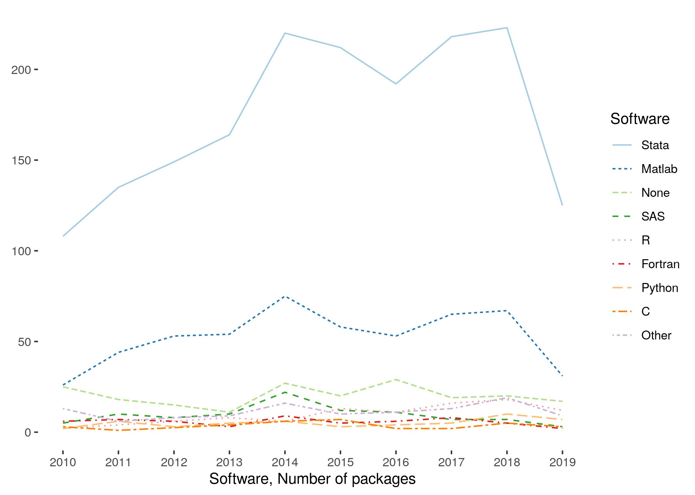

```{r setup,echo=FALSE,message=FALSE,warning=FALSE}
knitr::opts_chunk$set(echo = FALSE,message=FALSE,warning = FALSE,cache=TRUE)
source(file.path(rprojroot::find_root(rprojroot::has_file("pathconfig.R")),"pathconfig.R"),echo=FALSE)
source(file.path(programs,"config.R"), echo=FALSE)
source(file.path(programs,"global-libraries.R"), echo=FALSE)

options(DT.options = list(dom = 'frtipB',
						  autoFill = TRUE,
                           buttons = c('csv','copy'),
                           lengthMenu = list(c(10,25,50),
                                             c(10,25,50))))
options(DT.extensions = c('AutoFill','Buttons'))
```

```{r readin1,echo=FALSE,message=FALSE,warning=FALSE}

# load data
fread.exist <- function(file,...) 
{

if ( file.exists(file) ) { fread(file,...) }
	
}

aea.icpsr <- fread.exist(file.path(acquired,"aea_icpsr_all_files.csv.gz")) %>%
	filter(!file_path %in% c("metadata.rdf","LICENSE.txt","citations")) %>%
	filter(!dirname(file_path) %in% c("citations"))
# Database of the articles and the associated packages sent to ICSPR
aea.article <- fread.exist(file.path(acquired,"aea_article_data.csv.gz"))
# Issue information
aea.issue <- fread.exist(file.path(acquired,"aea_issue_data.csv.gz"))
# JEL codes associated with articles
aea.jel <- fread.exist(file.path(acquired,"aea_jel_data.csv.gz"))
# Mapping of ICPSR packages to ICPSR-based DOI
aea.mapping <- fread.exist(file.path(acquired,"aea_icpsr_mapping.20191014.txt"),
						   col.names = c("DOI","Zipfile")) %>% 
	mutate(icpsr_package_name = str_remove(Zipfile,"Original Zip: "),
		   icpsr_doi = str_remove(DOI,"http://doi.org/")) %>%
	select(-Zipfile,-DOI)

# Files that were too big to be migrated in the first batch
aea.big <- fread(file.path(acquired,"1000plus_file_count.txt"),sep = " ",col.names = c("filecount","pkgsize","compressed"))
file.ext.map <- fread(file.path(basepath,"data","original",file.ext.map.file)) %>% 
	mutate(file.ext = tolower(Extension))
# do some manipulation

aea.icpsr %>% left_join(select(aea.article,doi,issue_id),by=c("doi")) %>%
	left_join(aea.issue,by=c("issue_id")) -> aea.tmp
aea.tmp %>% filter(is.na(issue_id)) %>% select(doi) %>% distinct(doi) -> aea.not_complete
aea.complete.B <- rcrossref::cr_works(dois=aea.not_complete$doi)
aea.complete <- left_join(aea.tmp,select(aea.complete.B$data,doi,container.title),by=c("doi")) %>%
	mutate(journal=if_else(is.na(journal),container.title,journal),file.ext = tolower(file_ext(file_path))) %>%
	left_join(file.ext.map,by=c("file.ext")) %>%
	mutate(Software=if_else(is.na(Software),"Unknown",Software),Type=if_else(is.na(Type),"Unknown",Type))

# this computes ex-post the status of openICPSR at certain dates
# On Oct 16, openICPSR reported:
#   - 3461 deposits
#   - 2570 added "this week"
#   - 2594 added "this month" -> interpreted to mean in October
n.openicpsr.16oct2019 <- 3461
n.openicpsr.oct.added <- 2594
n.openicpsr.sept2019 <- n.openicpsr.16oct2019 - n.openicpsr.oct.added # end of september number
n.datalumos.sept2019 <- 94
n.psid.sept2019 <- 13
n.aera.sept2019 <- 46
n.aea.oct2019 <- 2645 # from private interface
n.aea.sept2019 <- n.aea.oct2019 - nrow(aea.article)
n.aea.sept2019.public <- 5

software_cats <- c("Stata" ,  "Matlab" , "None" ,   "SAS"  ,   "R"  ,     "Fortran" ,"Python", "C" )

```

```{r logos,results="asis"}
outputFormat <- ifelse(is.null(knitr:::pandoc_to()),"html",knitr:::pandoc_to())
if (outputFormat %in% c('html')) {
	cat("")
    cat("")
}
```

# Migrating historical AEA supplements - DRAFT

*Author: Lars Vilhuber, Cornell University, AEA Data Editor ([dataeditor@aeapubs.org](mailto:dataeditor@aeapubs.org))*

*Last updated: `r Sys.Date()`*


Since July 16, 2019, the American Economic Association has used the **[AEA Data and Code Repository](https://www.openicpsr.org/openicpsr/aea)** at **[openICPSR](https://www.openicpsr.org/openicpsr/)** as the default archive for its supplements. This archive serves a dual purpose: to share data with the AEA Data Editor prior to being published, and as a publication outlet for supplements to articles in AEA journals.

At the time, the AEA also announced that it would  migrate the historical supplements, hitherto stored as ZIP files on the [AEA website](https://www.aeaweb.org/journals), into the AEA Data and Code Repository. 

On Oct 1, 2019, openICPSR had `r format(n.openicpsr.sept2019,big.mark=",")` deposits, which covered `r n.datalumos.sept2019` deposits in the [DataLumos](https://www.datalumos.org/datalumos/search/studies) archive, `r n.aera.sept2019` in the [AERA archive](https://www.openicpsr.org/openicpsr/search/aerajournals/studies), and `r n.psid.sept2019` in the [PSID](https://www.openicpsr.org/openicpsr/search/psid/studies) archive. The **AEA Data and Code Repository** contained at the time `r n.aea.sept2019` deposits, of which `r n.aea.sept2019.public` were public, the others awaiting publication of the associated article. 

Between Oct 11 and Oct 13, 2019, the staff at openICPSR ingested `r format(nrow(aea.article),big.mark=",")` historical supplements, increasing the size of the openICPSR repository **by a factor of `r round(nrow(aea.article) / (n.openicpsr.sept2019),0.1)`**, to `r format(n.openicpsr.16oct2019,big.mark=",")`. This was only the first part of the migration, as there are about 1,000 more archives that need to be migrated.

## Increased findability
The migrated archives are now available through the [openICPSR search interface](https://www.openicpsr.org/openicpsr/search/aea/studies), the [general ICPSR search interface](https://www.icpsr.umich.edu/icpsrweb/ICPSR/search/studies), as well as through a variety of federated search interfaces such as [Google Dataset Search](https://toolbox.google.com/datasetsearch/search). For instance, the current AER Editor's supplements can be found [here](https://www.openicpsr.org/openicpsr/search/aea/studies?start=0&ARCHIVE=aea&sort=score%20desc%2CTITLE_SORT%20asc&rows=25&q=esther%20duflo), [here](https://www.icpsr.umich.edu/icpsrweb/ICPSR/search/studies?start=0&ARCHIVE=ICPSR&PUBLISH_STATUS=PUBLISHED&sort=score%20desc%2CTITLE_SORT%20asc&rows=50&q=esther%20duflo) and [here](https://toolbox.google.com/datasetsearch/search?query=esther duflo), with increasing generality.

## Characteristics of AEA supplement data
We can describe this subset of the historical supplements in a variety of ways. 

### Time coverage
This is only a subset of all supplements, so what years are covered?
```{r figure_years}
aea.complete %>% group_by(year) %>% summarise(count=n()) -> table.by_year

write.csv(table.by_year,file=file.path(generated,"table.by_year.csv"))
table.by_year %>% kable() %>% 
	kableExtra::kable_styling(bootstrap_options = c("striped", "hover", "condensed"),full_width = F) 

aea.complete %>%  ggplot(aes(year)) + 
	  geom_histogram(fill="grey",col="white",breaks=seq(min(aea.complete$year,na.rm=TRUE),max(aea.complete$year,na.rm=TRUE),1)) + 
	  ylab(element_blank())+ 
	  xlab("Number of files, by year") +
	  theme_classic() + 
	  theme(axis.line = element_line(size=0)) -> fig.count_by_year
aea.complete %>% group_by(doi) %>%
	summarize(count=n(),year=first(year)) %>%
	ggplot(aes(year)) + 
	  geom_histogram(fill="grey",col="white",breaks=seq(min(aea.complete$year,na.rm=TRUE),max(aea.complete$year,na.rm=TRUE),1)) + 
	  ylab(element_blank())+ 
	  xlab("Number of supplements, by year") +
	  theme_classic() + 
	  theme(axis.line = element_line(size=0)) -> fig.doi_count_by_year
g <- ggarrange(fig.count_by_year,fig.doi_count_by_year) 

ggsave(file.path(programs,"figure_files_by_year.png"),fig.count_by_year)
ggsave(file.path(programs,"figure_doi_by_year.png"),fig.doi_count_by_year)
ggsave(file.path(programs,"figure_years.png"),g)
```


### Number of files per supplement and size of supplement
```{r table_files,echo=FALSE,message=FALSE,warning=FALSE}
aea.icpsr %>% group_by(doi) %>%
	summarize(size=sum(as.numeric(file_size)),count=n()) %>% 
	arrange(desc(size)) -> table.aea.filecount
max.aea.filecount <- head(table.aea.filecount,1)
max.aea.filecount.bib <- RefManageR::ReadCrossRef(query = paste("doi=",max.aea.filecount$doi))
RefManageR::WriteBib(max.aea.filecount.bib,file.path(programs,"max.aea.filecount.bib"))

write.csv(table.aea.filecount,file=file.path(generated,"table.aea.filecount.csv"))
#table.aea.filecount %>% head(10) %>% kable() %>% 
#	kableExtra::kable_styling(bootstrap_options = c("striped", "hover", #"condensed"),full_width = F) 
table.aea.filecount %>% 
	datatable( autoHideNavigation = TRUE )
```


```{r additional_stats,cache=FALSE}
text.stats <- tibble(statistic = "supplements",value=as.numeric(nrow(aea.article)))
text.stats <- add_row(text.stats,statistic="files",value=nrow(aea.icpsr))
text.stats <- add_row(text.stats,statistic="max.filecount",value=max.aea.filecount$count)
text.stats <- add_row(text.stats,statistic="max.size",value=max.aea.filecount$size)
text.stats <- add_row(text.stats,statistic="size",value=sum(aea.icpsr$file_size))
text.stats <- add_row(text.stats,statistic="median.size",value=median(table.aea.filecount$size))
text.stats <- add_row(text.stats,statistic="median.filecount",value=median(table.aea.filecount$count))

myvalue <- function(arg) {
	as.numeric(filter(text.stats,statistic==arg) %>% select(value))
}
```

The `r format(myvalue("supplements"),big.mark=",")` supplements contain a total of `r format(myvalue("files"),big.mark=",")` files - programs, documents, datasets. The largest supplement within this group in terms of file count has `r format(myvalue("max.filecount"),big.mark=",")` files, summing to `r utils:::format.object_size(max.aea.filecount$size,"auto")` [`r Citep(max.aea.filecount.bib)`](https://doi.org/`r max.aea.filecount$doi`). Note however that among the remaining non-migrated supplements are very large packages: the largest we have identified has `r format(max(aea.big$filecount),big.mark=",")` files. 

### Distribution overall
```{r figure_files,cache=FALSE}
table.aea.filecount %>% 
	mutate(logsize=log(size)) %>%
	ggplot(aes(logsize)) + 
	  geom_histogram(aes(y=..density..),bins=50,fill="grey") + 
	  geom_density(alpha=.2) +
	  ylab(element_blank())+ 
	  xlab("Log(size) in bytes") +
	  theme_classic() + 
	  theme(axis.line = element_line(size=0)) -> fig.size
table.aea.filecount %>% 
	mutate(logcount=log(count)) %>%
	ggplot(aes(logcount)) + 
	  geom_histogram(aes(y=..density..),bins=50,fill="grey") + 
	  geom_density(alpha=.2)  +
	  ylab(element_blank())+ 
	  xlab("Log(count of files)") +
	  theme_classic() + 
	  theme(axis.line = element_line(size=0)) -> fig.count

ggsave(file.path(programs,"figure_files_count.png"),fig.count)

g <- ggarrange(fig.size,fig.count) 
ggsave(file.path(programs,"figure_files.png"),g)
```


### Stats by journal
Globally, the median supplement is `r utils:::format.object_size(myvalue("median.size"),"auto")` and has `r format(myvalue("median.filecount"),big.mark=",")`. We can look at the size of the supplements by journal. The following table shows cumulative and median size and number of files.

```{r table_journal,echo=FALSE,message=FALSE,warning=FALSE,cache=TRUE}


# create a distribution of package counts by journal

table.aea.count_by_journal <- group_by(aea.complete,doi) %>%
	summarize(size=sum(as.numeric(file_size)),count=n(),journal=first(journal)) %>% 
	ungroup() %>%
	group_by(journal) %>%
	summarize(articles=n(),median_size=median(as.numeric(size)),median_count=median(count),size=sum(as.numeric(size)),count=sum(count)) %>%
	arrange(desc(size)) %>%
	mutate(`Cumulative Size (Mb)`=round(size/1024^2,1),`Median Size (Mb)`=round(median_size/1024^2,1))

write.csv(table.aea.count_by_journal,file=file.path(generated,"table.aea.count_by_journal.csv"))
table.aea.count_by_journal %>% 
	select(journal,articles,`Median Size (Mb)`,`Cumulative Size (Mb)`,median_count ,count) %>%
	datatable( autoHideNavigation = TRUE)
	#kable(col.names=c("Journal","Articles","Median Size (Mb)","Cumulative Size (Mb)","Median no. of files","Total no. of files"),format.args=list(big.mark = ",")) %>% 
	#kableExtra::kable_styling(bootstrap_options = c("striped", "hover", "condensed"),full_width = F) 

```

### Distribution across JEL codes

The top 10 JEL codes associated with supplements are:

```{r table_jel,echo=FALSE,message=FALSE,warning=FALSE}
aea.jel %>% group_by(jel_code) %>% 
	summarize(count=n(),jel_description=first(jel_description))  %>% 
	arrange(desc(count)) %>% 
	mutate(Pct = round(count/nrow(aea.article)*100,2)) %>% 
	select(count,Pct,everything()) %>%
	rename(`Number of packages` = count, JEL = jel_code, Description = jel_description) -> table.aea.jel

write.csv(table.aea.jel,file=file.path(generated,"table.aea.jel.csv"))
table.aea.jel %>% 
	datatable( autoHideNavigation = TRUE)
    #head(10) %>% kable() %>% 
	#kableExtra::kable_styling(bootstrap_options = c("striped", "hover", "condensed"),full_width = F) %>%
	#footnote(general="*A supplement can be associated with multiple JEL codes.*")

```
*A supplement can be associated with multiple JEL codes.*

### Software used
To identify software usage and data formats, we (manually) [mapped file extensions](../data/original/`r file.ext.map.file`)  into known software packages, and classified the file type into a set of categories:

```{r file.ext.map}
file.ext.map %>% group_by(Type) %>%
	summarize(count=n()) %>% arrange(desc(count)) %>%
	kable(col.names=c("File type","Number of extensions")) %>%
	kableExtra::kable_styling(bootstrap_options = c("striped", "hover", "condensed"),full_width = F)
```

The table below shows the top ten software, by frequency of program files:
```{r software_files}
aea.complete %>% filter(Type=="Program")  -> aea.complete.programs
# patching since not all DOI have programs!
distinct(aea.complete,doi) %>% 
	select(doi) %>% 
	left_join(aea.complete.programs,by=c("doi"))  %>%
	mutate(Software=if_else(is.na(Software),"None",Software)) -> aea.complete.programs

aea.complete.programs %>%
	group_by(Software) %>% 
	summarize(count=n())  %>% 
	arrange(desc(count)) %>% 
	mutate(Pct = round(count/nrow(aea.complete.programs)*100,2)) %>% 
	select(count,Pct,everything())  -> table.aea.file.ext

write.csv(table.aea.file.ext,file=file.path(generated,"table.aea.file.ext.csv"))

table.aea.file.ext %>% 
	head(10) %>% kable(col.names = c("Number of files","Pct","Software")) %>% 
	kableExtra::kable_styling(bootstrap_options = c("striped", "hover", "condensed"),full_width = F) 

# NOw do graph by files
table.aea.file.ext %>% 
	mutate(Software=if_else(Software=="General","Other",Software)) %>%
	mutate(sw=fct_explicit_na(factor(if_else(Pct>1,Software,"NA"),levels=software_cats),"Other")) %>% 
	group_by(sw) %>% summarise(count=sum(count),Pct=sum(Pct)) %>% 
	arrange(desc(Pct)) %>% 
	ggplot(aes(sw,Pct)) +
		geom_col(fill="grey") +
	    ylab(element_blank())+
	    xlab("Software, Percent of all files") +
	    ylab(element_blank()) +
	    theme_classic() +
	    theme(axis.line = element_line(size=0),axis.text.x = element_text(angle=45),
	    	  axis.title.y = element_text(angle=0)) -> fig.software.files

ggsave(file.path(programs,"figure_software_files.png"),fig.software.files)

# Do the same by package
```
The top software with respect to number of files is **`r head(table.aea.file.ext,1)$Software`**. Note that there are `r filter(table.aea.file.ext,Software=="None") %>% select(count)` supplements that do not contain files that we have identified as program files ("None"). 

More interesting is how many supplements use one or more software:

```{r software_packages}
min_mentions <- 10
aea.complete.programs %>%
	group_by(doi,Software) %>% 
	summarize(count=n())  %>% 
	mutate(presence=count>0) %>% ungroup() -> aea.complete.programs.bydoi

aea.complete.programs.bydoi %>% group_by(doi) %>%
	summarize(n_software=n())  %>% 
	arrange(desc(n_software)) %>% ungroup() -> table.aea.software_by_doi 

# this needs to be tabulated by frequency

write.csv(table.aea.software_by_doi,file=file.path(generated,"table.aea.software_by_doi.csv"))

table.aea.software_by_doi  %>% 
	mutate(c_software=factor(pmin(n_software,3),levels=c(0,1,2,3),labels=c("0","1","2","3+"))) %>%
	group_by(c_software) %>%
	summarize(count=n()) %>%
	mutate(Percent = round(count/nrow(aea.article) *100,2)) %>%
	kable(col.names = c("Number of Software","N","Percent")) %>% 
	kableExtra::kable_styling(bootstrap_options = c("striped", "hover", "condensed"),full_width = F) 

```
with a maximum of `r max(table.aea.software_by_doi$n_software)` different software packages used in any one of the supplements. 
In turn, the number of supplements in which software is used at least once is reflected in the next table (restricted to at least `r min_mentions` mentions):

```{r software_packages2}
aea.complete.programs.bydoi %>% group_by(Software) %>%
	summarize(n_packages=n())  %>% 
	arrange(desc(n_packages)) %>%
	filter(n_packages >= min_mentions ) %>%
	mutate(Percent = round(n_packages/nrow(aea.article) *100,2)) -> table.aea.doi_by_software # this needs to be tabulated by Software

write.csv(table.aea.doi_by_software,file=file.path(generated,"table.aea.doi_by_software.csv"))

table.aea.doi_by_software  %>% 
	kable(col.names = c("Name of Software","Usages","Percent")) %>% 
	kableExtra::kable_styling(bootstrap_options = c("striped", "hover", "condensed"),full_width = F) %>%
	footnote(general="*Percentage sum to more than 100 percent, since a supplement can use multiple software packages.*")

# now prepare the graph
# We need to do this again, to reduce the types of software
aea.complete.programs %>%
	mutate(Software_collapsed=fct_explicit_na(factor(Software,levels=software_cats),"Other")) %>%
    group_by(Software_collapsed,doi) %>% 
	summarize(n_files_per_pkg=n()) %>% ungroup() -> aea.complete.software_collapsed.bydoi

aea.complete.software_collapsed.bydoi %>% 
	group_by(Software_collapsed) %>%
	summarize(n_doi=n())  %>% 
	arrange(desc(n_doi)) %>% ungroup() -> table.aea.software_by_doi # this needs to be tabulated by frequency

table.aea.software_by_doi %>% 
	ggplot(aes(Software_collapsed,n_doi)) +
		geom_col(fill="grey") +
	    ylab(element_blank())+
	    xlab("Software, Number of packages") +
	    ylab(element_blank()) +
	    theme_classic() +
	    theme(axis.line = element_line(size=0),axis.text.x = element_text(angle=45),
	    	  axis.title.y = element_text(angle=0)) ->fig.software.pkgs
ggsave(file.path(programs,"figure_software_pkgs.png"),fig.software.pkgs)

g.software <- ggarrange(fig.software.files,fig.software.pkgs) 
ggsave(file.path(programs,"figure_software.png"),g.software)

text.stats <- add_row(text.stats,statistic="supplements.stata.pct",value=as.numeric(filter(table.aea.file.ext,Software=="Stata") %>% select(Pct)))
text.stats <- add_row(text.stats,statistic="supplements.matlab.pct",value=as.numeric(filter(table.aea.file.ext,Software=="Matlab") %>% select(Pct)))

```


Clearly, **`r head(table.aea.doi_by_software$Software,1)`** is the most popular statistical software in the journals of the AEA (`r head(table.aea.doi_by_software$Percent,1)` percent of all supplements use it), followed by **`r table.aea.doi_by_software[2,"Software"]`** (`r table.aea.doi_by_software[2,"Percent"]` percent). Note again the `r filter(table.aea.file.ext,Software=="None") %>% select(count)` supplements that do not contain files that we have identified as program files ("None"). 
 
```{r software_packages_time}
# We want to show the evolution across time. To do this, we exploit the fact that a DOI is present in only one year. We simply attach the year of publication back to the DOI, and graph that. 

# get the year and journal from aea.issue
aea.issue %>% select(issue_id,journal,year) %>% 
	right_join(select(aea.article,doi,issue_id),by="issue_id") %>% 
    right_join(aea.complete.software_collapsed.bydoi,by="doi") -> aea.software_collapsed.bydoi_and_year.tmp

# there are a few issues that do not have an issue_id. We look them up in crossref
aea.software_collapsed.bydoi_and_year.tmp %>% filter(is.na(year)) %>% select(doi) %>% distinct(doi) -> lookup.doi

results.doi <- rcrossref::cr_works(dois=lookup.doi$doi)$data
results.doi %>% select(doi,issued) %>% 
	mutate(year = substr(issued,1,4)) %>%
	select(doi,year) %>%
	right_join(aea.software_collapsed.bydoi_and_year.tmp,by="doi") %>%
	mutate(year = if_else(is.na(year.x),year.y,as.integer(year.x))) %>% 
	select(-year.x,-year.y) -> aea.software_collapsed.bydoi_and_year

aea.software_collapsed.bydoi_and_year %>% 
	group_by(year) %>%
	summarize(n_doi_year=n()) -> total.dois.by_year

aea.software_collapsed.bydoi_and_year %>% 
	group_by(Software_collapsed,year) %>%
	summarize(n_doi=n()) %>% 
	left_join(total.dois.by_year,by="year") %>% 
	mutate(Percent = round(n_doi/n_doi_year*100,2)) -> table.aea.software_by_year

# now graph it

table.aea.software_by_year %>% 
	filter(year>2009) %>%
	rename(Software = Software_collapsed) %>%
	ggplot(aes(year,n_doi)) +
		geom_line(aes(color=Software,linetype=Software)) +
	    ylab(element_blank())+
	    xlab("Software, Number of packages") +
	    ylab(element_blank()) +
	    theme_classic() +
	    scale_colour_brewer(palette = "Paired") +
	    scale_x_continuous(limits=c(2010,max(table.aea.software_by_year$year)),breaks=seq(2010,max(table.aea.software_by_year$year),1)) +
	    theme(axis.line = element_line(size=0),
	    	  axis.title.y = element_text(angle=0)) -> fig.software_by_year.count
ggsave(file.path(programs,"figure_software_years_count.png"),fig.software_by_year.count)

# graph percent
table.aea.software_by_year %>% 
	filter(year>2009) %>%
	rename(Software = Software_collapsed) %>%
	ggplot(aes(year,Percent)) +
		geom_line(aes(color=Software,linetype=Software)) +
	    ylab(element_blank())+
	    xlab("Software, Percentage of packages") +
	    ylab(element_blank()) +
	    theme_classic() +
	    scale_colour_brewer(palette = "Paired") +
	    scale_x_continuous(limits=c(2010,max(table.aea.software_by_year$year)),breaks=seq(2010,max(table.aea.software_by_year$year),1)) +
	    theme(axis.line = element_line(size=0),
	    	  axis.title.y = element_text(angle=0)) -> fig.software_by_year.pct
ggsave(file.path(programs,"figure_software_years_pct.png"),fig.software_by_year.pct)

g.software.years <- ggarrange(fig.software_by_year.count,fig.software_by_year.pct) 
ggsave(file.path(programs,"figure_software_years.png"),g.software.years)

```




### Data formats 
It is somewhat more ambiguous identifying data files, as they come in a large variety of formats. Furthermore, data might be compressed. In the following table, we tabulate data files and archives, by the software package associated with their extension. The data type "General" encompasses formats like "tsv" or "csv" that are not associated with any particular software, but are nevertheless clearly identifiable as data files ([full list available](../data/original/`r file.ext.map.file`)). We restrict ourselves to the number of supplements which contain files with such extensions.

```{r data_formats}
aea.complete %>% filter(Type=="Data" | Type=="Archive") %>%
	mutate(Software=if_else(Type=="Archive",Type,Software)) -> aea.complete.data
aea.complete.data %>%
	group_by(doi,Software) %>% 
	summarize(count=n())  %>% 
	mutate(presence=count>0) -> aea.complete.data.bydoi
aea.complete.data.bydoi %>% group_by(Software) %>%
	summarize(n_packages=n())  %>% 
	arrange(desc(n_packages)) %>%
	mutate(Percent = round(n_packages/nrow(aea.complete.data.bydoi) *100,2)) -> table.aea.doi_by_data # this needs to be tabulated by Software

write.csv(table.aea.doi_by_data,file=file.path(generated,"table.aea.doi_by_data.csv"))

table.aea.doi_by_data  %>% 
	kable(col.names = c("Name of Software","Usages","Percent")) %>% 
	kableExtra::kable_styling(bootstrap_options = c("striped", "hover", "condensed"),full_width = F) %>%
	footnote(general="*Percentage sum to more than 100 percent, since a supplement can use multiple software packages.*")
	
```


## Metadata 
When planning the migration, the preservation of existing metadata - the information about the data and code - was important. The AEA Data Editor worked with the openICPSR staff to enhance the data infrastructure, adding the capability to store and display JEL codes in addition to subject terms.  Going forward, in addition to adding the JEL codes that also describe the linked article, authors can add metadata such as *geographic coverage*, *funding sources*, *time periods*, *geographic units* as well as *units of observation*, greatly enhancing the ability of researchers to find data through the openICPSR search interface. 

Two important caveats apply, however. First, none of the additional metadata exists for the historical archives. Second, the openICPSR search interface only allows to search for these in an implicit way, i.e., one can search for "J31" because it is unlikely to appear as anything else, but there is no selection by specific JEL codes currently possible. The ability to do so is planned for a later implementation.


```{r output_mapping}
aea.mapping %>% 
	left_join(aea.article,by=c("icpsr_package_name")) %>% 
	select(doi,icpsr_doi,title) -> table.aea.icpsr.mapping

write.csv(table.aea.icpsr.mapping,file=file.path(generated,"table.aea.icpsr.mapping.csv"))
```

```{r datacite_example}
sample_datacite <- max.aea.filecount %>% left_join(table.aea.icpsr.mapping,by=c("doi")) 
```

Metadata on which supplement at openICPSR relates to which article can be found in a few ways. First, in registering the new supplement DOI at openICPSR, a relationship link pointing to the article was created. A query to the [Datacite API](https://api.datacite.org/). For instance, the article with the largest supplement had article DOI `r max.aea.filecount$doi`. The associated supplement now has DOI `r sample_datacite$icpsr_doi`. The Datacite API query for the supplement would be [https://api.datacite.org/dois/`r sample_datacite$icpsr_doi`](https://api.datacite.org/dois/`r sample_datacite$icpsr_doi`), and querying this URL would yield a [JSON](https://www.json.org/) object, identifying the link:


Alternatively, we have created a linkage file, available at [`r file.path(git.base,git.repo,"data","generated","table.aea.icpsr.mapping.csv")`](`r file.path(git.base,git.repo,"data","generated","table.aea.icpsr.mapping.csv")`), containing the article DOI, the title of the paper, and the supplement DOI at openICPSR:

```{r print_linkage}

table.aea.icpsr.mapping  %>% 
	datatable()
    head() %>%
	kable() %>% 
	kableExtra::kable_styling(bootstrap_options = c("striped", "hover", "condensed"),full_width = F)

```

## Data Availability

```{r write_out_parms, cache=FALSE}
write.csv(text.stats,file=file.path(generated,"text.stats.csv"))
```

The input data to this paper are available at (OPENICPSR TBD). The tables presented in this paper,  the data underlying the figures, and the linkage between article DOIs and supplement DOIs are all available at [`r file.path(git.base,git.repo,"data","generated")`](`r file.path(git.base,git.repo,"data","generated")`). 

## Code Availability
The code underlying this analysis can be downloaded at  [`r file.path(git.base,git.repo)`](`r file.path(git.base,git.repo)`).

## References
