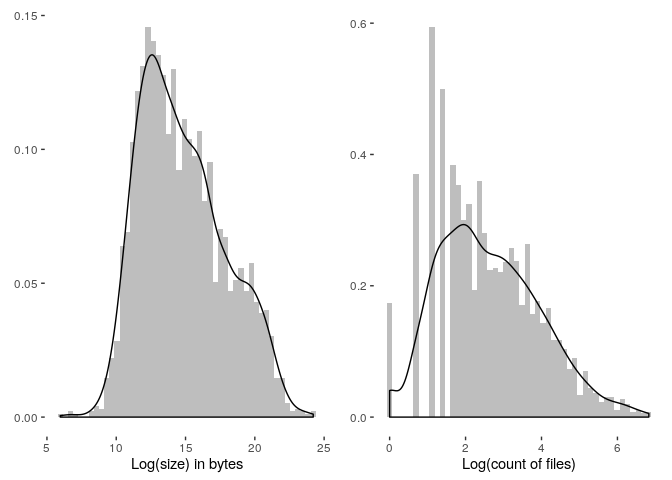

# Migrating historical AEA supplements - DRAFT

Since July 16, 2019, the American Economic Association has used the **[AEA Data and Code Repository](https://www.openicpsr.org/openicpsr/aea)** at **[openICPSR](https://www.openicpsr.org/openicpsr/)** as the default archive for its supplements. This archive serves a dual purpose: to share data with the AEA Data Editor prior to being published, and as a publication outlet for supplements to articles in AEA journals.

At the time, the AEA also announced that it would  migrate the historical supplements, hitherto stored as ZIP files on the [AEA website](https://www.aeaweb.org/journals), into the AEA Data and Code Repository. 

On Oct 1, 2019, openICPSR had 867 deposits, which covered 94 deposits in the [DataLumos](https://www.datalumos.org/datalumos/search/studies) archive, 46 in the [AERA archive](https://www.openicpsr.org/openicpsr/search/aerajournals/studies), and 13 in the [PSID](https://www.openicpsr.org/openicpsr/search/psid/studies) archive. The **AEA Data and Code Repository** contained at the time 93 deposits, of which 5 were public, the others awaiting publication of the associated article. 

Between Oct 11 and Oct 13, 2019, the staff at openICPSR ingested 2,552 historical supplements, increasing the size of the openICPSR repository **by a factor of 3**, to 3,461. This was only the first part of the migration, as there are about 1,000 more archives that need to be migrated.

## Increased findability
The migrated archives are now available through the [openICPSR search interface](https://www.openicpsr.org/openicpsr/search/aea/studies), the [general ICPSR search interface](https://www.icpsr.umich.edu/icpsrweb/ICPSR/search/studies), as well as through a variety of federated search interfaces such as [Google Dataset Search](https://toolbox.google.com/datasetsearch/search). For instance, the current AER Editor's supplements can be found [here](https://www.openicpsr.org/openicpsr/search/aea/studies?start=0&ARCHIVE=aea&sort=score%20desc%2CTITLE_SORT%20asc&rows=25&q=esther%20duflo), [here](https://www.icpsr.umich.edu/icpsrweb/ICPSR/search/studies?start=0&ARCHIVE=ICPSR&PUBLISH_STATUS=PUBLISHED&sort=score%20desc%2CTITLE_SORT%20asc&rows=50&q=esther%20duflo) and [here](https://toolbox.google.com/datasetsearch/search?query=esther duflo), with increasing generality.

## Characteristics of AEA supplement data
We can describe this subset of the historical supplements in a variety of ways. 

### Number of files per supplement and size of supplement
<table class="table table-striped table-hover table-condensed" style="width: auto !important; margin-left: auto; margin-right: auto;">
 <thead>
  <tr>
   <th style="text-align:left;"> doi </th>
   <th style="text-align:right;"> size </th>
   <th style="text-align:right;"> count </th>
  </tr>
 </thead>
<tbody>
  <tr>
   <td style="text-align:left;"> 10.1257/pandp.20181045 </td>
   <td style="text-align:right;"> 32782817227 </td>
   <td style="text-align:right;"> 795 </td>
  </tr>
  <tr>
   <td style="text-align:left;"> 10.1257/pol.20150168 </td>
   <td style="text-align:right;"> 27251086584 </td>
   <td style="text-align:right;"> 691 </td>
  </tr>
  <tr>
   <td style="text-align:left;"> 10.1257/app.20170080 </td>
   <td style="text-align:right;"> 19924915397 </td>
   <td style="text-align:right;"> 236 </td>
  </tr>
  <tr>
   <td style="text-align:left;"> 10.1257/aer.20131496 </td>
   <td style="text-align:right;"> 15688843069 </td>
   <td style="text-align:right;"> 186 </td>
  </tr>
  <tr>
   <td style="text-align:left;"> 10.1257/app.20160510 </td>
   <td style="text-align:right;"> 14419727617 </td>
   <td style="text-align:right;"> 465 </td>
  </tr>
  <tr>
   <td style="text-align:left;"> 10.1257/app.6.3.206 </td>
   <td style="text-align:right;"> 12190878093 </td>
   <td style="text-align:right;"> 45 </td>
  </tr>
  <tr>
   <td style="text-align:left;"> 10.1257/aer.102.2.994 </td>
   <td style="text-align:right;"> 10789428265 </td>
   <td style="text-align:right;"> 36 </td>
  </tr>
  <tr>
   <td style="text-align:left;"> 10.1257/aer.20121662 </td>
   <td style="text-align:right;"> 10334181612 </td>
   <td style="text-align:right;"> 622 </td>
  </tr>
  <tr>
   <td style="text-align:left;"> 10.1257/mic.20130164 </td>
   <td style="text-align:right;"> 8042445763 </td>
   <td style="text-align:right;"> 20 </td>
  </tr>
  <tr>
   <td style="text-align:left;"> 10.1257/aer.20141374 </td>
   <td style="text-align:right;"> 6804364827 </td>
   <td style="text-align:right;"> 140 </td>
  </tr>
</tbody>
</table>

The 2,552 supplements contain a total of 94,465 files - programs, documents, datasets. The largest supplement within this group in terms of file count has 795 files, summing to 30.5 Gb [(Armour, Button, and Hollands, 2018)](https://doi.org/10.1257/pandp.20181045). Note however that among the remaining non-migrated supplements are very large packages: the largest we have identified has 201,972 files. 

### Distribution overall
<!-- -->

### Stats by journal
We can look at the size of the supplements globally by journal. The following table shows cumulative and median size and number of files.

<table class="table table-striped table-hover table-condensed" style="width: auto !important; margin-left: auto; margin-right: auto;">
 <thead>
  <tr>
   <th style="text-align:left;"> Journal </th>
   <th style="text-align:right;"> Median Size (Mb) </th>
   <th style="text-align:right;"> Cumulative Size (Mb) </th>
   <th style="text-align:right;"> Median files </th>
   <th style="text-align:right;"> Total files </th>
  </tr>
 </thead>
<tbody>
  <tr>
   <td style="text-align:left;"> American Economic Review </td>
   <td style="text-align:right;"> 1.4 </td>
   <td style="text-align:right;"> 165,552.8 </td>
   <td style="text-align:right;"> 13 </td>
   <td style="text-align:right;"> 50,310 </td>
  </tr>
  <tr>
   <td style="text-align:left;"> American Economic Journal: Applied Economics </td>
   <td style="text-align:right;"> 3.1 </td>
   <td style="text-align:right;"> 101,969.8 </td>
   <td style="text-align:right;"> 10 </td>
   <td style="text-align:right;"> 9,979 </td>
  </tr>
  <tr>
   <td style="text-align:left;"> American Economic Journal: Economic Policy </td>
   <td style="text-align:right;"> 4.2 </td>
   <td style="text-align:right;"> 98,574.0 </td>
   <td style="text-align:right;"> 12 </td>
   <td style="text-align:right;"> 12,585 </td>
  </tr>
  <tr>
   <td style="text-align:left;"> AEA Papers and Proceedings </td>
   <td style="text-align:right;"> 0.9 </td>
   <td style="text-align:right;"> 44,497.3 </td>
   <td style="text-align:right;"> 5 </td>
   <td style="text-align:right;"> 2,589 </td>
  </tr>
  <tr>
   <td style="text-align:left;"> American Economic Journal: Macroeconomics </td>
   <td style="text-align:right;"> 1.4 </td>
   <td style="text-align:right;"> 14,943.5 </td>
   <td style="text-align:right;"> 21 </td>
   <td style="text-align:right;"> 10,246 </td>
  </tr>
  <tr>
   <td style="text-align:left;"> American Economic Journal: Microeconomics </td>
   <td style="text-align:right;"> 1.1 </td>
   <td style="text-align:right;"> 12,899.3 </td>
   <td style="text-align:right;"> 10 </td>
   <td style="text-align:right;"> 5,448 </td>
  </tr>
  <tr>
   <td style="text-align:left;"> Journal of Economic Perspectives </td>
   <td style="text-align:right;"> 0.8 </td>
   <td style="text-align:right;"> 12,755.7 </td>
   <td style="text-align:right;"> 7 </td>
   <td style="text-align:right;"> 2,833 </td>
  </tr>
  <tr>
   <td style="text-align:left;"> Journal of Economic Literature </td>
   <td style="text-align:right;"> 17.8 </td>
   <td style="text-align:right;"> 432.1 </td>
   <td style="text-align:right;"> 67 </td>
   <td style="text-align:right;"> 623 </td>
  </tr>
  <tr>
   <td style="text-align:left;"> American Economic Review: Insights </td>
   <td style="text-align:right;"> 8.2 </td>
   <td style="text-align:right;"> 74.7 </td>
   <td style="text-align:right;"> 5 </td>
   <td style="text-align:right;"> 103 </td>
  </tr>
</tbody>
</table>

### Distribution across JEL codes

The top 10 JEL codes associated with supplements are:

<table class="table table-striped table-hover table-condensed" style="width: auto !important; margin-left: auto; margin-right: auto;">
 <thead>
  <tr>
   <th style="text-align:right;"> Number of packages </th>
   <th style="text-align:right;"> Pct </th>
   <th style="text-align:left;"> JEL </th>
   <th style="text-align:left;"> Description </th>
  </tr>
 </thead>
<tbody>
  <tr>
   <td style="text-align:right;"> 263 </td>
   <td style="text-align:right;"> 10.31 </td>
   <td style="text-align:left;"> E32 </td>
   <td style="text-align:left;"> Business Fluctuations; Cycles </td>
  </tr>
  <tr>
   <td style="text-align:right;"> 245 </td>
   <td style="text-align:right;"> 9.60 </td>
   <td style="text-align:left;"> J24 </td>
   <td style="text-align:left;"> Human Capital; Skills; Occupational Choice; Labor Productivity </td>
  </tr>
  <tr>
   <td style="text-align:right;"> 217 </td>
   <td style="text-align:right;"> 8.50 </td>
   <td style="text-align:left;"> O15 </td>
   <td style="text-align:left;"> Economic Development: Human Resources; Human Development; Income Distribution; Migration </td>
  </tr>
  <tr>
   <td style="text-align:right;"> 214 </td>
   <td style="text-align:right;"> 8.39 </td>
   <td style="text-align:left;"> D12 </td>
   <td style="text-align:left;"> Consumer Economics: Empirical Analysis </td>
  </tr>
  <tr>
   <td style="text-align:right;"> 207 </td>
   <td style="text-align:right;"> 8.11 </td>
   <td style="text-align:left;"> J31 </td>
   <td style="text-align:left;"> Wage Level and Structure; Wage Differentials </td>
  </tr>
  <tr>
   <td style="text-align:right;"> 191 </td>
   <td style="text-align:right;"> 7.48 </td>
   <td style="text-align:left;"> J16 </td>
   <td style="text-align:left;"> Economics of Gender; Non-labor Discrimination </td>
  </tr>
  <tr>
   <td style="text-align:right;"> 183 </td>
   <td style="text-align:right;"> 7.17 </td>
   <td style="text-align:left;"> J13 </td>
   <td style="text-align:left;"> Fertility; Family Planning; Child Care; Children; Youth </td>
  </tr>
  <tr>
   <td style="text-align:right;"> 176 </td>
   <td style="text-align:right;"> 6.90 </td>
   <td style="text-align:left;"> I21 </td>
   <td style="text-align:left;"> Analysis of Education </td>
  </tr>
  <tr>
   <td style="text-align:right;"> 162 </td>
   <td style="text-align:right;"> 6.35 </td>
   <td style="text-align:left;"> D72 </td>
   <td style="text-align:left;"> Political Processes: Rent-seeking, Lobbying, Elections, Legislatures, and Voting Behavior </td>
  </tr>
  <tr>
   <td style="text-align:right;"> 157 </td>
   <td style="text-align:right;"> 6.15 </td>
   <td style="text-align:left;"> D83 </td>
   <td style="text-align:left;"> Search; Learning; Information and Knowledge; Communication; Belief </td>
  </tr>
</tbody>
<tfoot>
<tr><td style="padding: 0; border: 0;" colspan="100%">Note: </td></tr>
<tr><td style="padding: 0; border: 0;" colspan="100%">
 *A supplement can be associated with multiple JEL codes.*</td></tr>
</tfoot>
</table>

### Software used
To identify software usage and data formats, we (manually) [mapped file extensions](../data/original/aea_file_ext.csv)  into known software packages, and classified the file type into a set of categories:

<table class="table table-striped table-hover table-condensed" style="width: auto !important; margin-left: auto; margin-right: auto;">
 <thead>
  <tr>
   <th style="text-align:left;"> File type </th>
   <th style="text-align:right;"> Number of extensions </th>
  </tr>
 </thead>
<tbody>
  <tr>
   <td style="text-align:left;"> Program </td>
   <td style="text-align:right;"> 66 </td>
  </tr>
  <tr>
   <td style="text-align:left;"> Document </td>
   <td style="text-align:right;"> 36 </td>
  </tr>
  <tr>
   <td style="text-align:left;"> Data </td>
   <td style="text-align:right;"> 26 </td>
  </tr>
  <tr>
   <td style="text-align:left;"> Junk </td>
   <td style="text-align:right;"> 14 </td>
  </tr>
  <tr>
   <td style="text-align:left;"> Archive </td>
   <td style="text-align:right;"> 7 </td>
  </tr>
  <tr>
   <td style="text-align:left;"> Unknown </td>
   <td style="text-align:right;"> 3 </td>
  </tr>
  <tr>
   <td style="text-align:left;"> Logfile </td>
   <td style="text-align:right;"> 2 </td>
  </tr>
</tbody>
</table>

The table below shows the top ten software, by frequency of program files:
<table class="table table-striped table-hover table-condensed" style="width: auto !important; margin-left: auto; margin-right: auto;">
 <thead>
  <tr>
   <th style="text-align:right;"> Number of files </th>
   <th style="text-align:right;"> Pct </th>
   <th style="text-align:left;"> Software </th>
  </tr>
 </thead>
<tbody>
  <tr>
   <td style="text-align:right;"> 19676 </td>
   <td style="text-align:right;"> 48.37 </td>
   <td style="text-align:left;"> Stata </td>
  </tr>
  <tr>
   <td style="text-align:right;"> 15244 </td>
   <td style="text-align:right;"> 37.47 </td>
   <td style="text-align:left;"> Matlab </td>
  </tr>
  <tr>
   <td style="text-align:right;"> 1750 </td>
   <td style="text-align:right;"> 4.30 </td>
   <td style="text-align:left;"> Fortran </td>
  </tr>
  <tr>
   <td style="text-align:right;"> 1084 </td>
   <td style="text-align:right;"> 2.66 </td>
   <td style="text-align:left;"> SAS </td>
  </tr>
  <tr>
   <td style="text-align:right;"> 659 </td>
   <td style="text-align:right;"> 1.62 </td>
   <td style="text-align:left;"> R </td>
  </tr>
  <tr>
   <td style="text-align:right;"> 454 </td>
   <td style="text-align:right;"> 1.12 </td>
   <td style="text-align:left;"> General </td>
  </tr>
  <tr>
   <td style="text-align:right;"> 416 </td>
   <td style="text-align:right;"> 1.02 </td>
   <td style="text-align:left;"> C </td>
  </tr>
  <tr>
   <td style="text-align:right;"> 291 </td>
   <td style="text-align:right;"> 0.72 </td>
   <td style="text-align:left;"> Unknown </td>
  </tr>
  <tr>
   <td style="text-align:right;"> 258 </td>
   <td style="text-align:right;"> 0.63 </td>
   <td style="text-align:left;"> None </td>
  </tr>
  <tr>
   <td style="text-align:right;"> 207 </td>
   <td style="text-align:right;"> 0.51 </td>
   <td style="text-align:left;"> Python </td>
  </tr>
</tbody>
</table>
The top software with respect to number of files is **Stata**. Note that there are 258 supplements that do not contain files that we have identified as program files ("None"). 

More interesting is how many supplements use one or more software:

<table class="table table-striped table-hover table-condensed" style="width: auto !important; margin-left: auto; margin-right: auto;">
 <thead>
  <tr>
   <th style="text-align:left;"> Number of Software </th>
   <th style="text-align:right;"> N </th>
   <th style="text-align:right;"> Percent </th>
  </tr>
 </thead>
<tbody>
  <tr>
   <td style="text-align:left;"> 1 </td>
   <td style="text-align:right;"> 2058 </td>
   <td style="text-align:right;"> 80.39 </td>
  </tr>
  <tr>
   <td style="text-align:left;"> 2 </td>
   <td style="text-align:right;"> 397 </td>
   <td style="text-align:right;"> 15.51 </td>
  </tr>
  <tr>
   <td style="text-align:left;"> 3+ </td>
   <td style="text-align:right;"> 105 </td>
   <td style="text-align:right;"> 4.10 </td>
  </tr>
</tbody>
</table>
with a maximum of 7 different software packages used in any one of the supplements. 
In turn, the number of supplements in which software is used at least once is reflected in the next table (restricted to at least 10 mentions):

<table class="table table-striped table-hover table-condensed" style="width: auto !important; margin-left: auto; margin-right: auto;">
 <thead>
  <tr>
   <th style="text-align:left;"> Name of Software </th>
   <th style="text-align:right;"> Usages </th>
   <th style="text-align:right;"> Percent </th>
  </tr>
 </thead>
<tbody>
  <tr>
   <td style="text-align:left;"> Stata </td>
   <td style="text-align:right;"> 1862 </td>
   <td style="text-align:right;"> 72.73 </td>
  </tr>
  <tr>
   <td style="text-align:left;"> Matlab </td>
   <td style="text-align:right;"> 573 </td>
   <td style="text-align:right;"> 22.38 </td>
  </tr>
  <tr>
   <td style="text-align:left;"> None </td>
   <td style="text-align:right;"> 258 </td>
   <td style="text-align:right;"> 10.08 </td>
  </tr>
  <tr>
   <td style="text-align:left;"> SAS </td>
   <td style="text-align:right;"> 111 </td>
   <td style="text-align:right;"> 4.34 </td>
  </tr>
  <tr>
   <td style="text-align:left;"> R </td>
   <td style="text-align:right;"> 97 </td>
   <td style="text-align:right;"> 3.79 </td>
  </tr>
  <tr>
   <td style="text-align:left;"> Fortran </td>
   <td style="text-align:right;"> 64 </td>
   <td style="text-align:right;"> 2.50 </td>
  </tr>
  <tr>
   <td style="text-align:left;"> Python </td>
   <td style="text-align:right;"> 54 </td>
   <td style="text-align:right;"> 2.11 </td>
  </tr>
  <tr>
   <td style="text-align:left;"> Unknown </td>
   <td style="text-align:right;"> 37 </td>
   <td style="text-align:right;"> 1.45 </td>
  </tr>
  <tr>
   <td style="text-align:left;"> C </td>
   <td style="text-align:right;"> 34 </td>
   <td style="text-align:right;"> 1.33 </td>
  </tr>
  <tr>
   <td style="text-align:left;"> General </td>
   <td style="text-align:right;"> 29 </td>
   <td style="text-align:right;"> 1.13 </td>
  </tr>
  <tr>
   <td style="text-align:left;"> Shell </td>
   <td style="text-align:right;"> 29 </td>
   <td style="text-align:right;"> 1.13 </td>
  </tr>
  <tr>
   <td style="text-align:left;"> Windows </td>
   <td style="text-align:right;"> 24 </td>
   <td style="text-align:right;"> 0.94 </td>
  </tr>
</tbody>
<tfoot>
<tr><td style="padding: 0; border: 0;" colspan="100%">Note: </td></tr>
<tr><td style="padding: 0; border: 0;" colspan="100%">
 *Percentage sum to more than 100 percent, since a supplement can use multiple software packages.*</td></tr>
</tfoot>
</table>
Clearly, **Stata** is the most popular statistical software in the journals of the AEA, followed by **Matlab**. Note again the 258 supplements that do not contain files that we have identified as program files ("None"). 
 
### Data formats 
It is somewhat more ambiguous identifying data files, as they come in a large variety of formats. Furthermore, data might be compressed. In following table, we tabulate data files and archives, by the software package associated with their extension. We restrict ourselves to the number of supplements which contain files with such extensions.

<table class="table table-striped table-hover table-condensed" style="width: auto !important; margin-left: auto; margin-right: auto;">
 <thead>
  <tr>
   <th style="text-align:left;"> Name of Software </th>
   <th style="text-align:right;"> Usages </th>
   <th style="text-align:right;"> Percent </th>
  </tr>
 </thead>
<tbody>
  <tr>
   <td style="text-align:left;"> Stata </td>
   <td style="text-align:right;"> 1392 </td>
   <td style="text-align:right;"> 44.90 </td>
  </tr>
  <tr>
   <td style="text-align:left;"> Excel </td>
   <td style="text-align:right;"> 682 </td>
   <td style="text-align:right;"> 22.00 </td>
  </tr>
  <tr>
   <td style="text-align:left;"> General </td>
   <td style="text-align:right;"> 547 </td>
   <td style="text-align:right;"> 17.65 </td>
  </tr>
  <tr>
   <td style="text-align:left;"> Matlab </td>
   <td style="text-align:right;"> 242 </td>
   <td style="text-align:right;"> 7.81 </td>
  </tr>
  <tr>
   <td style="text-align:left;"> Archive </td>
   <td style="text-align:right;"> 179 </td>
   <td style="text-align:right;"> 5.77 </td>
  </tr>
  <tr>
   <td style="text-align:left;"> SAS </td>
   <td style="text-align:right;"> 38 </td>
   <td style="text-align:right;"> 1.23 </td>
  </tr>
  <tr>
   <td style="text-align:left;"> R </td>
   <td style="text-align:right;"> 9 </td>
   <td style="text-align:right;"> 0.29 </td>
  </tr>
  <tr>
   <td style="text-align:left;"> OpenOffice </td>
   <td style="text-align:right;"> 5 </td>
   <td style="text-align:right;"> 0.16 </td>
  </tr>
  <tr>
   <td style="text-align:left;"> Unknown </td>
   <td style="text-align:right;"> 3 </td>
   <td style="text-align:right;"> 0.10 </td>
  </tr>
  <tr>
   <td style="text-align:left;"> SPSS </td>
   <td style="text-align:right;"> 2 </td>
   <td style="text-align:right;"> 0.06 </td>
  </tr>
  <tr>
   <td style="text-align:left;"> Julia </td>
   <td style="text-align:right;"> 1 </td>
   <td style="text-align:right;"> 0.03 </td>
  </tr>
</tbody>
<tfoot>
<tr><td style="padding: 0; border: 0;" colspan="100%">Note: </td></tr>
<tr><td style="padding: 0; border: 0;" colspan="100%">
 *Percentage sum to more than 100 percent, since a supplement can use multiple software packages.*</td></tr>
</tfoot>
</table>

## Metadata 
When planning the migration, the preservation of existing metadata - the information about the data and code - was important. The AEA Data Editor worked with the openICPSR staff to enhance the data infrastructure, adding the capability to store and display JEL codes in addition to subject terms.  Going forward, in addition to adding the JEL codes that also describe the linked article, authors can add metadata such as *geographic coverage*, *funding sources*, *time periods*, *geographic units* as well as *units of observation*, greatly enhancing the ability of researchers to find data through the openICPSR search interface. 

Two important caveats apply, however. First, none of the additional metadata exists for the historical archives. Second, the openICPSR search interface does not currently expose the ability to search by those fields. An enhancement is planned for implementation before the end of 2019.

## References

