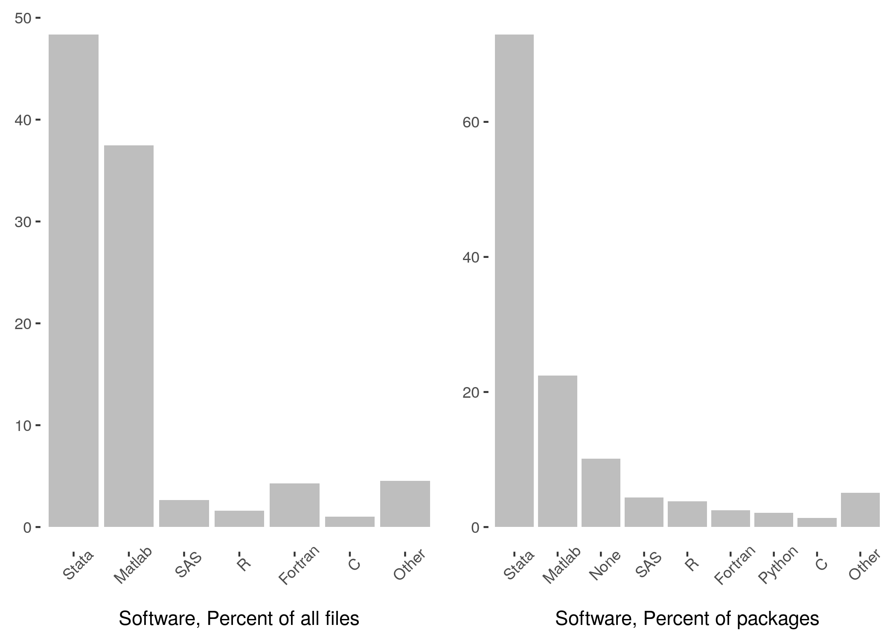
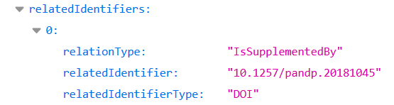

# Migrating historical AEA supplements - DRAFT

*Author: Lars Vilhuber, Cornell University, AEA Data Editor ([dataeditor@aeapubs.org](mailto:dataeditor@aeapubs.org))*

*Last updated: 2020-01-10*

Since July 16, 2019, the American Economic Association has used the **[AEA Data and Code Repository](https://www.openicpsr.org/openicpsr/aea)** at **[openICPSR](https://www.openicpsr.org/openicpsr/)** as the default archive for its supplements. This archive serves a dual purpose: to share data with the AEA Data Editor prior to being published, and as a publication outlet for supplements to articles in AEA journals.

At the time, the AEA also announced that it would  migrate the historical supplements, hitherto stored as ZIP files on the [AEA website](https://www.aeaweb.org/journals), into the AEA Data and Code Repository. 

On Oct 1, 2019, openICPSR had 867 deposits, which covered 94 deposits in the [DataLumos](https://www.datalumos.org/datalumos/search/studies) archive, 46 in the [AERA archive](https://www.openicpsr.org/openicpsr/search/aerajournals/studies), and 13 in the [PSID](https://www.openicpsr.org/openicpsr/search/psid/studies) archive. The **AEA Data and Code Repository** contained at the time 93 deposits, of which 5 were public, the others awaiting publication of the associated article. 

Between Oct 11 and Oct 13, 2019, the staff at openICPSR ingested 2,552 historical supplements, increasing the size of the openICPSR repository **by a factor of 3**, to 3,461. This was only the first part of the migration, as there are about 1,000 more archives that need to be migrated.

## Increased findability
The migrated archives are now available through the [openICPSR search interface](https://www.openicpsr.org/openicpsr/search/aea/studies), the [general ICPSR search interface](https://www.icpsr.umich.edu/icpsrweb/ICPSR/search/studies), as well as through a variety of federated search interfaces such as [Google Dataset Search](https://toolbox.google.com/datasetsearch/search). For instance, the current AER Editor's supplements can be found [here](https://www.openicpsr.org/openicpsr/search/aea/studies?start=0&ARCHIVE=aea&sort=score%20desc%2CTITLE_SORT%20asc&rows=25&q=esther%20duflo), [here](https://www.icpsr.umich.edu/icpsrweb/ICPSR/search/studies?start=0&ARCHIVE=ICPSR&PUBLISH_STATUS=PUBLISHED&sort=score%20desc%2CTITLE_SORT%20asc&rows=50&q=esther%20duflo) and [here](https://toolbox.google.com/datasetsearch/search?query=esther duflo), with increasing generality.

## Characteristics of AEA supplement data
We can describe this subset of the historical supplements in a variety of ways. 

### Time coverage
This is only a subset of all supplements, so what years are covered?
<table class="table table-striped table-hover table-condensed" style="width: auto !important; margin-left: auto; margin-right: auto;">
 <thead>
  <tr>
   <th style="text-align:right;"> year </th>
   <th style="text-align:right;"> count </th>
  </tr>
 </thead>
<tbody>
  <tr>
   <td style="text-align:right;"> 1999 </td>
   <td style="text-align:right;"> 2 </td>
  </tr>
  <tr>
   <td style="text-align:right;"> 2000 </td>
   <td style="text-align:right;"> 2 </td>
  </tr>
  <tr>
   <td style="text-align:right;"> 2004 </td>
   <td style="text-align:right;"> 24 </td>
  </tr>
  <tr>
   <td style="text-align:right;"> 2005 </td>
   <td style="text-align:right;"> 280 </td>
  </tr>
  <tr>
   <td style="text-align:right;"> 2006 </td>
   <td style="text-align:right;"> 7 </td>
  </tr>
  <tr>
   <td style="text-align:right;"> 2007 </td>
   <td style="text-align:right;"> 625 </td>
  </tr>
  <tr>
   <td style="text-align:right;"> 2008 </td>
   <td style="text-align:right;"> 1010 </td>
  </tr>
  <tr>
   <td style="text-align:right;"> 2009 </td>
   <td style="text-align:right;"> 3918 </td>
  </tr>
  <tr>
   <td style="text-align:right;"> 2010 </td>
   <td style="text-align:right;"> 6063 </td>
  </tr>
  <tr>
   <td style="text-align:right;"> 2011 </td>
   <td style="text-align:right;"> 6198 </td>
  </tr>
  <tr>
   <td style="text-align:right;"> 2012 </td>
   <td style="text-align:right;"> 7394 </td>
  </tr>
  <tr>
   <td style="text-align:right;"> 2013 </td>
   <td style="text-align:right;"> 6923 </td>
  </tr>
  <tr>
   <td style="text-align:right;"> 2014 </td>
   <td style="text-align:right;"> 11813 </td>
  </tr>
  <tr>
   <td style="text-align:right;"> 2015 </td>
   <td style="text-align:right;"> 7511 </td>
  </tr>
  <tr>
   <td style="text-align:right;"> 2016 </td>
   <td style="text-align:right;"> 10037 </td>
  </tr>
  <tr>
   <td style="text-align:right;"> 2017 </td>
   <td style="text-align:right;"> 11323 </td>
  </tr>
  <tr>
   <td style="text-align:right;"> 2018 </td>
   <td style="text-align:right;"> 13574 </td>
  </tr>
  <tr>
   <td style="text-align:right;"> 2019 </td>
   <td style="text-align:right;"> 6147 </td>
  </tr>
  <tr>
   <td style="text-align:right;"> NA </td>
   <td style="text-align:right;"> 1865 </td>
  </tr>
</tbody>
</table>

### Number of files per supplement and size of supplement
<!--html_preserve-->

<script type="application/json" data-for="htmlwidget-554c8588caeb06594758">{"x":{"filter":"none","autoHideNavigation":true,"data":[["1","2","3","4","5","6","7","8","9","10","11","12","13","14","15","16","17","18","19","20","21","22","23","24","25","26","27","28","29","30","31","32","33","34","35","36","37","38","39","40","41","42","43","44","45","46","47","48","49","50","51","52","53","54","55","56","57","58","59","60","61","62","63","64","65","66","67","68","69","70","71","72","73","74","75","76","77","78","79","80","81","82","83","84","85","86","87","88","89","90","91","92","93","94","95","96","97","98","99","100","101","102","103","104","105","106","107","108","109","110","111","112","113","114","115","116","117","118","119","120","121","122","123","124","125","126","127","128","129","130","131","132","133","134","135","136","137","138","139","140","141","142","143","144","145","146","147","148","149","150","151","152","153","154","155","156","157","158","159","160","161","162","163","164","165","166","167","168","169","170","171","172","173","174","175","176","177","178","179","180","181","182","183","184","185","186","187","188","189","190","191","192","193","194","195","196","197","198","199","200","201","202","203","204","205","206","207","208","209","210","211","212","213","214","215","216","217","218","219","220","221","222","223","224","225","226","227","228","229","230","231","232","233","234","235","236","237","238","239","240","241","242","243","244","245","246","247","248","249","250","251","252","253","254","255","256","257","258","259","260","261","262","263","264","265","266","267","268","269","270","271","272","273","274","275","276","277","278","279","280","281","282","283","284","285","286","287","288","289","290","291","292","293","294","295","296","297","298","299","300","301","302","303","304","305","306","307","308","309","310","311","312","313","314","315","316","317","318","319","320","321","322","323","324","325","326","327","328","329","330","331","332","333","334","335","336","337","338","339","340","341","342","343","344","345","346","347","348","349","350","351","352","353","354","355","356","357","358","359","360","361","362","363","364","365","366","367","368","369","370","371","372","373","374","375","376","377","378","379","380","381","382","383","384","385","386","387","388","389","390","391","392","393","394","395","396","397","398","399","400","401","402","403","404","405","406","407","408","409","410","411","412","413","414","415","416","417","418","419","420","421","422","423","424","425","426","427","428","429","430","431","432","433","434","435","436","437","438","439","440","441","442","443","444","445","446","447","448","449","450","451","452","453","454","455","456","457","458","459","460","461","462","463","464","465","466","467","468","469","470","471","472","473","474","475","476","477","478","479","480","481","482","483","484","485","486","487","488","489","490","491","492","493","494","495","496","497","498","499","500","501","502","503","504","505","506","507","508","509","510","511","512","513","514","515","516","517","518","519","520","521","522","523","524","525","526","527","528","529","530","531","532","533","534","535","536","537","538","539","540","541","542","543","544","545","546","547","548","549","550","551","552","553","554","555","556","557","558","559","560","561","562","563","564","565","566","567","568","569","570","571","572","573","574","575","576","577","578","579","580","581","582","583","584","585","586","587","588","589","590","591","592","593","594","595","596","597","598","599","600","601","602","603","604","605","606","607","608","609","610","611","612","613","614","615","616","617","618","619","620","621","622","623","624","625","626","627","628","629","630","631","632","633","634","635","636","637","638","639","640","641","642","643","644","645","646","647","648","649","650","651","652","653","654","655","656","657","658","659","660","661","662","663","664","665","666","667","668","669","670","671","672","673","674","675","676","677","678","679","680","681","682","683","684","685","686","687","688","689","690","691","692","693","694","695","696","697","698","699","700","701","702","703","704","705","706","707","708","709","710","711","712","713","714","715","716","717","718","719","720","721","722","723","724","725","726","727","728","729","730","731","732","733","734","735","736","737","738","739","740","741","742","743","744","745","746","747","748","749","750","751","752","753","754","755","756","757","758","759","760","761","762","763","764","765","766","767","768","769","770","771","772","773","774","775","776","777","778","779","780","781","782","783","784","785","786","787","788","789","790","791","792","793","794","795","796","797","798","799","800","801","802","803","804","805","806","807","808","809","810","811","812","813","814","815","816","817","818","819","820","821","822","823","824","825","826","827","828","829","830","831","832","833","834","835","836","837","838","839","840","841","842","843","844","845","846","847","848","849","850","851","852","853","854","855","856","857","858","859","860","861","862","863","864","865","866","867","868","869","870","871","872","873","874","875","876","877","878","879","880","881","882","883","884","885","886","887","888","889","890","891","892","893","894","895","896","897","898","899","900","901","902","903","904","905","906","907","908","909","910","911","912","913","914","915","916","917","918","919","920","921","922","923","924","925","926","927","928","929","930","931","932","933","934","935","936","937","938","939","940","941","942","943","944","945","946","947","948","949","950","951","952","953","954","955","956","957","958","959","960","961","962","963","964","965","966","967","968","969","970","971","972","973","974","975","976","977","978","979","980","981","982","983","984","985","986","987","988","989","990","991","992","993","994","995","996","997","998","999","1000","1001","1002","1003","1004","1005","1006","1007","1008","1009","1010","1011","1012","1013","1014","1015","1016","1017","1018","1019","1020","1021","1022","1023","1024","1025","1026","1027","1028","1029","1030","1031","1032","1033","1034","1035","1036","1037","1038","1039","1040","1041","1042","1043","1044","1045","1046","1047","1048","1049","1050","1051","1052","1053","1054","1055","1056","1057","1058","1059","1060","1061","1062","1063","1064","1065","1066","1067","1068","1069","1070","1071","1072","1073","1074","1075","1076","1077","1078","1079","1080","1081","1082","1083","1084","1085","1086","1087","1088","1089","1090","1091","1092","1093","1094","1095","1096","1097","1098","1099","1100","1101","1102","1103","1104","1105","1106","1107","1108","1109","1110","1111","1112","1113","1114","1115","1116","1117","1118","1119","1120","1121","1122","1123","1124","1125","1126","1127","1128","1129","1130","1131","1132","1133","1134","1135","1136","1137","1138","1139","1140","1141","1142","1143","1144","1145","1146","1147","1148","1149","1150","1151","1152","1153","1154","1155","1156","1157","1158","1159","1160","1161","1162","1163","1164","1165","1166","1167","1168","1169","1170","1171","1172","1173","1174","1175","1176","1177","1178","1179","1180","1181","1182","1183","1184","1185","1186","1187","1188","1189","1190","1191","1192","1193","1194","1195","1196","1197","1198","1199","1200","1201","1202","1203","1204","1205","1206","1207","1208","1209","1210","1211","1212","1213","1214","1215","1216","1217","1218","1219","1220","1221","1222","1223","1224","1225","1226","1227","1228","1229","1230","1231","1232","1233","1234","1235","1236","1237","1238","1239","1240","1241","1242","1243","1244","1245","1246","1247","1248","1249","1250","1251","1252","1253","1254","1255","1256","1257","1258","1259","1260","1261","1262","1263","1264","1265","1266","1267","1268","1269","1270","1271","1272","1273","1274","1275","1276","1277","1278","1279","1280","1281","1282","1283","1284","1285","1286","1287","1288","1289","1290","1291","1292","1293","1294","1295","1296","1297","1298","1299","1300","1301","1302","1303","1304","1305","1306","1307","1308","1309","1310","1311","1312","1313","1314","1315","1316","1317","1318","1319","1320","1321","1322","1323","1324","1325","1326","1327","1328","1329","1330","1331","1332","1333","1334","1335","1336","1337","1338","1339","1340","1341","1342","1343","1344","1345","1346","1347","1348","1349","1350","1351","1352","1353","1354","1355","1356","1357","1358","1359","1360","1361","1362","1363","1364","1365","1366","1367","1368","1369","1370","1371","1372","1373","1374","1375","1376","1377","1378","1379","1380","1381","1382","1383","1384","1385","1386","1387","1388","1389","1390","1391","1392","1393","1394","1395","1396","1397","1398","1399","1400","1401","1402","1403","1404","1405","1406","1407","1408","1409","1410","1411","1412","1413","1414","1415","1416","1417","1418","1419","1420","1421","1422","1423","1424","1425","1426","1427","1428","1429","1430","1431","1432","1433","1434","1435","1436","1437","1438","1439","1440","1441","1442","1443","1444","1445","1446","1447","1448","1449","1450","1451","1452","1453","1454","1455","1456","1457","1458","1459","1460","1461","1462","1463","1464","1465","1466","1467","1468","1469","1470","1471","1472","1473","1474","1475","1476","1477","1478","1479","1480","1481","1482","1483","1484","1485","1486","1487","1488","1489","1490","1491","1492","1493","1494","1495","1496","1497","1498","1499","1500","1501","1502","1503","1504","1505","1506","1507","1508","1509","1510","1511","1512","1513","1514","1515","1516","1517","1518","1519","1520","1521","1522","1523","1524","1525","1526","1527","1528","1529","1530","1531","1532","1533","1534","1535","1536","1537","1538","1539","1540","1541","1542","1543","1544","1545","1546","1547","1548","1549","1550","1551","1552","1553","1554","1555","1556","1557","1558","1559","1560","1561","1562","1563","1564","1565","1566","1567","1568","1569","1570","1571","1572","1573","1574","1575","1576","1577","1578","1579","1580","1581","1582","1583","1584","1585","1586","1587","1588","1589","1590","1591","1592","1593","1594","1595","1596","1597","1598","1599","1600","1601","1602","1603","1604","1605","1606","1607","1608","1609","1610","1611","1612","1613","1614","1615","1616","1617","1618","1619","1620","1621","1622","1623","1624","1625","1626","1627","1628","1629","1630","1631","1632","1633","1634","1635","1636","1637","1638","1639","1640","1641","1642","1643","1644","1645","1646","1647","1648","1649","1650","1651","1652","1653","1654","1655","1656","1657","1658","1659","1660","1661","1662","1663","1664","1665","1666","1667","1668","1669","1670","1671","1672","1673","1674","1675","1676","1677","1678","1679","1680","1681","1682","1683","1684","1685","1686","1687","1688","1689","1690","1691","1692","1693","1694","1695","1696","1697","1698","1699","1700","1701","1702","1703","1704","1705","1706","1707","1708","1709","1710","1711","1712","1713","1714","1715","1716","1717","1718","1719","1720","1721","1722","1723","1724","1725","1726","1727","1728","1729","1730","1731","1732","1733","1734","1735","1736","1737","1738","1739","1740","1741","1742","1743","1744","1745","1746","1747","1748","1749","1750","1751","1752","1753","1754","1755","1756","1757","1758","1759","1760","1761","1762","1763","1764","1765","1766","1767","1768","1769","1770","1771","1772","1773","1774","1775","1776","1777","1778","1779","1780","1781","1782","1783","1784","1785","1786","1787","1788","1789","1790","1791","1792","1793","1794","1795","1796","1797","1798","1799","1800","1801","1802","1803","1804","1805","1806","1807","1808","1809","1810","1811","1812","1813","1814","1815","1816","1817","1818","1819","1820","1821","1822","1823","1824","1825","1826","1827","1828","1829","1830","1831","1832","1833","1834","1835","1836","1837","1838","1839","1840","1841","1842","1843","1844","1845","1846","1847","1848","1849","1850","1851","1852","1853","1854","1855","1856","1857","1858","1859","1860","1861","1862","1863","1864","1865","1866","1867","1868","1869","1870","1871","1872","1873","1874","1875","1876","1877","1878","1879","1880","1881","1882","1883","1884","1885","1886","1887","1888","1889","1890","1891","1892","1893","1894","1895","1896","1897","1898","1899","1900","1901","1902","1903","1904","1905","1906","1907","1908","1909","1910","1911","1912","1913","1914","1915","1916","1917","1918","1919","1920","1921","1922","1923","1924","1925","1926","1927","1928","1929","1930","1931","1932","1933","1934","1935","1936","1937","1938","1939","1940","1941","1942","1943","1944","1945","1946","1947","1948","1949","1950","1951","1952","1953","1954","1955","1956","1957","1958","1959","1960","1961","1962","1963","1964","1965","1966","1967","1968","1969","1970","1971","1972","1973","1974","1975","1976","1977","1978","1979","1980","1981","1982","1983","1984","1985","1986","1987","1988","1989","1990","1991","1992","1993","1994","1995","1996","1997","1998","1999","2000","2001","2002","2003","2004","2005","2006","2007","2008","2009","2010","2011","2012","2013","2014","2015","2016","2017","2018","2019","2020","2021","2022","2023","2024","2025","2026","2027","2028","2029","2030","2031","2032","2033","2034","2035","2036","2037","2038","2039","2040","2041","2042","2043","2044","2045","2046","2047","2048","2049","2050","2051","2052","2053","2054","2055","2056","2057","2058","2059","2060","2061","2062","2063","2064","2065","2066","2067","2068","2069","2070","2071","2072","2073","2074","2075","2076","2077","2078","2079","2080","2081","2082","2083","2084","2085","2086","2087","2088","2089","2090","2091","2092","2093","2094","2095","2096","2097","2098","2099","2100","2101","2102","2103","2104","2105","2106","2107","2108","2109","2110","2111","2112","2113","2114","2115","2116","2117","2118","2119","2120","2121","2122","2123","2124","2125","2126","2127","2128","2129","2130","2131","2132","2133","2134","2135","2136","2137","2138","2139","2140","2141","2142","2143","2144","2145","2146","2147","2148","2149","2150","2151","2152","2153","2154","2155","2156","2157","2158","2159","2160","2161","2162","2163","2164","2165","2166","2167","2168","2169","2170","2171","2172","2173","2174","2175","2176","2177","2178","2179","2180","2181","2182","2183","2184","2185","2186","2187","2188","2189","2190","2191","2192","2193","2194","2195","2196","2197","2198","2199","2200","2201","2202","2203","2204","2205","2206","2207","2208","2209","2210","2211","2212","2213","2214","2215","2216","2217","2218","2219","2220","2221","2222","2223","2224","2225","2226","2227","2228","2229","2230","2231","2232","2233","2234","2235","2236","2237","2238","2239","2240","2241","2242","2243","2244","2245","2246","2247","2248","2249","2250","2251","2252","2253","2254","2255","2256","2257","2258","2259","2260","2261","2262","2263","2264","2265","2266","2267","2268","2269","2270","2271","2272","2273","2274","2275","2276","2277","2278","2279","2280","2281","2282","2283","2284","2285","2286","2287","2288","2289","2290","2291","2292","2293","2294","2295","2296","2297","2298","2299","2300","2301","2302","2303","2304","2305","2306","2307","2308","2309","2310","2311","2312","2313","2314","2315","2316","2317","2318","2319","2320","2321","2322","2323","2324","2325","2326","2327","2328","2329","2330","2331","2332","2333","2334","2335","2336","2337","2338","2339","2340","2341","2342","2343","2344","2345","2346","2347","2348","2349","2350","2351","2352","2353","2354","2355","2356","2357","2358","2359","2360","2361","2362","2363","2364","2365","2366","2367","2368","2369","2370","2371","2372","2373","2374","2375","2376","2377","2378","2379","2380","2381","2382","2383","2384","2385","2386","2387","2388","2389","2390","2391","2392","2393","2394","2395","2396","2397","2398","2399","2400","2401","2402","2403","2404","2405","2406","2407","2408","2409","2410","2411","2412","2413","2414","2415","2416","2417","2418","2419","2420","2421","2422","2423","2424","2425","2426","2427","2428","2429","2430","2431","2432","2433","2434","2435","2436","2437","2438","2439","2440","2441","2442","2443","2444","2445","2446","2447","2448","2449","2450","2451","2452","2453","2454","2455","2456","2457","2458","2459","2460","2461","2462","2463","2464","2465","2466","2467","2468","2469","2470","2471","2472","2473","2474","2475","2476","2477","2478","2479","2480","2481","2482","2483","2484","2485","2486","2487","2488","2489","2490","2491","2492","2493","2494","2495","2496","2497","2498","2499","2500","2501","2502","2503","2504","2505","2506","2507","2508","2509","2510","2511","2512","2513","2514","2515","2516","2517","2518","2519","2520","2521","2522","2523","2524","2525","2526","2527","2528","2529","2530","2531","2532","2533","2534","2535","2536","2537","2538","2539","2540","2541","2542","2543","2544","2545","2546","2547","2548","2549","2550","2551","2552","2553","2554","2555","2556","2557","2558","2559","2560"],["10.1257/pandp.20181045","10.1257/pol.20150168","10.1257/app.20170080","10.1257/aer.20131496","10.1257/app.20160510","10.1257/app.6.3.206","10.1257/aer.102.2.994","10.1257/aer.20121662","10.1257/mic.20130164","10.1257/aer.20141374","10.1257/aer.p20151052","10.1257/pandp.20181107","10.1257/aer.20120642","10.1257/app.20170300","10.1257/app.20170223","10.1257/jep.32.3.239","10.1257/mac.20170390","10.1257/aer.20172020","10.1257/pandp.20181113","10.1257/pol.20130057","10.1257/app.3.4.152","10.1257/aer.97.5.2026","10.1257/aer.104.5.387","10.1257/pol.6.3.1","10.1257/pol.2.4.58","10.1257/pol.6.3.207","10.1257/app.20140095","10.1257/aer.104.11.3600","10.1257/aer.20131026","10.1257/jep.30.2.179","10.1257/app.5.4.144","10.1257/pol.20140048","10.1257/pol.20130248","10.1257/pol.3.4.77","10.1257/aer.20120555","10.1257/aer.20141708","10.1257/aer.20131296","10.1257/aer.20130821","10.1257/pol.20160618","10.1257/pol.20140258","10.1257/aer.20131377","10.1257/aer.104.11.3668","10.1257/app.2.4.128","10.1257/pol.4.4.253","10.1257/aer.20130375","10.1257/aer.103.5.1664","10.1257/aer.103.5.1960","10.1257/aer.98.5.2221","10.1257/app.20120387","10.1257/app.5.2.151","10.1257/mac.20150117","10.1257/aer.104.11.3529","10.1257/app.3.3.88","10.1257/pol.20140483","10.1257/jep.32.2.47","10.1257/pol.3.2.41","10.1257/aer.20161385","10.1257/pol.20130361","10.1257/aer.102.1.613","10.1257/pol.1.2.190","10.1257/pol.5.2.313","10.1257/aer.20160696","10.1257/app.20130169","10.1257/pol.3.4.25","10.1257/pol.20130081","10.1257/pol.20130370","10.1257/jep.31.1.141","10.1257/pol.5.2.188","10.1257/app.20170068","10.1257/aer.20160137","10.1257/pol.20160039","10.1257/pol.20170490","10.1257/app.20150044","10.1257/app.3.1.189","10.1257/app.2.4.236","10.1257/aer.20141745","10.1257/aer.102.7.3516","10.1257/aer.98.5.1864","10.1257/aer.100.1.98","10.1257/aer.104.10.3222","10.1257/aer.p20171128","10.1257/aer.20150508","10.1257/aer.103.7.2935","10.1257/aer.103.3.598","10.1257/aer.20150540","10.1257/aer.20170116","10.1257/aer.104.2.459","10.1257/aer.101.6.2687","10.1257/pol.20140344","10.1257/app.20170048","10.1257/aer.99.5.1714","10.1257/app.20130126","10.1257/aer.101.4.1601","10.1257/pol.20150321","10.1257/aer.20140015","10.1257/pol.20120219","10.1257/pol.6.3.120","10.1257/aer.20120389","10.1257/pol.1.2.53","10.1257/pol.5.2.148","10.1257/aer.20160131","10.1257/aer.p20151019","10.1257/app.5.3.189","10.1257/aer.104.10.3297","10.1257/aer.101.6.2309","10.1257/app.6.4.1","10.1257/pandp.20181046","10.1257/pandp.20181111","10.1257/mic.5.2.33","10.1257/aer.101.7.3019","10.1257/pol.20160395","10.1257/app.4.2.62","10.1257/aer.103.4.1289","10.1257/aer.102.4.1378","10.1257/app.20150059","10.1257/pol.20170504","10.1257/mac.20120257","10.1257/app.5.4.61","10.1257/pandp.20181049","10.1257/app.6.1.190","10.1257/aer.99.3.667","10.1257/pol.20140008","10.1257/mic.20130254","10.1257/app.6.3.133","10.1257/mac.4.4.1","10.1257/aer.97.5.2038","10.1257/pol.20130077","10.1257/app.4.3.167","10.1257/aer.97.5.1667","10.1257/aer.20141524","10.1257/app.5.1.65","10.1257/pol.4.1.224","10.1257/app.20160567","10.1257/app.20170249","10.1257/pol.20130271","10.1257/pol.20130315","10.1257/mac.3.2.189","10.1257/mac.20150097","10.1257/pol.2.3.90","10.1257/app.20150581","10.1257/app.5.4.165","10.1257/aer.20120599","10.1257/aer.104.5.381","10.1257/aer.20150154","10.1257/aer.20150243","10.1257/aer.20131455","10.1257/pol.20170014","10.1257/aer.20101557","10.1257/app.20140379","10.1257/aer.20150102","10.1257/aer.20170237","10.1257/mic.20140015","10.1257/aer.103.5.1977","10.1257/aer.p20161110","10.1257/mac.5.1.135","10.1257/aer.104.9.2698","10.1257/aer.104.9.2736","10.1257/pol.2.4.26","10.1257/jep.28.4.193","10.1257/app.4.4.194","10.1257/pol.4.1.58","10.1257/pol.5.4.78","10.1257/app.20130359","10.1257/app.1.2.128","10.1257/app.20140111","10.1257/aer.103.5.1892","10.1257/app.20160004","10.1257/aer.20161570","10.1257/aer.20141707","10.1257/mac.6.2.1","10.1257/aer.102.3.549","10.1257/aer.101.4.1410","10.1257/aer.20170416","10.1257/pol.20120179","10.1257/pol.20160035","10.1257/aer.104.10.3038","10.1257/app.20150314","10.1257/app.3.2.196","10.1257/pol.6.1.272","10.1257/aer.20161151","10.1257/aer.20151326","10.1257/aer.103.2.863","10.1257/pol.6.4.207","10.1257/aer.20150503","10.1257/app.6.2.195","10.1257/aer.p20171063","10.1257/app.3.1.152","10.1257/mac.20120103","10.1257/pol.20130134","10.1257/aer.103.2.831","10.1257/mic.5.3.157","10.1257/aer.20110572","10.1257/aer.20130397","10.1257/mac.20150074","10.1257/pol.20130139","10.1257/app.2.3.1","10.1257/pol.20160076","10.1257/mic.20160220","10.1257/pol.20160094","10.1257/aer.104.6.1777","10.1257/pol.5.4.107","10.1257/aer.p20161085","10.1257/mac.6.1.102","10.1257/mic.3.2.60","10.1257/aer.20161413","10.1257/aer.104.5.250","10.1257/pol.20150262","10.1257/pol.20160600","10.1257/aer.104.2.687","10.1257/aer.98.1.458","10.1257/mic.20170130","10.1257/pandp.20191063","10.1257/jep.30.2.53","10.1257/aer.20171218","10.1257/mac.20120155","10.1257/pol.20160570","10.1257/aer.101.6.2844","10.1257/mac.3.1.91","10.1257/pol.5.2.111","10.1257/jel.20160995","10.1257/aer.20141346","10.1257/aer.103.2.981","10.1257/app.20160089","10.1257/pol.6.4.135","10.1257/aer.20151551","10.1257/pol.20160319","10.1257/mac.2.2.31","10.1257/aer.104.7.2127","10.1257/pandp.20181098","10.1257/pol.6.2.164","10.1257/app.2.1.116","10.1257/pol.20150206","10.1257/aer.103.3.244","10.1257/mac.6.3.29","10.1257/pol.20140171","10.1257/aer.20161014","10.1257/pol.5.1.302","10.1257/pol.3.1.1","10.1257/app.3.2.1","10.1257/jep.28.2.99","10.1257/aer.20150774","10.1257/aer.20121110","10.1257/aer.20141127","10.1257/pol.20150320","10.1257/aer.102.1.428","10.1257/aer.20130479","10.1257/jep.30.2.79","10.1257/mac.5.2.1","10.1257/app.20150431","10.1257/app.20140073","10.1257/aer.101.5.1649","10.1257/aer.20151667","10.1257/app.2.1.165","10.1257/aer.20170413","10.1257/aer.101.4.1535","10.1257/app.20150043","10.1257/aer.20150020","10.1257/aer.104.5.245","10.1257/aer.20161488","10.1257/mic.20140145","10.1257/pol.20170019","10.1257/pol.20110309","10.1257/pol.6.3.63","10.1257/aer.20151047","10.1257/aer.20131706","10.1257/pol.4.4.41","10.1257/jep.29.3.99","10.1257/pol.20150511","10.1257/aer.20111559","10.1257/aer.p20171144","10.1257/aer.20150781","10.1257/aer.102.7.3731","10.1257/app.20130401","10.1257/jep.30.4.57","10.1257/app.4.3.138","10.1257/aer.101.4.1106","10.1257/pol.4.3.251","10.1257/aer.102.1.396","10.1257/pol.20150268","10.1257/aer.20120926","10.1257/pandp.20181101","10.1257/pol.20150131","10.1257/app.20130482","10.1257/app.1.1.49","10.1257/aer.99.3.864","10.1257/app.20160429","10.1257/aer.20140412","10.1257/aer.20151211","10.1257/mac.20150175","10.1257/aer.101.5.1775","10.1257/aer.102.4.1477","10.1257/app.4.4.1","10.1257/aer.97.5.1533","10.1257/pol.20150074","10.1257/aer.98.4.1517","10.1257/app.20170543","10.1257/aer.20171455","10.1257/aer.20170748","10.1257/aer.102.4.1414","10.1257/aer.101.5.1842","10.1257/pol.20150498","10.1257/aer.100.2.532","10.1257/app.3.3.244","10.1257/mac.6.1.70","10.1257/aer.100.4.1847","10.1257/aer.20141781","10.1257/aer.20160524","10.1257/aer.20141449","10.1257/aer.20161420","10.1257/aer.100.2.321","10.1257/pol.5.3.92","10.1257/aer.102.4.1206","10.1257/aer.104.8.2482","10.1257/aer.101.5.2157","10.1257/jep.32.1.179","10.1257/aer.20131578","10.1257/pol.20170499","10.1257/jep.31.1.117","10.1257/app.20140100","10.1257/aer.104.11.3701","10.1257/pol.20160248","10.1257/app.20140533","10.1257/pol.20130225","10.1257/aer.20120070","10.1257/aer.101.7.2923","10.1257/aer.p20151088","10.1257/pol.20170067","10.1257/aer.103.6.2265","10.1257/aer.20160698","10.1257/aer.102.5.2111","10.1257/pol.3.1.129","10.1257/app.20150023","10.1257/pol.20160573","10.1257/pol.20150378","10.1257/pandp.20181118","10.1257/aer.p20151113","10.1257/app.4.3.225","10.1257/app.20160267","10.1257/pol.5.2.1","10.1257/app.20120359","10.1257/aer.20121524","10.1257/pol.2.3.32","10.1257/aer.104.9.2763","10.1257/aer.20150592","10.1257/jep.27.1.197","10.1257/aer.100.3.984","10.1257/aer.20151398","10.1257/app.1.2.1","10.1257/app.2.4.150","10.1257/mic.20150343","10.1257/aer.104.9.2872","10.1257/mac.2.2.95","10.1257/app.20160232","10.1257/pol.6.3.178","10.1257/mac.20160405","10.1257/mac.20150253","10.1257/aer.p20151034","10.1257/aer.20160600","10.1257/pandp.20191089","10.1257/aer.102.4.1241","10.1257/aer.20141070","10.1257/mic.3.4.68","10.1257/pol.20120393","10.1257/aer.102.6.2700","10.1257/mac.20120197","10.1257/aer.20150343","10.1257/aer.20160186","10.1257/aer.20140205","10.1257/pol.2.1.177","10.1257/app.4.1.193","10.1257/pol.20130292","10.1257/pol.4.4.199","10.1257/aer.104.3.963","10.1257/pol.6.4.343","10.1257/aer.p20151042","10.1257/pol.20150237","10.1257/pol.1.1.229","10.1257/pol.20140211","10.1257/aer.20150528","10.1257/aer.102.5.2237","10.1257/app.20140350","10.1257/pol.3.2.169","10.1257/app.20150548","10.1257/jep.28.2.119","10.1257/aer.20160863","10.1257/aer.20150993","10.1257/aer.103.4.1109","10.1257/aer.20121607","10.1257/pol.6.2.258","10.1257/pol.20150478","10.1257/aer.20141751","10.1257/app.3.1.65","10.1257/pandp.20181048","10.1257/aer.20110457","10.1257/pol.20140296","10.1257/aer.101.2.749","10.1257/pol.4.4.169","10.1257/mac.4.3.128","10.1257/app.5.2.179","10.1257/pol.20130025","10.1257/aer.20171112","10.1257/pol.5.2.53","10.1257/app.4.1.85","10.1257/aer.103.1.472","10.1257/mic.20150178","10.1257/aer.104.4.1288","10.1257/aer.20140389","10.1257/0002828054825484","10.1257/aer.20120525","10.1257/pol.5.4.167","10.1257/aer.102.7.3406","10.1257/aer.20131002","10.1257/aer.104.5.136","10.1257/pol.6.4.302","10.1257/mic.6.4.407","10.1257/mac.20120222","10.1257/aer.104.5.501","10.1257/pandp.20181072","10.1257/aer.104.12.3991","10.1257/mac.4.1.226","10.1257/aer.p20151024","10.1257/aer.103.3.570","10.1257/mac.2.4.195","10.1257/app.2.4.42","10.1257/aer.101.7.2980","10.1257/pol.5.3.160","10.1257/aer.103.6.2169","10.1257/aer.100.1.364","10.1257/aer.102.2.965","10.1257/aer.p20151056","10.1257/app.1.4.1","10.1257/pol.5.3.189","10.1257/aer.99.1.146","10.1257/aer.101.3.88","10.1257/aer.104.3.931","10.1257/aer.20141122","10.1257/jep.29.2.81","10.1257/aer.102.5.2018","10.1257/jep.30.2.3","10.1257/app.3.4.186","10.1257/app.5.4.92","10.1257/aer.98.5.2032","10.1257/mic.5.4.244","10.1257/aer.p20151109","10.1257/aeri.20180248","10.1257/aer.99.5.1831","10.1257/pol.4.2.182","10.1257/pol.20170214","10.1257/aer.20151604","10.1257/mic.6.4.106","10.1257/aer.102.2.643","10.1257/aer.102.6.2509","10.1257/aer.100.1.247","10.1257/aer.p20171086","10.1257/aer.98.3.843","10.1257/app.20130346","10.1257/aer.20150897","10.1257/mic.20160124","10.1257/aer.101.5.2205","10.1257/app.20140352","10.1257/aer.20170007","10.1257/pol.20150165","10.1257/aer.20150956","10.1257/aer.104.4.1446","10.1257/mac.20150029","10.1257/aer.102.5.1832","10.1257/aer.103.5.1697","10.1257/aer.104.5.291","10.1257/mac.4.2.218","10.1257/aer.20120427","10.1257/aer.20080841","10.1257/aer.p20161111","10.1257/aer.101.5.1933","10.1257/app.20140135","10.1257/0002828053828671","10.1257/aer.104.7.2238","10.1257/app.20150405","10.1257/aer.p20171028","10.1257/aer.99.5.2012","10.1257/app.2.3.205","10.1257/aer.20171330","10.1257/aer.20140150","10.1257/aer.p20171142","10.1257/pol.20120262","10.1257/pol.20150578","10.1257/aer.99.3.1006","10.1257/aer.102.1.364","10.1257/app.20130267","10.1257/aer.98.5.2242","10.1257/pol.20150066","10.1257/aer.20151606","10.1257/mac.20160250","10.1257/aer.20151052","10.1257/pol.20140188","10.1257/app.20150509","10.1257/aer.104.5.122","10.1257/pol.20150100","10.1257/mic.20160218","10.1257/pandp.20181092","10.1257/aer.102.5.2327","10.1257/pol.20160384","10.1257/app.2.4.1","10.1257/app.1.3.111","10.1257/aer.103.6.2437","10.1257/aer.104.8.2456","10.1257/mac.20160120","10.1257/app.6.3.1","10.1257/aer.103.2.1071","10.1257/mac.2.1.169","10.1257/aer.20121036","10.1257/pandp.20181075","10.1257/aer.p20151124","10.1257/pandp.20181106","10.1257/pol.20130009","10.1257/pandp.20181013","10.1257/mac.20160307","10.1257/aer.20110236","10.1257/jep.30.3.3","10.1257/mac.20130267","10.1257/app.4.1.49","10.1257/aer.20160542","10.1257/aer.103.3.251","10.1257/pol.20170045","10.1257/aer.98.4.1605","10.1257/aer.99.1.486","10.1257/app.5.2.200","10.1257/aer.p20151031","10.1257/mic.5.1.100","10.1257/aer.20151404","10.1257/mac.20130234","10.1257/aer.20121242","10.1257/pandp.20191029","10.1257/pol.20150374","10.1257/app.20130489","10.1257/aer.20131564","10.1257/app.20140404","10.1257/aer.20130758","10.1257/aer.102.4.1508","10.1257/aer.98.4.1370","10.1257/aer.97.5.2005","10.1257/aer.98.4.1578","10.1257/pol.6.4.239","10.1257/pol.20150525","10.1257/mac.1.2.189","10.1257/aer.103.7.3001","10.1257/mac.20160118","10.1257/pol.20120337","10.1257/aer.103.6.2633","10.1257/jel.20171300","10.1257/app.20160066","10.1257/mic.1.1.237","10.1257/app.3.2.119","10.1257/aer.20120737","10.1257/mic.3.3.1","10.1257/mac.20130306","10.1257/aer.20151260","10.1257/mic.20170280","10.1257/app.5.3.91","10.1257/aer.102.5.1927","10.1257/aer.20161329","10.1257/mac.20160220","10.1257/mac.6.4.1","10.1257/mac.5.4.179","10.1257/app.20150447","10.1257/pandp.20181085","10.1257/app.20120337","10.1257/pandp.20181018","10.1257/pol.5.4.1","10.1257/app.20170497","10.1257/mac.20130231","10.1257/aer.20161343","10.1257/pol.1.2.72","10.1257/pol.20130268","10.1257/aer.20141280","10.1257/aer.p20171087","10.1257/pol.3.2.130","10.1257/app.2.3.60","10.1257/app.1.4.109","10.1257/pol.6.4.174","10.1257/aer.99.5.1979","10.1257/0002828054201323","10.1257/aer.p20171132","10.1257/app.20170411","10.1257/aer.101.7.3078","10.1257/aer.99.5.1740","10.1257/aer.104.11.3752","10.1257/mic.20120085","10.1257/aer.98.4.1397","10.1257/mic.20150070","10.1257/jel.20151248","10.1257/aer.20131061","10.1257/pandp.20191095","10.1257/aer.20170619","10.1257/pol.20140062","10.1257/pol.20140087","10.1257/aer.98.5.1887","10.1257/jep.32.3.167","10.1257/aer.20141123","10.1257/app.20150390","10.1257/aer.20130623","10.1257/pol.20160060","10.1257/app.6.1.220","10.1257/aer.20131311","10.1257/mic.20160252","10.1257/mac.20160244","10.1257/pol.5.1.146","10.1257/aer.20131118","10.1257/app.20150554","10.1257/pandp.20181037","10.1257/app.6.2.32","10.1257/aer.99.5.2120","10.1257/aer.104.6.1630","10.1257/aer.102.6.2381","10.1257/mac.1.2.29","10.1257/pol.20140391","10.1257/app.20150310","10.1257/app.5.2.29","10.1257/jep.30.2.29","10.1257/app.20160140","10.1257/aer.20141335","10.1257/app.20150512","10.1257/aer.103.5.1830","10.1257/aer.20141096","10.1257/aer.99.4.1356","10.1257/mac.20160353","10.1257/mic.20150168","10.1257/aer.104.3.753","10.1257/pandp.20181099","10.1257/pol.20140093","10.1257/pol.2.1.1","10.1257/aer.20180044","10.1257/aer.103.1.277","10.1257/aer.p20151032","10.1257/aer.20150630","10.1257/app.4.4.32","10.1257/aer.p20151076","10.1257/pandp.20181021","10.1257/aer.20150487","10.1257/jep.28.4.49","10.1257/aer.98.1.237","10.1257/mac.6.1.162","10.1257/app.5.1.208","10.1257/aer.100.3.1195","10.1257/aer.99.5.2149","10.1257/aer.20161923","10.1257/aer.103.7.2643","10.1257/app.3.1.91","10.1257/mic.4.1.1","10.1257/aer.20131273","10.1257/app.20170286","10.1257/jel.52.4.993","10.1257/aer.101.3.582","10.1257/pol.4.3.118","10.1257/aer.20150742","10.1257/app.3.4.1","10.1257/aer.99.4.1278","10.1257/aer.20150988","10.1257/aer.101.4.1467","10.1257/app.20150112","10.1257/mac.3.4.143","10.1257/aer.104.6.1551","10.1257/aer.20151362","10.1257/aer.20170627","10.1257/aer.103.7.2683","10.1257/mic.2.3.186","10.1257/aer.101.5.1676","10.1257/jep.28.4.77","10.1257/jep.33.2.3","10.1257/aer.98.1.426","10.1257/aer.20121660","10.1257/aer.20121416","10.1257/aer.101.1.263","10.1257/pandp.20191085","10.1257/aer.104.5.127","10.1257/pol.3.3.113","10.1257/jep.33.2.141","10.1257/mac.20130108","10.1257/aer.104.5.394","10.1257/aer.104.4.1244","10.1257/app.2.1.33","10.1257/mac.4.1.22","10.1257/aer.20151057","10.1257/aer.100.5.2060","10.1257/aer.20131193","10.1257/app.20160618","10.1257/aer.104.5.406","10.1257/aer.20140832","10.1257/app.5.4.111","10.1257/mac.5.1.81","10.1257/aer.104.3.868","10.1257/aer.104.4.1120","10.1257/pol.20150297","10.1257/mac.20150293","10.1257/pandp.20181019","10.1257/mac.20160213","10.1257/pandp.20191054","10.1257/pol.20120137","10.1257/mac.20160298","10.1257/pol.4.4.68","10.1257/mac.6.3.153","10.1257/aer.99.1.509","10.1257/pol.20150362","10.1257/app.4.3.90","10.1257/pol.20140383","10.1257/jep.28.2.153","10.1257/aer.p20151103","10.1257/aer.103.2.897","10.1257/app.20130480","10.1257/aer.20140044","10.1257/mac.20140097","10.1257/aer.99.5.2209","10.1257/app.3.2.67","10.1257/aer.101.7.3456","10.1257/aer.20141702","10.1257/aer.104.6.1735","10.1257/app.2.3.256","10.1257/aer.102.1.305","10.1257/aer.20160144","10.1257/aer.99.5.1808","10.1257/aer.100.1.35","10.1257/app.20150027","10.1257/mac.6.4.84","10.1257/aer.100.5.2157","10.1257/app.20130272","10.1257/app.6.4.142","10.1257/mic.20160125","10.1257/app.2.2.95","10.1257/aer.101.4.1238","10.1257/app.5.2.86","10.1257/pol.20130290","10.1257/app.4.3.116","10.1257/app.20140201","10.1257/aer.20130853","10.1257/mic.5.1.1","10.1257/app.3.3.221","10.1257/jep.31.4.73","10.1257/aer.20141301","10.1257/jep.33.2.89","10.1257/0002828053828509","10.1257/pol.20160355","10.1257/aer.102.1.524","10.1257/aer.20141419","10.1257/aer.20131461","10.1257/pol.20150426","10.1257/pandp.20191008","10.1257/jep.31.1.93","10.1257/mac.6.4.39","10.1257/aer.99.5.2227","10.1257/aer.99.1.324","10.1257/aer.20160284","10.1257/pol.20140065","10.1257/aer.100.1.590","10.1257/aer.101.6.2391","10.1257/aer.104.2.422","10.1257/pol.2.3.134","10.1257/mac.20140171","10.1257/mac.20140362","10.1257/aer.20140529","10.1257/pol.4.2.46","10.1257/aer.20171019","10.1257/pol.20130426","10.1257/aer.102.1.337","10.1257/aer.102.1.556","10.1257/aer.20151086","10.1257/0002828053828455","10.1257/pol.20160465","10.1257/app.3.3.29","10.1257/pol.20120245","10.1257/aer.20180041","10.1257/aer.20151485","10.1257/app.20130170","10.1257/mac.20140002","10.1257/pol.6.1.92","10.1257/aer.102.7.3749","10.1257/pandp.20181121","10.1257/aer.20150474","10.1257/aer.20140913","10.1257/pol.2.4.83","10.1257/app.5.3.41","10.1257/aer.20131031","10.1257/pol.20120017","10.1257/mac.20140337","10.1257/aer.101.7.3221","10.1257/app.2.4.213","10.1257/app.6.2.49","10.1257/mac.4.4.56","10.1257/pandp.20191013","10.1257/mic.2.1.39","10.1257/aer.99.1.350","10.1257/aer.98.3.1040","10.1257/aer.104.11.3635","10.1257/aer.p20161113","10.1257/mac.20150147","10.1257/app.1.3.82","10.1257/jep.30.4.3","10.1257/aer.103.1.107","10.1257/pol.6.1.137","10.1257/pol.5.1.206","10.1257/aer.20130903","10.1257/mic.6.2.93","10.1257/pol.3.3.62","10.1257/aer.100.5.2340","10.1257/app.2.4.76","10.1257/app.20140405","10.1257/mac.3.3.29","10.1257/aer.104.8.2320","10.1257/pol.6.4.71","10.1257/aer.p20161121","10.1257/mac.20160211","10.1257/aer.100.4.1432","10.1257/app.2.2.72","10.1257/aer.104.7.2152","10.1257/aer.20140890","10.1257/pol.6.2.1","10.1257/mac.20130041","10.1257/aer.20130675","10.1257/pol.20150161","10.1257/app.4.4.165","10.1257/aer.20151317","10.1257/mac.1.2.88","10.1257/app.2.3.129","10.1257/pandp.20181083","10.1257/aer.98.1.311","10.1257/aer.p20161042","10.1257/app.1.4.34","10.1257/pol.3.1.91","10.1257/mic.20160304","10.1257/aer.p20151118","10.1257/app.4.1.212","10.1257/pol.20150388","10.1257/app.20140010","10.1257/pol.20150249","10.1257/aer.98.3.1009","10.1257/aer.97.5.1774","10.1257/aer.20160763","10.1257/app.2.2.1","10.1257/mic.5.4.163","10.1257/app.6.1.133","10.1257/aer.104.7.1909","10.1257/aer.102.2.1093","10.1257/app.1.4.140","10.1257/aer.20150313","10.1257/jep.29.1.89","10.1257/aer.20121637","10.1257/aer.98.1.474","10.1257/aer.20162015","10.1257/pol.5.4.230","10.1257/mac.5.1.49","10.1257/pol.20170001","10.1257/aer.20160921","10.1257/pol.20160038","10.1257/aeri.20180063","10.1257/jep.32.3.3","10.1257/mic.2.3.1","10.1257/aer.p20171100","10.1257/pol.2.1.155","10.1257/aer.p20151120","10.1257/aer.99.4.1178","10.1257/aer.104.4.1091","10.1257/aer.102.7.3531","10.1257/aer.20151299","10.1257/mac.20150218","10.1257/aer.20140297","10.1257/pol.6.1.230","10.1257/aer.103.5.1629","10.1257/aer.20160055","10.1257/aer.p20151064","10.1257/aer.98.5.1766","10.1257/aer.20140774","10.1257/aer.20161500","10.1257/aer.p20161052","10.1257/app.20160262","10.1257/pandp.20181105","10.1257/mac.20130011","10.1257/aer.20170947","10.1257/mac.20160400","10.1257/aer.101.5.2081","10.1257/aer.20120767","10.1257/mic.2.1.183","10.1257/mac.20170291","10.1257/app.20130472","10.1257/mic.20140167","10.1257/app.4.4.94","10.1257/aer.101.7.3130","10.1257/aer.103.4.1325","10.1257/app.3.1.1","10.1257/aer.103.5.2003","10.1257/pol.2.4.119","10.1257/aer.100.4.1860","10.1257/pol.20140160","10.1257/app.20170077","10.1257/aer.104.6.1833","10.1257/aer.20151425","10.1257/aer.99.4.1636","10.1257/aer.98.3.1103","10.1257/aer.99.5.1689","10.1257/app.5.4.206","10.1257/aer.102.5.1898","10.1257/aer.20140259","10.1257/pol.5.1.59","10.1257/aer.p20151112","10.1257/jep.32.3.31","10.1257/app.5.2.232","10.1257/aer.97.5.1639","10.1257/aer.20131032","10.1257/mac.20140084","10.1257/aer.103.3.293","10.1257/aer.101.6.2562","10.1257/aer.p20161008","10.1257/app.4.2.134","10.1257/pandp.20191028","10.1257/pol.3.1.25","10.1257/app.20160404","10.1257/mac.4.3.33","10.1257/app.3.1.129","10.1257/aer.20130954","10.1257/aer.20141685","10.1257/mac.3.3.192","10.1257/aer.20160034","10.1257/mac.2.1.207","10.1257/aer.102.1.131","10.1257/mac.3.4.85","10.1257/aer.101.1.411","10.1257/app.3.1.35","10.1257/mac.3.2.29","10.1257/aer.100.4.1725","10.1257/mic.5.4.142","10.1257/aer.100.5.2261","10.1257/aer.101.5.1912","10.1257/aer.101.5.1739","10.1257/mac.20150216","10.1257/aer.20131365","10.1257/mac.3.1.36","10.1257/aer.20140500","10.1257/aer.20130549","10.1257/app.20150057","10.1257/aer.101.5.1872","10.1257/aer.20131416","10.1257/pol.4.3.190","10.1257/aer.100.3.837","10.1257/aer.103.3.184","10.1257/aer.20151138","10.1257/pol.5.3.126","10.1257/aer.p20151000","10.1257/aer.20170133","10.1257/pandp.20181110","10.1257/aer.100.4.1572","10.1257/0002828043052358","10.1257/mac.20170381","10.1257/aer.103.2.771","10.1257/mic.5.1.35","10.1257/pandp.20191007","10.1257/aer.102.7.3333","10.1257/pol.6.2.94","10.1257/aer.20160346","10.1257/aer.99.5.2177","10.1257/app.20170117","10.1257/aer.p20151030","10.1257/pandp.20191077","10.1257/aer.20151720","10.1257/jep.29.4.135","10.1257/aer.103.5.1553","10.1257/jep.31.4.205","10.1257/jep.31.2.211","10.1257/pol.20150551","10.1257/app.20140185","10.1257/aer.102.6.2798","10.1257/aer.20130711","10.1257/app.20150245","10.1257/aer.20120901","10.1257/mic.6.4.180","10.1257/mac.6.1.1","10.1257/pol.5.3.287","10.1257/aer.20170765","10.1257/aer.104.4.1211","10.1257/pandp.20191044","10.1257/aer.15000001","10.1257/jep.29.1.3","10.1257/app.20150048","10.1257/aer.99.4.1384","10.1257/aer.103.6.2121","10.1257/aer.104.5.586","10.1257/aer.p20151051","10.1257/aer.98.4.1553","10.1257/mac.5.2.152","10.1257/jep.29.2.239","10.1257/aer.20160425","10.1257/aer.99.3.1027","10.1257/mac.20150155","10.1257/mac.1.1.219","10.1257/mac.20140253","10.1257/jep.28.4.23","10.1257/app.1.3.135","10.1257/aer.20131702","10.1257/aer.98.3.642","10.1257/jep.32.4.201","10.1257/pol.5.1.262","10.1257/aer.103.6.2087","10.1257/aer.p20161014","10.1257/aer.p20171017","10.1257/mac.20170080","10.1257/pol.20140271","10.1257/jep.29.4.89","10.1257/mac.1.1.242","10.1257/aer.102.1.167","10.1257/pol.20150150","10.1257/aer.20131483","10.1257/pandp.20181051","10.1257/pandp.20191023","10.1257/pandp.20181027","10.1257/aer.109.4.1197","10.1257/aer.101.7.3368","10.1257/aer.20160613","10.1257/aer.101.2.695","10.1257/jep.30.3.235","10.1257/pol.2.3.111","10.1257/aer.101.6.2653","10.1257/app.20160079","10.1257/aer.102.2.686","10.1257/aer.101.6.2450","10.1257/aer.20160547","10.1257/pol.20130064","10.1257/pol.4.4.146","10.1257/aer.101.2.900","10.1257/pol.20170046","10.1257/aer.20151182","10.1257/aer.101.6.2782","10.1257/mac.20160312","10.1257/app.4.2.247","10.1257/app.20130533","10.1257/aer.20140806","10.1257/aer.20130360","10.1257/app.20130442","10.1257/aer.101.1.371","10.1257/aer.p20151041","10.1257/pol.5.3.320","10.1257/aer.p20171146","10.1257/aer.102.2.720","10.1257/mac.4.2.1","10.1257/app.20170042","10.1257/mic.5.3.97","10.1257/aer.104.5.132","10.1257/aer.20110948","10.1257/mic.3.3.100","10.1257/app.6.3.159","10.1257/pandp.20191074","10.1257/aer.20150626","10.1257/aer.p20161118","10.1257/jep.30.2.151","10.1257/app.6.4.90","10.1257/app.20150397","10.1257/app.20150517","10.1257/pandp.20191079","10.1257/aer.104.10.3335","10.1257/mac.6.4.246","10.1257/mic.20140068","10.1257/aer.20140012","10.1257/jep.32.3.113","10.1257/aer.101.7.3440","10.1257/mac.20130255","10.1257/app.6.3.76","10.1257/aer.20161080","10.1257/mac.3.2.1","10.1257/app.20150385","10.1257/pol.20130429","10.1257/app.20170670","10.1257/aer.104.1.149","10.1257/app.20140022","10.1257/mac.5.4.141","10.1257/aer.104.5.255","10.1257/aer.104.8.2567","10.1257/pandp.20191072","10.1257/pol.6.3.282","10.1257/mac.2.4.124","10.1257/app.20160055","10.1257/mac.6.2.29","10.1257/app.20150476","10.1257/aer.20170404","10.1257/aer.100.3.1283","10.1257/aer.100.3.1008","10.1257/aer.p20161002","10.1257/app.4.3.64","10.1257/pol.6.1.65","10.1257/aer.100.5.2205","10.1257/aer.102.6.2472","10.1257/app.1.1.164","10.1257/aer.102.7.3761","10.1257/mac.20150379","10.1257/pandp.20181031","10.1257/aer.101.2.431","10.1257/aer.99.5.1878","10.1257/pol.1.1.75","10.1257/app.3.2.167","10.1257/aer.20150501","10.1257/aer.20150566","10.1257/app.2.4.200","10.1257/aer.104.5.370","10.1257/aer.100.4.1759","10.1257/aer.100.1.518","10.1257/mac.20160078","10.1257/app.5.3.170","10.1257/aer.20170792","10.1257/aer.p20161034","10.1257/jep.31.4.185","10.1257/app.20160183","10.1257/aer.98.1.358","10.1257/jep.32.3.259","10.1257/aer.101.2.991","10.1257/aer.104.10.3115","10.1257/mac.20140139","10.1257/aer.p20151055","10.1257/aer.20170029","10.1257/aer.20170279","10.1257/pol.4.2.28","10.1257/pol.20120312","10.1257/jep.28.2.3","10.1257/mac.20170367","10.1257/aer.101.2.819","10.1257/app.2.1.62","10.1257/pol.6.3.242","10.1257/aer.104.6.1806","10.1257/pol.6.1.1","10.1257/aer.104.12.4104","10.1257/mac.20140016","10.1257/pol.3.3.175","10.1257/pol.20140371","10.1257/aer.20141222","10.1257/pol.20130101","10.1257/aer.20130267","10.1257/aer.104.1.277","10.1257/app.20140362","10.1257/jep.30.2.103","10.1257/aer.20141297","10.1257/mac.5.3.85","10.1257/app.1.4.85","10.1257/pol.4.1.98","10.1257/mic.1.1.207","10.1257/pol.4.2.145","10.1257/aer.20160575","10.1257/aer.104.10.3186","10.1257/app.20160213","10.1257/app.20150131","10.1257/jep.28.4.99","10.1257/aer.102.2.1062","10.1257/app.20140062","10.1257/mac.1.2.55","10.1257/pol.2.2.28","10.1257/mac.2.1.43","10.1257/aer.104.10.3256","10.1257/pol.6.2.231","10.1257/app.6.1.108","10.1257/aer.p20161067","10.1257/pol.4.3.1","10.1257/app.20150365","10.1257/mac.4.3.66","10.1257/aer.102.2.834","10.1257/aer.p20161105","10.1257/mac.20130237","10.1257/aer.100.3.1104","10.1257/mac.3.4.53","10.1257/aer.103.2.563","10.1257/aer.p20171119","10.1257/mac.20160426","10.1257/mac.1.2.225","10.1257/aer.20130090","10.1257/aer.99.5.1850","10.1257/aeri.20180070","10.1257/aer.98.3.808","10.1257/mic.1.1.53","10.1257/aer.103.2.624","10.1257/aer.104.5.354","10.1257/aer.100.4.1913","10.1257/aer.p20151062","10.1257/app.20150158","10.1257/pol.6.1.38","10.1257/aer.102.1.202","10.1257/app.3.4.56","10.1257/pol.20150029","10.1257/pol.20170151","10.1257/pol.20150124","10.1257/aer.104.10.3365","10.1257/aer.104.5.310","10.1257/aer.20130025","10.1257/aer.101.3.303","10.1257/aer.103.1.257","10.1257/aer.20151045","10.1257/aer.100.4.1778","10.1257/pol.4.3.216","10.1257/mac.6.2.207","10.1257/mic.3.3.86","10.1257/aer.20150143","10.1257/aer.100.2.277","10.1257/aer.100.1.70","10.1257/mac.20120141","10.1257/mac.20130057","10.1257/aer.20161965","10.1257/aer.103.1.378","10.1257/pol.20130020","10.1257/aer.104.7.2210","10.1257/aer.101.7.3253","10.1257/app.5.3.1","10.1257/aer.98.4.1476","10.1257/jep.29.2.123","10.1257/aer.20131048","10.1257/pol.5.3.30","10.1257/mac.1.2.1","10.1257/aer.p20151087","10.1257/aer.101.2.556","10.1257/aer.104.3.1063","10.1257/aer.102.2.1029","10.1257/mac.2.1.224","10.1257/app.1.2.88","10.1257/aer.p20171075","10.1257/aer.p20171025","10.1257/pandp.20181026","10.1257/mac.5.2.72","10.1257/aer.103.5.1862","10.1257/aer.101.7.3477","10.1257/aer.20150811","10.1257/app.5.2.122","10.1257/mac.2.4.158","10.1257/aer.102.6.2955","10.1257/pol.3.4.148","10.1257/0002828054825583","10.1257/aer.100.3.870","10.1257/jep.31.1.25","10.1257/pol.20150261","10.1257/aer.101.2.975","10.1257/aer.99.4.1415","10.1257/mic.20140008","10.1257/aer.104.5.50","10.1257/aer.100.5.2093","10.1257/app.1.2.35","10.1257/aer.102.7.3317","10.1257/mac.3.3.127","10.1257/mac.4.1.144","10.1257/aer.103.6.2052","10.1257/mic.3.4.35","10.1257/jep.31.3.175","10.1257/app.20160121","10.1257/aer.20161946","10.1257/aer.99.1.85","10.1257/pandp.20181007","10.1257/aer.100.3.724","10.1257/mac.4.2.65","10.1257/app.5.1.136","10.1257/aer.103.3.314","10.1257/mac.1.1.84","10.1257/pol.20130211","10.1257/app.20150083","10.1257/aer.104.5.284","10.1257/app.5.1.239","10.1257/jel.54.1.193","10.1257/aer.100.5.1999","10.1257/aer.104.2.707","10.1257/aer.p20161044","10.1257/0002828054201242","10.1257/mic.20160046","10.1257/mac.20140302","10.1257/aer.20150320","10.1257/mac.3.1.60","10.1257/aer.p20171098","10.1257/app.20150076","10.1257/aer.101.4.1312","10.1257/app.6.2.152","10.1257/pol.4.2.95","10.1257/app.20160030","10.1257/aer.100.5.2383","10.1257/aer.104.2.495","10.1257/app.4.1.245","10.1257/jep.28.3.149","10.1257/mac.5.1.1","10.1257/aer.104.5.528","10.1257/aer.99.4.1451","10.1257/mic.20160309","10.1257/pol.5.3.67","10.1257/mac.20140234","10.1257/pandp.20181004","10.1257/app.4.3.28","10.1257/aer.20120946","10.1257/aer.104.1.27","10.1257/aer.20151318","10.1257/mac.2.4.247","10.1257/aer.98.3.737","10.1257/aer.102.4.1619","10.1257/aer.p20151035","10.1257/aer.103.1.1","10.1257/aer.104.12.3841","10.1257/aer.104.4.1172","10.1257/aer.104.5.218","10.1257/aer.99.1.295","10.1257/pol.4.2.115","10.1257/aer.20140308","10.1257/mac.20170131","10.1257/aer.109.4.1616","10.1257/aer.20121266","10.1257/mac.20130324","10.1257/pol.20140293","10.1257/aer.104.1.183","10.1257/mac.6.2.156","10.1257/pol.5.3.227","10.1257/mac.20130176","10.1257/app.20160469","10.1257/mic.20150256","10.1257/pol.6.4.271","10.1257/pol.20150588","10.1257/aer.104.5.44","10.1257/jep.32.3.59","10.1257/aer.100.1.304","10.1257/mic.3.3.164","10.1257/pol.20170108","10.1257/aer.102.4.1310","10.1257/aer.20141757","10.1257/aer.20151730","10.1257/mac.2.3.128","10.1257/aer.20171339","10.1257/app.20150576","10.1257/aer.104.1.323","10.1257/pol.20130318","10.1257/mac.6.3.184","10.1257/aer.p20151033","10.1257/app.20160220","10.1257/pandp.20191024","10.1257/aer.20150233","10.1257/app.1.2.53","10.1257/aer.p20171038","10.1257/app.6.2.105","10.1257/aer.20171526","10.1257/aer.100.3.1163","10.1257/aer.104.3.1047","10.1257/aer.104.8.2527","10.1257/aer.20172043","10.1257/pandp.20191064","10.1257/mic.20150201","10.1257/mac.6.4.209","10.1257/pol.20120218","10.1257/aer.20141734","10.1257/aer.20121546","10.1257/pol.20150414","10.1257/app.20160247","10.1257/aer.20160251","10.1257/pol.20140050","10.1257/mic.1.2.199","10.1257/aer.99.4.1664","10.1257/pol.20150402","10.1257/aer.20160409","10.1257/pol.6.2.338","10.1257/mic.5.3.124","10.1257/pol.6.4.1","10.1257/aer.99.4.1672","10.1257/aer.101.4.1375","10.1257/aer.20111550","10.1257/pol.20160027","10.1257/aer.101.5.1964","10.1257/aer.20110306","10.1257/app.2.3.190","10.1257/mic.4.1.209","10.1257/mic.6.1.290","10.1257/aer.102.6.2734","10.1257/pol.4.2.69","10.1257/aer.99.4.1508","10.1257/aer.99.3.979","10.1257/aer.102.1.272","10.1257/aer.100.4.1804","10.1257/aer.20111196","10.1257/pol.6.1.167","10.1257/aer.20140260","10.1257/pol.20150394","10.1257/pandp.20191055","10.1257/aer.20130778","10.1257/aer.20151684","10.1257/aer.103.5.1759","10.1257/mic.20160141","10.1257/aer.103.4.1360","10.1257/app.6.3.20","10.1257/aer.98.5.1998","10.1257/aer.102.7.3357","10.1257/app.5.4.1","10.1257/aer.99.5.2267","10.1257/pol.20120081","10.1257/aer.104.5.101","10.1257/aer.98.5.1737","10.1257/jep.32.1.59","10.1257/aer.104.8.2421","10.1257/aer.101.4.1514","10.1257/app.2.2.210","10.1257/app.5.1.1","10.1257/aer.20150891","10.1257/aer.20180019","10.1257/aer.p20161026","10.1257/jep.29.1.29","10.1257/pandp.20181109","10.1257/pol.3.3.82","10.1257/aer.100.1.420","10.1257/mic.6.1.182","10.1257/aer.20131687","10.1257/mac.3.2.75","10.1257/aer.p20161097","10.1257/aer.102.4.1540","10.1257/aer.100.5.2492","10.1257/mic.3.2.114","10.1257/app.20170566","10.1257/pandp.20181114","10.1257/aer.20131063","10.1257/aer.20160812","10.1257/aer.101.6.2754","10.1257/pol.20160229","10.1257/pol.20140204","10.1257/aer.101.4.1274","10.1257/aer.20180325","10.1257/app.6.3.103","10.1257/mic.6.3.136","10.1257/app.20140430","10.1257/pandp.20181023","10.1257/app.6.4.110","10.1257/mic.6.2.247","10.1257/aer.103.3.73","10.1257/aer.p20151110","10.1257/000282805774669664","10.1257/pol.20130351","10.1257/mac.2.2.57","10.1257/aer.102.6.2674","10.1257/pandp.20191022","10.1257/app.3.4.119","10.1257/aer.101.6.2350","10.1257/mac.1.1.58","10.1257/aer.102.6.2540","10.1257/app.20160436","10.1257/aer.20120283","10.1257/mac.5.3.118","10.1257/mic.20140240","10.1257/aer.p20171120","10.1257/aer.103.6.2296","10.1257/aer.102.5.2048","10.1257/mac.20150093","10.1257/aer.20140571","10.1257/aer.p20171147","10.1257/mic.20110106","10.1257/mic.4.1.116","10.1257/pol.20160365","10.1257/aer.98.3.1069","10.1257/pol.20130327","10.1257/aer.103.6.2612","10.1257/mac.3.2.104","10.1257/aer.20140647","10.1257/jep.28.4.121","10.1257/aer.20170092","10.1257/aer.p20161066","10.1257/mac.20140064","10.1257/jep.30.1.117","10.1257/aer.99.4.1309","10.1257/mac.20130028","10.1257/app.2.1.211","10.1257/aer.99.4.1484","10.1257/pol.2.2.163","10.1257/app.6.2.1","10.1257/aer.98.5.1829","10.1257/pandp.20181059","10.1257/aer.20151093","10.1257/mac.5.2.118","10.1257/app.20140494","10.1257/pandp.20181074","10.1257/aer.103.6.2352","10.1257/app.20170438","10.1257/aer.104.4.1439","10.1257/0002828054201378","10.1257/jep.28.2.177","10.1257/pol.3.3.144","10.1257/mac.20170388","10.1257/mac.20140348","10.1257/aer.100.1.214","10.1257/mac.2.4.222","10.1257/aer.20120651","10.1257/aer.20130604","10.1257/aer.99.3.572","10.1257/aer.p20171040","10.1257/app.4.3.43","10.1257/aer.p20171097","10.1257/aer.102.5.1773","10.1257/mac.5.3.35","10.1257/aer.101.2.1012","10.1257/aer.20120578","10.1257/aer.20121532","10.1257/jep.28.3.3","10.1257/aer.104.5.581","10.1257/mac.3.1.128","10.1257/aer.102.6.2981","10.1257/pol.5.2.222","10.1257/aer.102.7.3483","10.1257/app.3.1.239","10.1257/pol.20120298","10.1257/aer.102.1.238","10.1257/aer.104.10.3154","10.1257/aer.104.11.3434","10.1257/0002828042002516","10.1257/aer.102.1.469","10.1257/aer.99.3.750","10.1257/pol.4.4.100","10.1257/app.20150373","10.1257/pol.6.2.291","10.1257/pol.5.3.254","10.1257/mac.3.3.1","10.1257/mic.6.3.256","10.1257/mic.6.4.35","10.1257/pandp.20181001","10.1257/aer.102.7.3277","10.1257/mic.1.2.114","10.1257/app.3.3.188","10.1257/aer.104.12.4071","10.1257/pol.5.1.94","10.1257/pandp.20181086","10.1257/aer.p20161025","10.1257/aer.101.7.3196","10.1257/pol.20170082","10.1257/mac.4.4.163","10.1257/aer.20130223","10.1257/aer.p20171109","10.1257/app.20150090","10.1257/pandp.20181010","10.1257/aer.98.1.439","10.1257/app.6.1.253","10.1257/aer.98.3.924","10.1257/aer.104.12.4184","10.1257/app.4.3.190","10.1257/mac.20130302","10.1257/jep.28.3.169","10.1257/jep.31.4.103","10.1257/aer.96.5.1912","10.1257/app.4.2.199","10.1257/aer.98.4.1653","10.1257/aer.p20151003","10.1257/aer.20180281","10.1257/aer.20121365","10.1257/aer.20141566","10.1257/aer.104.5.348","10.1257/aer.20151129","10.1257/jep.28.2.29","10.1257/aer.104.6.1597","10.1257/aer.104.2.379","10.1257/mac.20150016","10.1257/jep.33.1.131","10.1257/aer.p20171077","10.1257/aer.p20161062","10.1257/pol.5.4.134","10.1257/app.3.4.215","10.1257/mac.6.2.71","10.1257/aer.102.7.3214","10.1257/app.2.3.22","10.1257/aer.103.3.208","10.1257/mac.5.1.102","10.1257/mac.6.4.170","10.1257/aer.104.7.1942","10.1257/aer.100.3.905","10.1257/aer.p20151063","10.1257/aer.101.2.948","10.1257/app.3.4.228","10.1257/pol.20130012","10.1257/mac.6.1.134","10.1257/mic.20170039","10.1257/aer.20120141","10.1257/app.1.1.22","10.1257/app.3.1.224","10.1257/mac.20150359","10.1257/aer.20150912","10.1257/aer.103.4.1414","10.1257/aer.104.12.3956","10.1257/aer.102.5.2358","10.1257/aer.p20151070","10.1257/aer.20161852","10.1257/mac.3.2.246","10.1257/mic.4.4.145","10.1257/app.20160008","10.1257/pol.20140193","10.1257/pol.6.4.380","10.1257/aer.20110576","10.1257/app.20170295","10.1257/aer.99.3.700","10.1257/aer.104.12.4147","10.1257/aer.20151184","10.1257/aer.20141440","10.1257/jep.32.2.3","10.1257/app.3.2.137","10.1257/pol.4.1.28","10.1257/mic.20140147","10.1257/app.20140044","10.1257/pol.20120383","10.1257/jel.20161417","10.1257/aer.104.5.495","10.1257/mic.6.4.138","10.1257/aer.20141743","10.1257/aer.99.5.2050","10.1257/app.1.4.200","10.1257/app.5.3.27","10.1257/aer.20160576","10.1257/aer.102.2.1118","10.1257/aer.p20161032","10.1257/mac.20130105","10.1257/aer.104.5.412","10.1257/mac.1.1.178","10.1257/app.1.2.64","10.1257/pol.20160462","10.1257/mic.20130274","10.1257/aer.97.5.1731","10.1257/aer.20161495","10.1257/mic.4.2.131","10.1257/app.20160664","10.1257/aer.p20151083","10.1257/mac.5.4.1","10.1257/mac.20140104","10.1257/mac.20150051","10.1257/aer.98.1.38","10.1257/aer.20140202","10.1257/aer.p20171067","10.1257/aer.99.4.1335","10.1257/aer.20121437","10.1257/pol.2.3.154","10.1257/pol.3.3.35","10.1257/pol.20140068","10.1257/aer.p20171103","10.1257/aer.102.7.3774","10.1257/mic.3.3.193","10.1257/aer.20140850","10.1257/aer.103.5.1925","10.1257/pol.1.1.52","10.1257/aer.103.6.2196","10.1257/pol.20130399","10.1257/mac.20150109","10.1257/aer.p20171007","10.1257/pandp.20181082","10.1257/aer.103.7.3022","10.1257/mac.20140032","10.1257/aer.101.1.341","10.1257/aer.104.4.1368","10.1257/app.20160179","10.1257/mac.6.4.291","10.1257/aer.p20171016","10.1257/pol.5.4.306","10.1257/mac.6.3.102","10.1257/app.6.2.178","10.1257/jep.31.1.205","10.1257/pol.5.4.200","10.1257/aer.102.6.2826","10.1257/aer.104.8.2267","10.1257/mac.20150179","10.1257/aer.104.5.272","10.1257/aer.20150208","10.1257/aer.20140443","10.1257/aer.20130952","10.1257/aer.98.3.938","10.1257/aer.100.1.557","10.1257/aer.104.5.481","10.1257/aer.p20171076","10.1257/aer.104.5.31","10.1257/jep.33.2.51","10.1257/app.1.1.112","10.1257/aer.104.9.2593","10.1257/aer.104.9.2633","10.1257/pandp.20191078","10.1257/pol.20160068","10.1257/aer.p20171106","10.1257/pandp.20181011","10.1257/aer.104.3.1014","10.1257/mac.4.2.102","10.1257/pol.20130367","10.1257/mic.4.2.77","10.1257/aer.100.4.1826","10.1257/aer.103.1.305","10.1257/aer.103.7.3102","10.1257/aer.20171735","10.1257/aer.102.2.810","10.1257/aer.103.3.48","10.1257/mac.20160255","10.1257/aer.102.4.1692","10.1257/pol.6.4.34","10.1257/aer.20130232","10.1257/app.1.1.86","10.1257/aer.99.4.1097","10.1257/aer.104.7.2185","10.1257/app.20140468","10.1257/aer.96.5.1906","10.1257/mac.2.4.1","10.1257/app.20150241","10.1257/pol.6.3.30","10.1257/aer.104.8.2368","10.1257/aer.99.3.827","10.1257/aer.101.6.2616","10.1257/aer.103.1.178","10.1257/aer.100.3.763","10.1257/pol.2.2.61","10.1257/aer.102.2.941","10.1257/aer.p20151046","10.1257/aer.20151569","10.1257/aer.103.3.326","10.1257/pol.20120256","10.1257/app.20160350","10.1257/mac.4.2.33","10.1257/app.3.2.96","10.1257/pol.4.2.1","10.1257/aer.100.5.1941","10.1257/app.20150004","10.1257/mac.20150317","10.1257/mac.4.3.1","10.1257/aer.89.3.379","10.1257/aer.20160816","10.1257/aer.20131024","10.1257/aer.103.7.2960","10.1257/aer.104.12.3921","10.1257/pol.20160605","10.1257/aer.20150338","10.1257/aer.20131126","10.1257/app.4.2.36","10.1257/mac.1.2.127","10.1257/aer.20151422","10.1257/aer.20130393","10.1257/app.3.2.34","10.1257/aer.99.1.243","10.1257/pandp.20191051","10.1257/app.4.4.121","10.1257/pandp.20191086","10.1257/aer.103.3.528","10.1257/app.20140030","10.1257/aer.100.3.1046","10.1257/jep.32.1.97","10.1257/app.20150530","10.1257/pandp.20181095","10.1257/aer.p20151097","10.1257/mic.20130046","10.1257/aer.104.1.84","10.1257/mac.20140260","10.1257/mac.3.1.184","10.1257/pol.5.1.179","10.1257/aer.104.6.1667","10.1257/pandp.20191019","10.1257/aer.p20151009","10.1257/pol.20160078","10.1257/aer.20131513","10.1257/aer.99.1.112","10.1257/aer.103.4.1398","10.1257/app.5.2.58","10.1257/aer.20151080","10.1257/aer.103.3.643","10.1257/pol.4.3.146","10.1257/mac.20150245","10.1257/mic.20160382","10.1257/app.3.3.124","10.1257/aer.99.3.956","10.1257/aer.101.6.2723","10.1257/mic.3.4.77","10.1257/pol.20130223","10.1257/mac.20160065","10.1257/mic.20130126","10.1257/aer.90.3.429","10.1257/mac.20120163","10.1257/aer.20130392","10.1257/aer.101.2.927","10.1257/mac.4.4.126","10.1257/app.20160426","10.1257/aer.20130874","10.1257/aer.98.5.1943","10.1257/aer.20161534","10.1257/mac.6.1.190","10.1257/mic.3.2.221","10.1257/app.20130034","10.1257/pol.20150573","10.1257/pandp.20181065","10.1257/aer.20140079","10.1257/aer.104.4.1320","10.1257/app.2.2.118","10.1257/aer.101.7.3330","10.1257/aer.20150585","10.1257/aer.101.4.1497","10.1257/aer.104.1.123","10.1257/mac.20130069","10.1257/mic.20170119","10.1257/aer.100.5.2478","10.1257/mic.20150126","10.1257/pol.2.2.85","10.1257/app.20150213","10.1257/pol.20140215","10.1257/aer.20151282","10.1257/pol.1.1.258","10.1257/aer.104.5.376","10.1257/jep.29.4.227","10.1257/pol.4.3.91","10.1257/jep.28.3.205","10.1257/0002828053828446","10.1257/aer.102.4.1721","10.1257/pandp.20181071","10.1257/aer.102.6.3077","10.1257/pol.1.1.147","10.1257/mac.20150153","10.1257/aer.20130824","10.1257/aer.20131314","10.1257/mac.5.2.217","10.1257/aer.99.1.528","10.1257/app.20150421","10.1257/mac.5.4.29","10.1257/aer.101.6.2823","10.1257/jep.33.2.115","10.1257/pandp.20181120","10.1257/app.20140184","10.1257/mac.6.3.1","10.1257/pol.1.2.113","10.1257/pol.1.2.138","10.1257/jep.32.4.53","10.1257/pol.6.3.313","10.1257/aer.20150479","10.1257/pol.6.4.100","10.1257/aer.20171937","10.1257/app.20160626","10.1257/mic.20170077","10.1257/pol.20140233","10.1257/aer.104.11.3498","10.1257/aer.20121656","10.1257/mac.20130170","10.1257/pol.4.4.230","10.1257/pandp.20181068","10.1257/aer.20130935","10.1257/aer.p20171131","10.1257/pandp.20181035","10.1257/aer.101.7.3162","10.1257/aer.p20161018","10.1257/aer.101.2.877","10.1257/aer.101.4.1436","10.1257/app.20130423","10.1257/aer.p20151078","10.1257/mic.20130104","10.1257/aer.20121236","10.1257/pol.20130071","10.1257/pol.20170211","10.1257/aer.20131183","10.1257/aer.101.2.591","10.1257/aer.104.3.1072","10.1257/aer.102.4.1343","10.1257/aer.p20171130","10.1257/aer.98.1.519","10.1257/aer.100.3.691","10.1257/app.20160278","10.1257/mac.20130156","10.1257/app.5.3.211","10.1257/mic.20160040","10.1257/pol.4.4.1","10.1257/pol.20150079","10.1257/mic.20160326","10.1257/pol.2.1.103","10.1257/app.6.2.127","10.1257/aer.103.7.3045","10.1257/aer.104.5.329","10.1257/aer.20130932","10.1257/pandp.20191071","10.1257/aer.p20171105","10.1257/aer.100.1.193","10.1257/aer.102.7.3574","10.1257/aer.20171338","10.1257/mac.20140116","10.1257/aer.20160080","10.1257/app.20140495","10.1257/mac.3.1.155","10.1257/aer.p20151081","10.1257/aer.102.3.606","10.1257/aer.20150572","10.1257/aer.101.6.2530","10.1257/aer.100.1.491","10.1257/aer.103.3.412","10.1257/aer.20150681","10.1257/aer.20130665","10.1257/aer.20160789","10.1257/app.2.2.179","10.1257/pol.20170466","10.1257/aer.99.4.1145","10.1257/aer.103.5.1797","10.1257/aer.20131006","10.1257/pol.5.2.77","10.1257/aer.20160232","10.1257/aer.99.3.804","10.1257/aer.p20161074","10.1257/aer.100.1.130","10.1257/0002828054201468","10.1257/aer.103.1.145","10.1257/app.20160056","10.1257/aer.20160091","10.1257/app.6.4.35","10.1257/aer.p20151043","10.1257/app.4.2.274","10.1257/mac.20130329","10.1257/aer.104.3.832","10.1257/mac.20170294","10.1257/aer.100.4.1892","10.1257/aer.102.4.1644","10.1257/pol.5.1.1","10.1257/aer.104.7.2049","10.1257/aer.p20151017","10.1257/aer.103.3.129","10.1257/pandp.20181077","10.1257/aer.104.11.3397","10.1257/mic.20170110","10.1257/aer.p20161011","10.1257/app.2.2.241","10.1257/aer.p20151069","10.1257/aer.98.3.769","10.1257/jep.32.2.173","10.1257/mac.2.4.53","10.1257/mac.2.3.183","10.1257/app.2.2.164","10.1257/pol.20150176","10.1257/aer.20151193","10.1257/aer.104.12.4231","10.1257/jep.28.3.127","10.1257/mac.20130014","10.1257/aer.20141287","10.1257/aer.101.4.1180","10.1257/app.20150532","10.1257/aer.100.3.1238","10.1257/jep.33.1.3","10.1257/aer.103.4.1507","10.1257/aer.103.2.948","10.1257/aer.101.2.526","10.1257/aer.20161226","10.1257/pol.20130102","10.1257/aer.101.1.234","10.1257/aer.100.1.541","10.1257/pol.4.3.56","10.1257/aer.101.2.493","10.1257/mac.5.3.1","10.1257/aer.101.5.2003","10.1257/aer.20141300","10.1257/mac.3.4.27","10.1257/aer.20141362","10.1257/aer.p20161078","10.1257/aer.100.5.2510","10.1257/mic.1.1.151","10.1257/aer.20130817","10.1257/aer.104.5.112","10.1257/pol.4.1.127","10.1257/aer.100.3.1214","10.1257/aer.p20171018","10.1257/app.6.3.189","10.1257/jep.33.2.191","10.1257/app.3.4.86","10.1257/aer.20130570","10.1257/app.3.3.1","10.1257/aer.p20171121","10.1257/app.4.1.109","10.1257/pandp.20181060","10.1257/pol.20160014","10.1257/aer.20130249","10.1257/aer.20140466","10.1257/aer.p20151111","10.1257/aer.p20171127","10.1257/aer.103.2.1054","10.1257/app.20140039","10.1257/aer.20141467","10.1257/app.6.1.157","10.1257/jep.31.1.183","10.1257/aer.104.1.1","10.1257/pol.3.1.157","10.1257/aer.100.1.504","10.1257/jep.29.2.151","10.1257/aer.101.4.1211","10.1257/aer.99.3.1040","10.1257/pandp.20181104","10.1257/aer.20150248","10.1257/aer.20150986","10.1257/aer.101.7.3286","10.1257/aer.20140193","10.1257/aer.20160675","10.1257/mac.20110110","10.1257/mac.4.3.96","10.1257/jep.29.4.199","10.1257/mac.6.1.32","10.1257/aer.99.3.628","10.1257/aer.20131658","10.1257/pol.5.1.239","10.1257/jep.30.1.185","10.1257/jep.29.4.177","10.1257/app.20140506","10.1257/aer.103.3.105","10.1257/mic.2.4.195","10.1257/app.6.4.66","10.1257/mac.3.4.1","10.1257/app.5.1.32","10.1257/app.3.1.101","10.1257/aer.20161352","10.1257/pol.20150299","10.1257/mac.20160327","10.1257/aer.p20151027","10.1257/mac.2.3.98","10.1257/app.6.4.197","10.1257/aer.104.10.3003","10.1257/mic.20150295","10.1257/aer.101.7.3400","10.1257/aer.102.4.1596","10.1257/aer.p20151016","10.1257/app.20150114","10.1257/aer.p20161083","10.1257/mic.20150240","10.1257/aer.99.1.393","10.1257/aer.102.1.608","10.1257/aer.20130098","10.1257/aer.100.5.1967","10.1257/pol.20150421","10.1257/mac.3.2.130","10.1257/pol.4.1.186","10.1257/aer.p20151058","10.1257/aer.p20151079","10.1257/mic.20170271","10.1257/aer.p20151061","10.1257/mic.4.3.152","10.1257/aer.p20161056","10.1257/mac.20160136","10.1257/mic.3.1.280","10.1257/aer.99.2.550","10.1257/mac.20140033","10.1257/mac.20110130","10.1257/jep.29.2.3","10.1257/jep.31.1.161","10.1257/mac.4.1.190","10.1257/app.20150234","10.1257/aer.p20151037","10.1257/mic.20100119","10.1257/pol.6.1.193","10.1257/app.5.3.113","10.1257/aer.20160522","10.1257/mac.4.2.133","10.1257/aer.p20151075","10.1257/app.4.2.219","10.1257/pol.20150290","10.1257/aer.103.3.539","10.1257/aer.100.2.125","10.1257/pol.20130330","10.1257/app.20150172","10.1257/mac.1.1.26","10.1257/aer.101.2.470","10.1257/app.1.1.219","10.1257/aer.20151510","10.1257/aer.101.4.1616","10.1257/pol.2.4.173","10.1257/mac.4.1.69","10.1257/aer.97.2.177","10.1257/aer.97.3.828","10.1257/pol.2.2.142","10.1257/aer.20151413","10.1257/aer.104.2.564","10.1257/mac.20120008","10.1257/aer.103.1.220","10.1257/aer.103.3.257","10.1257/aer.104.5.206","10.1257/mac.6.2.137","10.1257/aer.104.4.1461","10.1257/aer.98.3.604","10.1257/mac.4.2.153","10.1257/mic.6.4.326","10.1257/app.6.1.1","10.1257/aer.102.7.3594","10.1257/mac.20150171","10.1257/pol.6.2.198","10.1257/aer.20171066","10.1257/app.1.3.170","10.1257/pol.6.3.92","10.1257/aer.104.5.514","10.1257/app.20170478","10.1257/jep.31.3.29","10.1257/app.5.4.241","10.1257/mac.5.3.229","10.1257/jep.29.3.3","10.1257/aer.102.7.3652","10.1257/aer.103.1.532","10.1257/aer.102.7.3377","10.1257/aer.101.1.109","10.1257/000282805774670347","10.1257/app.6.4.226","10.1257/jep.29.3.121","10.1257/app.20160395","10.1257/aer.20141212","10.1257/aer.p20171024","10.1257/aer.103.3.512","10.1257/pol.4.1.1","10.1257/aer.p20151018","10.1257/aer.103.3.580","10.1257/aer.99.5.2247","10.1257/pol.2.1.51","10.1257/pol.20160240","10.1257/pol.2.4.1","10.1257/aer.100.1.337","10.1257/aer.103.5.1598","10.1257/aer.20150063","10.1257/pol.3.2.66","10.1257/app.20150360","10.1257/aer.102.1.504","10.1257/aer.100.4.1673","10.1257/pol.5.4.29","10.1257/pandp.20181069","10.1257/app.1.3.33","10.1257/aer.103.3.320","10.1257/aer.101.7.3427","10.1257/app.6.3.58","10.1257/aer.99.5.2022","10.1257/app.20140262","10.1257/aer.101.5.1707","10.1257/aer.102.7.3628","10.1257/pol.3.2.189","10.1257/aer.101.3.65","10.1257/aer.100.3.958","10.1257/aer.101.4.1144","10.1257/jep.29.1.163","10.1257/aer.20161434","10.1257/jep.28.2.51","10.1257/mac.3.2.218","10.1257/jep.31.2.165","10.1257/jep.31.1.71","10.1257/app.4.4.57","10.1257/mac.2.1.131","10.1257/app.20150295","10.1257/mic.5.3.1","10.1257/aer.20130351","10.1257/aer.102.4.1751","10.1257/aer.98.3.1083","10.1257/aer.101.7.3109","10.1257/aer.20161503","10.1257/mac.3.3.92","10.1257/pandp.20191090","10.1257/pol.2.1.131","10.1257/pol.20150083","10.1257/aer.98.5.2101","10.1257/aer.103.3.279","10.1257/pol.20140334","10.1257/jep.29.3.185","10.1257/app.2.3.96","10.1257/aer.103.4.1212","10.1257/aer.98.5.2203","10.1257/pol.5.3.1","10.1257/aer.103.7.2911","10.1257/aer.20171288","10.1257/aer.103.3.147","10.1257/aer.103.5.2041","10.1257/aer.p20171111","10.1257/aer.103.3.381","10.1257/aer.p20171012","10.1257/app.20150342","10.1257/aer.p20161021","10.1257/aer.p20151011","10.1257/mac.20140003","10.1257/aer.103.4.1445","10.1257/app.20170328","10.1257/aer.p20151015","10.1257/app.20150087","10.1257/aer.102.6.2437","10.1257/aer.104.5.88","10.1257/aer.20160788","10.1257/jel.53.3.503","10.1257/aer.20141558","10.1257/aer.104.1.252","10.1257/jep.29.2.25","10.1257/app.6.2.76","10.1257/aer.104.5.278","10.1257/aer.102.5.2206","10.1257/pol.20140335","10.1257/aer.100.4.1358","10.1257/jep.29.1.47","10.1257/aer.p20151089","10.1257/aer.p20151122","10.1257/aer.99.4.1676","10.1257/jep.32.2.155","10.1257/mac.5.1.168","10.1257/app.6.1.91","10.1257/mic.20130182","10.1257/app.3.3.158","10.1257/aer.99.5.2085","10.1257/aer.20150355","10.1257/aer.102.7.3184","10.1257/jep.30.4.31","10.1257/aer.99.5.1770","10.1257/mic.4.3.96","10.1257/aer.98.3.1163","10.1257/app.20160634","10.1257/app.20130104","10.1257/aer.p20151022","10.1257/mic.4.4.35","10.1257/aer.p20151102","10.1257/mac.20130265","10.1257/mic.20160336","10.1257/aer.99.1.25","10.1257/aer.102.2.1161","10.1257/aer.104.11.3565","10.1257/pandp.20191043","10.1257/mac.4.4.36","10.1257/mic.6.1.91","10.1257/pol.20150145","10.1257/pol.20150271","10.1257/aer.103.2.804","10.1257/aer.100.5.2125","10.1257/aer.20151272","10.1257/app.6.1.38","10.1257/mac.20160403","10.1257/aer.100.5.2187","10.1257/mic.4.1.101","10.1257/pandp.20191010","10.1257/aer.p20161017","10.1257/aer.101.1.196","10.1257/aer.100.4.1399","10.1257/app.6.4.251","10.1257/aer.100.5.2414","10.1257/aer.103.3.61","10.1257/aer.104.5.212","10.1257/aer.104.8.2509","10.1257/aer.103.3.141","10.1257/aer.104.5.260","10.1257/pol.5.1.32","10.1257/mac.20140147","10.1257/app.20140323","10.1257/aer.103.2.732","10.1257/mic.20150080","10.1257/jep.30.1.161","10.1257/aer.p20151044","10.1257/aer.20141188","10.1257/aer.p20161084","10.1257/mac.2.2.125","10.1257/aer.98.2.230","10.1257/aer.101.4.1629","10.1257/aer.103.5.2021","10.1257/aer.20160848","10.1257/aer.p20151071","10.1257/aer.103.6.2227","10.1257/aer.p20161033","10.1257/mac.4.1.105","10.1257/pol.20130243","10.1257/pol.20170403","10.1257/aer.98.4.1591","10.1257/aer.20171438","10.1257/aer.20150484","10.1257/aer.20141406","10.1257/pol.20150235","10.1257/aer.p20161020","10.1257/aer.20110753","10.1257/aer.104.5.563","10.1257/pol.20140016","10.1257/mac.5.2.32","10.1257/aer.102.3.498","10.1257/aer.p20161015","10.1257/aer.p20161012","10.1257/pol.20150410","10.1257/aer.103.3.303","10.1257/aer.104.3.793","10.1257/aer.103.3.168","10.1257/pol.20170329","10.1257/pol.20160514","10.1257/app.4.1.136","10.1257/aer.p20151104","10.1257/mac.2.3.65","10.1257/aer.p20171008","10.1257/jep.33.1.23","10.1257/aer.102.5.2301","10.1257/app.6.2.231","10.1257/aer.p20151025","10.1257/aer.104.5.189","10.1257/aer.98.1.294","10.1257/pol.20160132","10.1257/mac.4.4.68","10.1257/aer.p20151007","10.1257/jep.29.2.173","10.1257/pandp.20181055","10.1257/mac.20130139","10.1257/pandp.20181050","10.1257/aer.20170491","10.1257/mac.20150040","10.1257/aer.104.3.991","10.1257/aer.102.4.1571","10.1257/pandp.20191088","10.1257/aer.99.2.58","10.1257/aer.p20171041","10.1257/mac.6.4.137","10.1257/mac.2.3.31","10.1257/aer.p20151060","10.1257/aer.p20171065","10.1257/pol.6.2.54","10.1257/aer.p20151029","10.1257/pol.20170641","10.1257/aer.103.1.438","10.1257/aer.103.3.423","10.1257/0002828053828635","10.1257/aer.20161048","10.1257/app.1.2.150","10.1257/aer.100.2.30","10.1257/aer.100.4.1330","10.1257/app.20160126","10.1257/app.20150540","10.1257/aer.104.5.37","10.1257/aer.p20171052","10.1257/app.20130046","10.1257/pol.20130407","10.1257/pandp.20181053","10.1257/aer.p20151082","10.1257/aer.98.4.1692","10.1257/aer.97.1.517","10.1257/mac.20130098","10.1257/mic.4.2.1","10.1257/pol.20140224","10.1257/aer.99.1.179","10.1257/aer.104.2.537","10.1257/aer.p20161057","10.1257/pol.2.3.180","10.1257/aer.20150361","10.1257/mic.3.3.69","10.1257/mac.3.3.159","10.1257/aer.101.2.844","10.1257/app.20150411","10.1257/app.5.4.28","10.1257/aer.99.4.1619","10.1257/pandp.20181119","10.1257/aer.p20151117","10.1257/jep.30.3.57","10.1257/app.2.3.228","10.1257/aer.104.5.159","10.1257/aer.102.2.884","10.1257/aer.20161553","10.1257/pol.3.2.97","10.1257/aer.p20151006","10.1257/aer.104.5.336","10.1257/mic.20130163","10.1257/aer.104.5.165","10.1257/mac.5.3.190","10.1257/mac.6.2.108","10.1257/jep.28.3.89","10.1257/pol.6.2.19","10.1257/aer.20131076","10.1257/mac.20170162","10.1257/aer.98.5.2259","10.1257/pol.2.3.64","10.1257/jep.28.2.221","10.1257/aer.p20151095","10.1257/app.20160214","10.1257/aer.20120942","10.1257/mic.20130196","10.1257/aer.p20161036","10.1257/app.20170163","10.1257/aer.104.9.2680","10.1257/aer.104.6.1793","10.1257/aer.104.5.322","10.1257/mac.20140233","10.1257/app.2.1.1","10.1257/mac.5.4.205","10.1257/pandp.20181025","10.1257/aer.p20171089","10.1257/mic.20140200","10.1257/aer.p20161122","10.1257/aer.104.5.342","10.1257/mac.5.3.152","10.1257/aer.100.3.1277","10.1257/aer.98.3.690","10.1257/aer.p20171001","10.1257/aer.20130189","10.1257/app.4.4.254","10.1257/aer.20150808","10.1257/pandp.20181039","10.1257/pol.20150486","10.1257/mac.1.1.280","10.1257/aer.p20151021","10.1257/app.1.3.59","10.1257/mac.4.3.184","10.1257/aer.97.5.1583","10.1257/pandp.20181038","10.1257/app.4.2.168","10.1257/aer.104.5.154","10.1257/app.2.4.105","10.1257/mac.2.2.1","10.1257/jep.31.3.47","10.1257/aer.104.5.141","10.1257/aer.104.1.224","10.1257/mac.20140181","10.1257/app.20130505","10.1257/aer.103.7.2722","10.1257/aer.p20171134","10.1257/mac.1.1.111","10.1257/mic.5.2.135","10.1257/pandp.20191040","10.1257/aer.101.1.304","10.1257/aer.99.4.1218","10.1257/aer.20140372","10.1257/app.20170113","10.1257/app.4.4.226","10.1257/aer.p20161007","10.1257/app.3.4.29","10.1257/app.20160150","10.1257/jep.31.4.163","10.1257/aer.100.1.164","10.1257/mic.20150272","10.1257/aer.104.4.1417","10.1257/aer.97.5.1560","10.1257/pandp.20181006","10.1257/pol.3.3.1","10.1257/jep.33.2.71","10.1257/jep.31.1.3","10.1257/pol.20150004","10.1257/pol.20150059","10.1257/aer.p20151114","10.1257/jep.31.2.87","10.1257/aer.104.1.338","10.1257/pol.20150116","10.1257/aer.102.7.3561","10.1257/aer.p20151094","10.1257/aer.p20161115","10.1257/mac.20140103","10.1257/app.20160195","10.1257/0002828054201314","10.1257/pandp.20191000","10.1257/aer.p20161112","10.1257/aer.p20161022","10.1257/app.2.3.46","10.1257/pandp.20191015","10.1257/aer.99.3.1053","10.1257/aer.p20171009","10.1257/aer.100.1.572","10.1257/aer.p20151005","10.1257/aer.104.5.360","10.1257/aer.102.4.1663","10.1257/app.1.4.69","10.1257/aer.20171787","10.1257/aer.101.2.1029","10.1257/aer.99.4.1653","10.1257/mac.20140043","10.1257/aer.20141482","10.1257/mac.20150220","10.1257/aer.p20161024","10.1257/mic.2.4.221","10.1257/aer.p20161010","10.1257/mac.3.4.112","10.1257/aer.p20161031","10.1257/aer.98.3.669","10.1257/aer.103.4.1172","10.1257/jep.31.1.49","10.1257/app.20170288","10.1257/mac.2.3.206","10.1257/jep.30.1.139","10.1257/jep.32.4.121","10.1257/app.20150042","10.1257/aer.p20171039","10.1257/aer.101.3.298","10.1257/pandp.20181089","10.1257/aer.p20171014","10.1257/pandp.20191046","10.1257/aer.p20171010","10.1257/pol.1.1.106","10.1257/app.6.3.234","10.1257/pol.20150085","10.1257/pandp.20181052","10.1257/aer.104.5.67","10.1257/aer.20141409","10.1257/mac.20140093","10.1257/aer.p20161043","10.1257/mic.20150172","10.1257/aer.103.7.2848","10.1257/jep.31.4.51","10.1257/jep.30.3.213","10.1257/aer.20161605","10.1257/mic.20130150","10.1257/app.20160390","10.1257/app.2.2.46","10.1257/app.2.1.149","10.1257/aer.99.5.1954","10.1257/pandp.20181079","10.1257/aer.103.7.2875","10.1257/pandp.20181108","10.1257/app.4.3.1","10.1257/app.1.3.97","10.1257/jep.31.4.23","10.1257/app.4.1.30","10.1257/app.1.4.170","10.1257/pol.2.2.1","10.1257/pol.2.2.185","10.1257/app.5.3.136","10.1257/jep.31.4.145","10.1257/aer.104.5.400","10.1257/0002828043052196","10.1257/aer.101.3.532","10.1257/aer.102.6.3059","10.1257/jep.33.1.107","10.1257/pandp.20181091","10.1257/aer.104.5.177","10.1257/pandp.20181067","10.1257/aer.98.5.2163","10.1257/jep.31.3.67","10.1257/aer.p20161081","10.1257/jep.29.1.139","10.1257/aer.p20171037","10.1257/mac.20150219","10.1257/pandp.20181061","10.1257/aer.p20171000","10.1257/pol.5.2.251","10.1257/pol.1.2.1","10.1257/aer.p20171094","10.1257/pandp.20181094","10.1257/aer.p20171055","10.1257/aer.104.5.489","10.1257/aer.99.5.1899","10.1257/aer.104.5.452","10.1257/mac.2.2.194","10.1257/aer.p20161016","10.1257/mac.5.1.193","10.1257/aer.99.1.544","10.1257/aer.99.5.2258","10.1257/pol.4.3.30","10.1257/pol.3.3.206","10.1257/aer.p20171078","10.1257/aer.104.5.56","10.1257/app.20160257","10.1257/jep.29.3.165","10.1257/aer.104.5.557","10.1257/mac.2.2.227","10.1257/pol.20150437","10.1257/pandp.20181032","10.1257/aer.p20161075","10.1257/aer.103.3.462","10.1257/aer.p20151050","10.1257/aer.103.3.238","10.1257/aer.104.5.200","10.1257/aer.p20161079","10.1257/mac.20130190","10.1257/pandp.20181087","10.1257/mac.20140095","10.1257/aer.p20151096","10.1257/app.1.1.251","10.1257/aer.20150314","10.1257/mic.20150237","10.1257/aer.p20171093","10.1257/aer.p20171082","10.1257/pol.20130397","10.1257/mac.2.3.158","10.1257/aer.103.1.415","10.1257/pol.5.2.26","10.1257/aer.99.3.769","10.1257/pandp.20191092","10.1257/aer.p20161054","10.1257/aer.104.5.148","10.1257/aer.p20161005","10.1257/pandp.20181064","10.1257/aer.103.3.226","10.1257/aer.p20161080","10.1257/aer.p20161029","10.1257/aer.p20161073","10.1257/aer.p20161109","10.1257/pandp.20181056","10.1257/aer.p20171002","10.1257/aer.p20151040","10.1257/aer.99.5.2096","10.1257/pandp.20191093","10.1257/pol.1.1.181","10.1257/aer.20140783","10.1257/app.6.1.73","10.1257/pandp.20181057","10.1257/aer.p20161055","10.1257/aer.104.4.1149","10.1257/pol.20160093","10.1257/mac.6.3.124","10.1257/aer.98.4.1675","10.1257/aer.p20171005","10.1257/aer.p20161037","10.1257/pandp.20181005","10.1257/aer.p20161006","10.1257/aer.p20171013","10.1257/pandp.20181047"],[32782817227,27251086584,19924915397,15688843069,14419727617,12190878093,10789428265,10334181612,8042445763,6804364827,5299216215,5076726105,4894566130,4700684172,4494125226,4171449084,4095383788,4068510263,3967585917,3846049341,3721214687,3618195926,3582451167,3506926360,3331012591,3270521359,3186195840,3184865835,3049839347,2863862106,2605143530,2588588032,2455239356,2428697993,2406184480,2344550868,2280887880,2258878965,2250888690,2247538115,2213855600,2127818098,2114505511,1896306688,1889531168,1885803902,1869306695,1830266214,1807514356,1802105447,1755431083,1740211091,1731330040,1725980872,1663410167,1654794808,1650809752,1643128427,1621738696,1595498054,1575426403,1569365940,1538146196,1522547691,1518374045,1495356124,1493139802,1482696070,1454816653,1428576197,1413918517,1392279773,1373097801,1345650345,1345613667,1315969653,1290925343,1268491081,1266285493,1262742297,1262109872,1248355697,1190399396,1187039826,1179502773,1156592227,1154996923,1154648949,1143569177,1137956306,1135201504,1085183296,1083357062,1075874118,1040248875,1039363186,1038957674,1027086262,1015352963,1012494221,1006549558,1004753614,1001809444,1000006650,996071575,989792621,984871208,978548027,959914715,951408165,948724599,948462538,930566458,922867646,921059385,902831398,888945256,888053658,874075450,862585877,856784013,850824064,841769782,840933682,840528178,839334397,831991134,811972990,806833908,799983599,784273856,776854327,757352113,756827275,720379304,711647323,710906186,706050217,704284785,698612841,695642557,694410572,689218209,687154363,680109887,669645112,666561003,654695082,650415857,648418300,637995706,636070407,632508010,622360864,613492450,611174787,609156710,602007457,597776631,593277421,583007289,576332099,567559566,560433376,557029929,556603253,550487365,545257118,529131310,527506070,525365425,524208705,517033999,513803713,510586755,503001197,491026084,489090777,488684632,482449572,480975353,468889601,464808269,463991170,460606150,456567082,453008588,451721839,449952748,447086793,446099719,443235873,436449864,429520579,422361130,420140783,418928286,418767881,410801289,410191218,406091560,403918283,401792121,401598948,398107974,397584078,394061247,392770727,391216545,385395721,385222906,384410515,382432503,381857617,379655796,378286075,373484439,372447229,371589356,369576944,364961285,363276670,362209901,360627431,351795903,351776127,351772061,349305664,349049445,348678058,347798016,343116508,340686377,335881829,335450786,331203236,327670324,326184594,320956239,320680902,320060481,312892250,311379683,310708829,307875174,304481886,301365773,297363131,296098041,296035314,295558636,293694372,290424676,289895577,288761508,285859293,283777225,280663329,276782133,274811376,273459202,273392348,272764638,269873441,266637349,260513085,259375555,258056620,256473290,250175776,249259116,248054749,242700395,240014472,239805192,239237162,238773357,238608013,236709719,236372506,236039820,234224652,232879681,229983878,228630008,226703134,220122638,215896731,213984739,213006395,211954660,210062764,209879723,207631449,204390145,203344977,202152550,200809587,196126074,190524576,189467166,188492727,183747825,183734253,183311558,183203691,181380891,180403624,179586349,179526794,178681315,175848316,175769017,175269526,173571332,173447005,173167190,172255314,170473178,170321701,167138526,163596004,163160297,162315316,160883537,160334481,159725237,158869074,158367991,157716098,157341973,156672238,156357761,154979715,154455281,153200496,152949359,152448819,151521028,151059346,149571500,145230689,145204027,144841009,144105566,143240563,142618976,141314450,141085576,139902486,131774956,130589438,130585604,129964863,129327168,128888911,128761893,127708525,126919162,126680161,124624789,124594525,123078193,121555368,120294871,119063894,118572440,118152027,116364655,114435100,113446851,113244328,113194185,110499107,110443905,109412277,109180885,109045497,108820153,107880252,107698755,105296246,104119246,103319435,103202827,103036730,102733333,102278347,102102341,101939553,101112262,100366050,99480164,96777746,94120030,93006606,92231723,90472343,89615677,88846851,86802175,85794478,85110160,84109234,83609872,82716748,81682843,80905321,80894629,80470720,80464842,78232649,77966769,77843628,77833685,77204940,76576418,76505702,76265595,75870082,75279431,75110822,74447535,73829923,73353309,73240831,73135649,72250953,72122371,72083792,71503934,70863524,70382550,70146997,70141305,69893380,69183545,68567044,68420360,68262702,68248548,67852465,67259984,67200180,67097733,67089605,66386203,66195525,64877903,64054704,63855159,63533202,63496425,62345735,60679888,60540112,60022214,59863148,59839108,59713966,59619393,59034430,58485037,58283046,58229569,57978121,57811499,57718683,57531010,56380723,56028959,55782887,55730474,55693492,55179514,54894684,54346943,54318304,53701887,53376592,52750856,52538603,52284978,52235192,51975692,51906238,51814773,51704230,51385770,51189530,50842157,50508570,50202048,50131511,50009091,49808334,49457798,49304500,48341794,48071704,47682843,46897530,46200863,46156783,46026227,45941069,45774678,45685750,45559664,45316615,45295711,45084340,44839494,44835141,44562527,44230410,44165684,43974654,43960446,43758188,43753575,43740996,43184602,42617117,42244709,41737847,41694580,41557428,40365646,39985981,39790876,39700813,39420381,39412654,39208490,38459521,38343771,38205152,38006655,37874398,37402264,37019856,36676049,36551640,36181514,35949416,35742479,35605676,35267396,35249648,34894177,34879635,34838809,34699295,34520448,34461407,34369135,34208678,34082705,34078036,34053845,34012782,33726098,33719049,33666096,33639160,32883755,32290261,32249707,31750689,31154036,30652261,30542247,30149395,29968140,29631883,29512874,29230836,29073020,28936806,28753045,28636982,28063127,27885606,27756436,27715140,27568174,27340972,27078046,26730788,26602647,26591632,26521621,26519244,26487987,26406093,26324603,26141496,26064140,25875390,25869807,25745985,25552648,25324116,25058883,24941326,24822997,24729571,24267409,24081435,24028614,23665394,23574732,23156694,22839201,22613602,22372934,22312937,22142750,21945322,21604668,21442814,21417556,21135489,21122809,21122045,20970099,20851822,20812757,20723654,20643100,20592970,20158220,19953733,19931856,19641916,19591658,19384018,19140621,19121226,19120438,19094555,19093916,19049628,18900802,18887164,18884503,18833067,18710626,18634218,18631092,18590999,18573151,18341563,18297108,18296607,18250277,18224529,18163987,18095614,18073634,18023476,17963626,17962263,17885877,17801528,17737417,17706799,17676378,17615129,17574110,17535019,17529757,17426345,17171129,17095418,17053522,17033972,16993708,16971621,16958203,16950644,16940382,16909950,16784885,16750712,16706475,16701885,16699750,16665639,16581836,16558460,16427738,16385082,16229645,16170668,16168881,16168856,16029180,16005632,15967106,15965739,15927593,15849228,15833111,15668979,15571375,15496518,15389816,15363423,15324482,15244127,15163047,14900804,14818429,14794330,14697784,14663408,14628572,14617605,14616993,14610404,14597976,14368496,14356321,14339702,14321291,14279208,14215204,14193114,14151487,14106172,14069971,14039866,13791513,13726193,13657046,13610798,13586433,13539784,13530796,13512587,13512488,13451023,13061921,12955342,12933214,12922585,12872133,12720267,12618123,12573646,12524864,12515611,12481967,12467558,12420526,12405499,12376839,12370265,12298629,12291500,12283887,12183134,12090367,11985742,11971485,11937020,11876287,11698633,11663806,11517989,11442431,11418508,11374765,11311102,11259897,11210301,11158758,10981207,10966885,10955084,10864237,10732008,10707145,10602311,10566347,10532650,10524999,10520992,10481094,10425976,10392678,10240987,10229985,10162079,10145260,10135832,10089597,10074487,9946735,9943651,9936083,9935942,9922952,9918928,9816973,9802760,9757704,9720893,9664907,9635293,9596163,9592484,9562528,9556699,9553416,9553042,9533099,9525873,9518370,9517014,9501511,9423612,9421581,9407326,9316896,9275034,9273861,9245515,9200743,9185998,9184163,9167729,9164729,9159917,9046930,9045126,8996428,8986849,8980247,8920084,8815614,8766841,8761886,8743075,8738262,8727271,8706712,8699043,8694744,8650722,8566445,8550291,8545513,8540715,8537316,8470959,8465821,8463868,8315562,8306235,8244822,8195179,8191052,8190705,8147132,8119616,8100620,8088215,8063617,8027551,8023420,8021495,7854565,7844912,7825843,7745217,7697035,7690337,7642823,7637926,7609672,7573442,7497416,7470386,7459518,7442232,7427698,7401713,7398380,7369392,7278220,7258626,7256985,7252518,7235793,7228381,7209109,7204974,7169198,7123602,7118066,7114414,7091347,7074489,7024239,7015625,6982229,6925411,6906345,6836623,6807802,6758359,6750000,6725453,6712766,6700385,6682181,6633586,6583351,6562008,6545945,6530156,6404591,6403645,6399096,6363224,6347610,6326590,6320792,6313958,6302517,6221489,6168812,6165937,6098994,6073978,6044780,6030010,6018060,6010259,5946706,5936293,5900437,5889448,5883455,5880452,5879332,5854415,5830234,5779141,5772757,5766138,5764783,5755184,5708799,5701899,5678110,5649923,5649277,5646439,5633389,5611923,5606919,5549533,5520008,5504070,5442018,5365768,5318397,5306297,5280464,5270598,5256941,5190749,5178161,5152279,5143126,5123207,5117201,5068396,5041975,5005925,4996153,4967851,4947782,4939166,4933281,4925554,4912780,4901099,4865847,4852026,4846467,4826162,4813591,4813146,4813084,4804629,4804288,4775997,4740955,4736908,4735787,4735342,4707086,4684504,4622917,4601972,4578906,4573911,4562682,4554779,4542070,4533328,4514222,4490380,4487920,4481331,4473044,4437123,4435882,4427440,4393437,4376945,4353527,4315878,4308412,4290025,4284199,4245225,4222948,4210962,4203390,4149232,4146477,4137911,4107079,4077830,4068635,4066450,4042316,4024086,4002902,3996721,3972245,3965380,3929889,3927289,3925372,3917927,3883748,3868169,3843935,3825924,3811799,3798821,3777259,3774009,3772120,3765711,3761518,3743180,3733352,3728370,3715265,3709226,3687976,3682929,3671268,3666173,3643815,3628273,3611210,3567940,3549658,3536108,3518821,3485240,3451457,3443796,3425383,3410471,3400960,3388228,3384633,3382915,3378874,3364283,3338869,3334818,3316057,3308713,3281590,3266447,3266113,3240202,3224256,3220746,3212496,3211142,3208784,3197513,3194034,3177729,3168220,3165490,3158564,3151406,3143656,3139659,3137979,3136625,3117270,3108992,3106172,3100081,3085831,3084693,3068673,3065753,3062930,3042334,3036773,3031333,3013271,3007500,2992580,2976205,2972182,2965974,2943033,2929849,2914201,2908140,2896589,2891755,2884762,2878068,2876281,2875664,2851753,2846404,2845164,2823494,2823397,2803256,2797752,2765595,2763034,2723864,2719939,2705430,2696277,2689407,2682343,2676867,2656026,2639459,2632548,2626241,2621982,2621795,2618137,2600441,2581757,2580992,2578716,2574701,2562416,2561829,2548000,2537674,2536851,2535193,2526815,2494064,2484022,2482698,2477383,2475155,2447295,2417738,2385842,2374869,2358597,2356870,2344306,2339664,2332694,2307887,2300775,2243071,2219339,2201698,2200484,2184459,2182040,2175082,2167338,2157673,2151128,2142441,2137945,2134793,2126148,2115161,2104556,2102387,2087916,2085773,2083673,2082137,2077331,2068272,2063949,2059313,2056081,2050244,2049108,2029862,2029656,2015232,2010300,2009949,1999042,1994003,1981155,1972294,1950263,1949817,1947905,1942346,1937646,1927077,1906266,1906192,1906009,1903693,1901736,1899619,1897249,1883231,1880150,1875440,1871366,1859576,1839239,1832052,1828169,1826755,1814348,1808726,1808340,1806018,1792475,1781663,1774680,1761924,1749734,1741588,1740390,1735482,1730712,1714555,1700748,1700629,1694936,1691948,1680767,1676954,1670311,1667029,1664906,1654564,1644978,1635285,1629970,1626112,1622028,1619422,1609510,1609482,1602106,1597457,1589292,1587901,1586683,1582053,1579704,1576623,1569117,1565545,1564210,1564210,1558851,1557942,1557897,1556744,1543433,1533971,1530935,1526691,1524163,1519724,1517707,1517036,1511770,1511491,1507798,1493489,1490456,1487617,1479860,1474823,1466531,1464965,1463053,1462458,1462082,1451471,1443525,1443409,1441133,1441131,1439383,1439254,1435653,1435405,1434812,1430967,1426084,1422536,1417783,1416367,1408680,1405053,1404062,1397839,1395877,1395171,1381677,1378805,1375307,1375141,1364583,1354927,1349877,1340828,1339642,1336712,1330601,1330500,1327464,1325739,1312742,1308607,1307709,1301277,1297664,1295954,1289392,1286388,1283458,1280058,1279819,1279219,1277618,1269305,1263419,1258326,1254734,1245136,1242117,1241088,1225011,1224353,1222842,1218489,1217179,1210298,1201557,1199893,1198374,1196332,1194878,1190270,1189915,1189424,1187871,1180289,1171625,1170450,1164147,1141745,1140912,1135711,1135680,1127619,1125187,1123633,1122386,1122064,1114425,1114254,1111321,1104149,1101603,1100783,1098400,1098392,1096614,1096525,1096024,1094038,1093568,1089810,1084351,1079578,1078556,1077736,1077273,1076923,1074372,1069364,1065924,1057061,1052393,1049766,1047236,1045766,1041907,1038690,1034569,1027988,1026282,1023743,1021968,1012024,1008333,1006871,997777,996827,987841,986511,966959,954975,950411,946677,942991,942141,941196,937970,937280,936499,935927,928256,925419,918621,918264,911163,906419,903793,899538,894665,893058,888032,887874,887240,886484,880652,879706,879469,877622,874541,873654,855994,854001,850598,842708,833752,826109,822827,822519,821465,818909,810850,809413,809197,807910,807326,806709,805789,805508,797666,797507,796890,795667,795617,790872,790531,786271,783314,780542,779518,776398,775759,773323,771160,768473,767994,766327,763536,762987,761348,760500,757279,757202,753743,752003,751321,750882,748447,748239,747998,743841,741564,737908,736603,736557,733987,732871,729921,729314,728789,727778,727561,716849,716518,715998,712859,711233,708152,703683,702019,698420,696314,695783,695510,692990,692569,689912,689452,688646,686438,683574,680299,677961,677360,676736,672689,670262,669537,668542,668363,663138,662752,662671,662577,659712,658972,652634,651947,650281,648893,646174,644937,643068,640270,636836,635840,634554,632577,632199,628533,625852,624118,619975,619626,618047,614529,614431,608918,605324,604218,603279,601889,598422,595653,594633,593190,586508,584821,583063,579616,579368,577346,575081,573933,565985,564198,562685,558188,553798,553659,553626,552924,550693,548954,548836,546397,542685,541938,541854,536211,530766,528778,527375,524693,522677,515866,514070,513353,512081,511357,510361,508971,508513,508098,507156,506033,502639,502527,499712,499634,499618,499417,498926,498521,496544,496039,496013,495294,493232,490126,490126,489635,487952,485946,484796,484440,483869,477676,477065,476911,474680,474657,474140,474113,473088,472608,471331,470472,469795,469336,467266,465785,465421,464775,463533,461362,457195,457134,453439,452883,452779,452778,452681,451564,450550,450012,448652,447122,446913,444768,442398,441433,440590,439724,435668,435509,434917,434753,431933,430365,429789,427435,424526,423994,422962,418824,417867,417374,416466,414497,413684,413262,412897,412518,410644,410236,410193,408968,406938,406250,405549,403693,403231,403163,402663,401840,400424,399501,398423,398059,396124,394191,392173,390813,386297,386152,384269,384025,383326,382177,380972,379190,376443,374642,374214,373781,371834,370120,367880,366911,365337,365248,365040,362507,362467,361098,360352,360019,358520,356711,356584,356464,356335,355853,355536,355266,355077,353141,352121,351127,350756,350618,349922,349879,349785,349334,345340,345172,344982,341899,341408,341405,341217,338911,338438,338231,337913,337822,336383,336382,336251,334186,333665,333288,332163,331676,330788,326900,326777,326201,325448,325362,325169,324960,324894,324757,323281,320618,319991,319327,318940,318540,317685,316739,316683,316201,313886,312615,312610,312558,309583,307843,307485,307393,307250,306819,304741,303670,303480,302971,302693,302623,301613,300588,299871,298134,295971,295892,295331,293560,293205,290509,288997,287562,286919,286787,286628,285032,284208,284128,282860,282832,281530,280882,280329,280323,279817,279244,278558,277682,276872,276059,275256,272354,269653,269328,268657,267676,267320,265556,265430,265220,265113,264803,262547,262045,261203,260189,259535,259353,258747,258556,258367,257548,256888,256770,254495,253525,253117,252633,252319,251754,251597,251490,251375,250009,249359,248919,248679,247560,247306,246861,245671,245529,244595,244406,243736,242794,242445,241924,240164,239692,239643,238501,237971,237772,237582,235814,235461,235430,235217,234978,234049,234039,233598,233304,233087,231977,231970,230040,229334,229274,228434,227962,227837,227545,226306,224199,223315,223311,222997,222786,222721,221674,221645,220814,219659,217009,216779,216570,216138,216055,215753,215010,214834,214368,214031,212719,212351,212221,212125,211887,211070,210965,209723,209081,207889,207830,206783,206603,205337,204565,204150,203872,203522,202248,202232,202211,201632,199625,199385,198820,198264,198254,198143,196965,196013,195541,195267,194401,193431,193384,193183,192770,192490,192352,191988,191899,189826,188525,187960,186649,186394,186238,185642,184874,184467,184249,183811,183559,183107,182655,181132,180750,180606,178657,178157,177897,177031,176983,175554,175388,175312,174425,174419,174003,173885,173445,173059,172221,172177,171147,169382,169017,168873,168800,168649,168596,168174,167741,167177,166705,166465,166197,164986,164827,164765,163708,163382,162678,162489,162376,160759,160490,158808,158665,158486,158387,158187,158111,157748,157637,157141,157138,156556,156401,155902,154664,154319,154195,153930,153917,153880,153234,152265,152240,151131,150741,150184,149757,149368,148343,147766,147660,147545,147109,147015,146856,146833,146007,144457,144018,143337,141159,140918,140604,139903,139640,139490,139466,139339,137880,137783,137218,136558,136215,135756,135599,135111,134256,133714,133681,133557,133245,132547,131611,130922,130484,130140,130095,129585,129487,129187,128793,128664,128571,128005,127654,127120,127049,126824,126524,126245,126195,125875,125605,124911,124720,124383,124148,123892,123719,123115,123098,122547,122491,122050,121724,121237,120971,120902,120598,120044,119763,119074,118645,118488,118100,116970,116509,115604,115587,114875,114692,114458,114435,113634,113323,113228,112853,112838,112311,112128,111810,111630,109923,109416,109215,109136,108407,107973,107959,107608,107543,107517,107014,106819,106752,106459,106093,105812,105796,105739,105703,105700,105148,104815,104680,104475,103351,102714,100912,100624,100395,100306,100157,100150,98851,98370,98286,98226,97762,97688,97380,97024,97000,96834,96587,96404,96107,95827,95623,95536,95118,94932,94790,94785,93959,93954,93242,93200,92018,91120,90647,90464,90176,90106,89759,89563,89448,89273,88781,88059,87932,87268,87115,87095,86833,86770,86680,86502,86216,86113,86056,85687,85675,84757,84440,84308,84103,84066,83484,83117,82829,82764,82573,82550,82417,81925,81226,80441,80290,80004,79635,79628,79585,78788,78668,78553,78350,77801,77789,77386,77341,76817,76736,76538,76536,76490,76136,76122,75363,75076,74839,74712,74492,74336,74115,73952,73851,73514,73457,73028,72948,72789,72592,72442,72293,72142,72004,71878,71758,71585,71564,71516,71140,70808,70558,70276,70198,69393,69234,69020,68810,68455,67597,67346,66508,66096,65361,65319,65137,64440,64171,64120,64028,63963,63962,63903,63386,63337,62488,62355,61902,61517,61393,61197,60894,60479,59876,59856,59838,59088,58748,58284,58047,57862,57827,57289,56992,56702,56645,56500,56252,56186,55855,55575,55160,54930,53748,52880,52680,50968,50902,50799,50748,50340,50267,50194,50100,49416,49179,49009,48995,48712,48496,48240,48225,47737,47605,47327,46888,46835,46661,46485,46334,45421,45386,44961,44903,44524,43822,43585,43420,43267,42766,42663,42516,42488,42000,41529,41472,41456,41305,41283,41064,40870,40847,40728,40427,40391,39909,39817,39765,39757,39348,39321,38937,38429,37602,37530,37502,37395,37182,37160,37137,37083,36999,36973,36774,36559,36428,36381,36331,36242,36107,35265,35032,35027,34799,34408,34329,34223,34059,33955,33868,33734,33659,33622,33526,33354,33300,32711,32355,32151,31990,31678,31415,30580,30509,30317,30231,29905,29619,29619,28937,28456,28252,28134,27979,27609,27597,27478,26810,25910,25593,25443,25441,25394,25085,24840,24384,24197,23387,23217,22369,22145,21274,21146,20825,20653,20615,20568,20354,20291,19936,18807,18473,18172,17808,17445,17351,17243,17234,17085,16912,16911,16832,16615,16516,15855,15724,15580,15457,14550,13779,13445,13333,13214,12898,12634,12528,12362,12154,11188,10944,10505,10491,9726,9349,9193,8426,6501,6398,6017,5592,5255,4384,4227,3153,1151,902,738,388],[795,691,236,186,465,45,36,622,20,140,24,274,35,61,252,248,60,488,19,76,125,132,67,49,139,368,47,55,142,125,10,31,33,241,57,412,55,67,45,38,192,625,106,36,130,204,17,38,6,10,16,545,36,11,59,34,58,198,242,685,4,22,20,72,99,23,70,35,17,491,30,40,426,225,7,75,69,25,26,10,14,112,20,121,65,197,88,17,74,44,283,179,31,19,111,26,13,92,45,181,111,6,10,88,57,358,9,7,60,118,71,16,13,62,17,18,106,58,94,371,281,619,33,10,36,124,249,8,226,23,16,106,298,6,4,18,22,18,6,135,64,18,6,85,15,18,76,429,29,110,116,922,13,11,7,14,59,60,32,164,18,4,30,16,51,35,45,35,507,26,7,7,42,59,161,466,8,5,7,223,19,68,9,42,73,724,122,11,5,319,436,32,28,28,11,224,33,59,37,9,16,3,50,8,558,5,18,64,113,14,121,6,89,103,11,42,873,30,18,8,109,6,22,115,65,56,132,16,17,38,172,44,6,19,72,86,6,37,12,51,108,91,41,14,532,31,5,148,12,39,76,69,30,388,3,17,97,2,22,68,52,22,5,34,39,37,5,20,106,3,14,19,37,3,169,23,29,12,13,20,10,178,16,32,28,8,450,56,290,76,72,11,11,10,22,23,164,13,9,8,12,9,28,33,56,57,126,32,100,4,12,359,44,16,5,33,54,30,7,8,12,26,75,88,115,16,34,548,10,68,62,3,117,31,5,5,14,10,36,10,368,8,6,14,7,163,8,22,20,19,76,22,38,12,90,31,13,32,3,139,7,22,4,10,38,59,149,22,62,4,9,11,58,8,5,14,188,23,7,92,12,4,53,16,39,278,82,21,45,6,197,8,16,170,4,22,48,78,17,41,13,82,82,11,10,15,365,71,53,76,21,18,14,18,169,24,127,98,74,61,2,9,18,12,80,8,26,14,35,17,66,55,192,12,8,39,60,24,10,5,6,35,348,4,5,18,8,7,357,31,125,51,27,12,8,5,56,919,15,8,6,11,91,103,28,30,66,32,100,26,32,9,19,5,7,68,26,4,8,42,190,35,4,21,37,49,172,54,94,5,289,74,211,8,3,3,6,5,51,5,20,10,6,12,13,14,34,30,539,73,112,44,6,11,51,103,358,3,18,41,28,10,130,4,12,4,126,29,14,38,69,12,49,82,23,47,28,18,21,14,4,5,6,30,13,100,29,7,118,6,5,7,85,89,42,230,43,10,8,8,43,14,9,4,41,4,25,46,9,38,46,56,6,33,16,13,5,38,16,30,56,3,26,16,6,14,7,40,68,67,116,11,76,7,3,28,217,21,10,20,19,12,46,8,84,5,492,64,16,5,7,52,21,122,100,10,32,15,51,154,21,28,186,25,36,22,68,19,19,39,8,23,4,121,5,3,4,19,17,48,22,39,292,20,167,11,7,7,6,19,81,3,167,298,55,3,8,6,10,7,95,37,14,11,3,62,3,183,8,132,15,64,4,19,15,12,30,99,3,5,346,156,3,48,10,4,30,22,8,381,22,117,10,5,42,86,69,25,29,12,3,76,11,130,25,1,98,104,34,354,6,6,47,181,103,35,62,6,9,87,49,31,6,53,4,8,6,16,9,28,3,4,8,250,25,16,4,11,3,85,18,52,140,34,8,38,173,7,24,30,73,24,54,845,4,85,3,18,24,38,6,27,4,496,91,6,9,3,5,163,33,49,5,44,5,8,138,733,8,127,5,47,26,8,24,3,5,289,7,12,19,2,10,10,26,5,34,6,13,8,32,5,7,25,206,98,38,3,47,4,7,161,47,3,16,80,65,9,127,7,31,3,13,3,35,169,27,4,23,6,40,6,98,5,6,27,8,4,45,36,11,7,12,90,3,10,11,12,3,66,20,95,24,22,6,9,9,25,27,31,79,6,40,29,31,36,3,59,28,20,18,11,17,13,37,4,4,13,17,103,4,11,6,35,19,9,7,90,301,39,91,7,117,53,2,4,10,13,8,27,5,5,10,38,16,39,3,13,4,4,8,9,6,19,14,28,477,25,13,15,28,64,28,4,39,12,15,18,6,5,63,17,9,113,67,7,23,10,4,75,3,67,71,7,15,3,54,15,7,12,4,10,33,4,74,15,27,4,3,194,6,61,8,290,3,9,65,10,4,86,25,91,22,8,39,15,258,11,18,36,48,8,21,4,35,34,102,8,39,18,125,16,69,126,5,16,10,17,4,20,24,7,6,167,35,7,8,44,7,8,6,4,13,26,3,6,76,10,40,51,38,5,58,45,8,71,4,35,10,7,16,14,19,14,4,73,3,28,215,24,33,46,45,25,20,13,6,3,53,9,8,11,4,25,190,13,36,126,12,7,9,27,24,5,17,5,109,8,56,3,17,9,8,8,4,3,50,18,8,226,7,6,14,4,165,51,20,9,174,17,8,5,16,38,48,4,4,10,4,37,3,290,5,62,9,5,138,79,14,89,12,48,31,22,6,93,212,27,6,30,59,16,245,41,174,29,85,3,11,10,3,19,15,8,10,13,2,2,10,25,5,58,3,177,11,6,7,86,12,43,13,6,5,4,18,8,4,4,86,7,29,6,73,3,21,7,3,2,18,53,3,50,11,25,5,7,13,23,6,19,30,48,120,22,11,49,71,4,33,3,80,3,12,147,28,5,19,8,4,8,6,45,80,5,29,44,9,15,6,43,28,94,6,22,6,66,69,4,27,13,19,24,6,1,4,3,6,28,1,17,2,128,10,4,4,92,161,7,15,18,98,21,42,23,126,17,7,11,4,16,7,6,222,4,2,8,5,21,15,21,152,3,5,34,6,33,6,14,34,13,15,23,4,21,46,25,68,7,7,23,128,42,17,67,99,5,138,79,33,2,4,18,30,24,21,21,26,7,4,53,8,27,24,57,17,4,207,78,4,28,12,5,3,17,154,4,8,89,8,12,15,5,42,61,2,12,8,27,4,10,9,86,19,27,47,4,42,99,10,8,53,13,9,10,5,34,6,10,3,2,19,469,23,2,38,25,10,7,104,2,8,11,63,22,64,9,69,8,12,43,42,15,5,69,19,1,27,48,51,8,2,4,10,3,8,11,5,43,8,3,9,4,3,3,3,13,4,10,9,5,10,20,4,44,84,151,40,15,8,40,8,5,3,4,17,8,5,3,3,6,6,33,22,8,5,4,9,26,34,32,3,2,38,81,60,14,13,73,7,10,9,18,29,48,27,2,25,14,24,8,18,52,4,19,4,8,6,8,7,47,59,1,20,4,60,27,1,17,3,21,3,62,22,12,13,5,4,4,16,31,8,27,21,12,15,169,18,10,71,6,16,21,11,6,4,40,8,3,5,54,11,33,14,167,5,67,3,3,61,2,10,3,15,7,44,24,5,4,22,2,6,30,13,39,3,14,8,5,18,7,3,17,51,3,29,84,11,37,5,30,5,8,3,16,7,47,36,4,6,35,3,16,6,34,33,6,18,125,25,21,42,6,48,7,10,38,10,7,68,48,7,8,5,10,128,94,3,23,17,5,4,47,10,112,21,13,19,9,4,50,7,37,11,47,9,5,17,11,3,5,13,2,15,4,9,27,10,80,55,39,2,53,6,3,62,5,27,9,3,8,3,8,34,5,16,41,11,17,8,52,10,58,9,8,1,4,3,5,10,9,3,43,13,46,2,4,14,19,2,10,94,13,59,8,42,16,16,3,21,3,4,5,8,11,15,4,13,5,21,11,1,7,36,30,6,15,38,4,12,2,16,3,16,54,5,3,56,27,3,8,3,93,10,8,36,3,40,60,7,21,2,23,2,53,4,40,3,33,1,13,49,8,40,29,9,3,3,24,5,3,51,6,1,3,11,16,37,6,7,19,3,23,3,7,52,40,14,131,4,14,4,5,40,23,7,2,2,22,4,6,7,2,15,23,4,29,4,8,28,2,89,19,19,7,5,31,39,16,7,8,6,3,13,10,6,3,8,23,4,5,59,3,2,19,2,2,92,3,12,62,30,21,9,20,2,21,33,18,4,3,34,4,16,7,4,1,9,4,22,29,14,25,2,8,7,7,6,61,6,3,15,3,5,19,43,3,11,57,10,3,14,40,30,27,2,39,56,12,38,6,4,6,81,9,9,24,19,4,19,7,5,29,13,40,24,6,8,10,9,8,2,22,48,11,5,16,4,6,9,9,21,105,32,36,3,3,2,4,24,3,17,17,2,16,24,96,40,5,6,7,9,4,6,62,4,11,4,28,10,7,1,45,59,6,26,2,13,5,10,4,18,5,7,5,19,59,3,14,12,26,11,18,4,52,8,45,37,5,4,15,2,14,44,48,32,3,3,6,12,12,24,1,4,12,20,31,27,3,2,24,15,5,15,24,32,6,5,8,3,7,3,40,38,4,8,22,68,23,6,6,9,3,17,7,2,8,4,10,31,3,6,9,8,4,22,5,5,3,22,21,43,6,5,15,4,4,13,4,18,3,32,25,4,2,3,4,11,14,2,17,27,3,6,2,7,15,28,9,4,21,59,5,6,10,4,12,11,3,2,13,15,24,4,12,9,21,4,16,4,25,10,7,21,4,3,6,3,9,24,67,20,2,17,8,7,12,14,6,14,5,3,3,8,5,20,26,3,12,22,6,4,6,16,3,6,2,35,5,7,7,14,9,3,2,13,79,11,7,7,19,9,16,6,5,5,26,7,4,25,2,5,5,7,5,3,14,2,12,2,3,23,18,2,4,8,4,9,5,3,4,2,4,4,28,3,4,6,25,16,4,4,38,18,4,3,8,6,9,7,12,4,28,2,25,3,21,4,2,10,44,10,6,3,2,5,2,5,3,7,6,9,2,8,5,4,10,17,16,18,9,11,19,28,4,3,14,12,7,1,6,2,19,6,10,2,8,8,3,7,4,3,13,22,3,5,7,4,2,10,5,3,3,2,1,8,24,3,11,5,6,13,4,1,8,14,8,10,2,6,4,27,9,11,2,5,3,10,11,5,21,3,61,2,2,2,15,6,5,4,2,3,3,9,8,3,9,5,3,4,3,5,2,7,6,7,5,6,11,6,5,3,25,8,1,12,2,4,2,6,11,3,3,1,6,4,3,6,8,3,2,11,8,11,13,2,4,2,3,7,7,4,4,5,2,16,2,9,4,13,3,7,14,4,8,13,3,17,2,2,7,1,3,5,7,3,3,8,2,8,2,6,10,3,30,4,1,11,3,1,4,23,3,3,2,5,9,7,4,14,13,3,3,3,13,3,8,2,9,12,2,19,6,4,6,3,3,5,4,17,14,1,3,4,5,17,1,1,6,14,5,9,3,3,2,1,4,2,4,2,13,4,6,19,1,3,1,2,15,3,5,1,2,9,7,2,18,2,5,3,3,2,2,4,2,3,7,3,2,4,14,2,1,4,1,4,6,2,2,5,3,18,8,7,6,2,5,3,5,13,1,2,3,4,2,2,2,5,2,4,3,1,2,4,7,3,3,7,1,2,3,7,1,1,4,7,2,5,3,13,2,2,1,2,3,3,3,4,3,7,2,1,2,5,4,6,3,4,7,9,2,3,3,3,5,3,3,5,6,3,8,2,2,7,2,2,4,1,5,4,9,2,3,3,3,5,1,1,1,2,1,8,1,3,3,3,2,2,1,3,2,2,3,6,2,3,7,10,3,2,6,1,2,5,1,5,1,3,1,1,1,3,3,3,1,1,1,1,2,1,2,1,2,1,2,1,2,1,1,1,1]],"container":"<table class=\"display\">\n  <thead>\n    <tr>\n      <th> <\/th>\n      <th>doi<\/th>\n      <th>size<\/th>\n      <th>count<\/th>\n    <\/tr>\n  <\/thead>\n<\/table>","options":{"dom":"frtipB","autoFill":true,"buttons":["csv","copy"],"lengthMenu":[[10,25,50],[10,25,50]],"columnDefs":[{"className":"dt-right","targets":[2,3]},{"orderable":false,"targets":0}],"order":[],"autoWidth":false,"orderClasses":false}},"evals":[],"jsHooks":[]}</script><!--/html_preserve-->

The 2,552 supplements contain a total of 94,465 files - programs, documents, datasets. The largest supplement within this group in terms of file count has 795 files, summing to 30.5 Gb [(Armour, Button, and Hollands, 2018)](https://doi.org/10.1257/pandp.20181045). Note however that among the remaining non-migrated supplements are very large packages: the largest we have identified has 201,972 files. 

### Distribution overall

### Stats by journal
Globally, the median supplement is 1.5 Mb and has 12. We can look at the size of the supplements by journal. The following table shows cumulative and median size and number of files.

<table class="table table-striped table-hover table-condensed" style="width: auto !important; margin-left: auto; margin-right: auto;">
 <thead>
  <tr>
   <th style="text-align:left;"> Journal </th>
   <th style="text-align:right;"> Articles </th>
   <th style="text-align:right;"> Median Size (Mb) </th>
   <th style="text-align:right;"> Cumulative Size (Mb) </th>
   <th style="text-align:right;"> Median no. of files </th>
   <th style="text-align:right;"> Total no. of files </th>
  </tr>
 </thead>
<tbody>
  <tr>
   <td style="text-align:left;"> American Economic Review </td>
   <td style="text-align:right;"> 1,238 </td>
   <td style="text-align:right;"> 1.4 </td>
   <td style="text-align:right;"> 165,552.8 </td>
   <td style="text-align:right;"> 13 </td>
   <td style="text-align:right;"> 50,310 </td>
  </tr>
  <tr>
   <td style="text-align:left;"> American Economic Journal: Applied Economics </td>
   <td style="text-align:right;"> 363 </td>
   <td style="text-align:right;"> 3.1 </td>
   <td style="text-align:right;"> 101,969.8 </td>
   <td style="text-align:right;"> 10 </td>
   <td style="text-align:right;"> 9,979 </td>
  </tr>
  <tr>
   <td style="text-align:left;"> American Economic Journal: Economic Policy </td>
   <td style="text-align:right;"> 351 </td>
   <td style="text-align:right;"> 4.2 </td>
   <td style="text-align:right;"> 98,574.0 </td>
   <td style="text-align:right;"> 12 </td>
   <td style="text-align:right;"> 12,585 </td>
  </tr>
  <tr>
   <td style="text-align:left;"> AEA Papers and Proceedings </td>
   <td style="text-align:right;"> 109 </td>
   <td style="text-align:right;"> 0.9 </td>
   <td style="text-align:right;"> 44,497.3 </td>
   <td style="text-align:right;"> 5 </td>
   <td style="text-align:right;"> 2,589 </td>
  </tr>
  <tr>
   <td style="text-align:left;"> American Economic Journal: Macroeconomics </td>
   <td style="text-align:right;"> 259 </td>
   <td style="text-align:right;"> 1.4 </td>
   <td style="text-align:right;"> 14,943.5 </td>
   <td style="text-align:right;"> 21 </td>
   <td style="text-align:right;"> 10,246 </td>
  </tr>
  <tr>
   <td style="text-align:left;"> American Economic Journal: Microeconomics </td>
   <td style="text-align:right;"> 115 </td>
   <td style="text-align:right;"> 1.1 </td>
   <td style="text-align:right;"> 12,899.3 </td>
   <td style="text-align:right;"> 10 </td>
   <td style="text-align:right;"> 5,448 </td>
  </tr>
  <tr>
   <td style="text-align:left;"> Journal of Economic Perspectives </td>
   <td style="text-align:right;"> 115 </td>
   <td style="text-align:right;"> 0.8 </td>
   <td style="text-align:right;"> 12,755.7 </td>
   <td style="text-align:right;"> 7 </td>
   <td style="text-align:right;"> 2,833 </td>
  </tr>
  <tr>
   <td style="text-align:left;"> Journal of Economic Literature </td>
   <td style="text-align:right;"> 7 </td>
   <td style="text-align:right;"> 17.8 </td>
   <td style="text-align:right;"> 432.1 </td>
   <td style="text-align:right;"> 67 </td>
   <td style="text-align:right;"> 623 </td>
  </tr>
  <tr>
   <td style="text-align:left;"> American Economic Review: Insights </td>
   <td style="text-align:right;"> 3 </td>
   <td style="text-align:right;"> 8.2 </td>
   <td style="text-align:right;"> 74.7 </td>
   <td style="text-align:right;"> 5 </td>
   <td style="text-align:right;"> 103 </td>
  </tr>
</tbody>
</table>

### Distribution across JEL codes

The top 10 JEL codes associated with supplements are:

<!--html_preserve-->

<!--/html_preserve-->
*A supplement can be associated with multiple JEL codes.*

### Software used
To identify software usage and data formats, we (manually) [mapped file extensions](../data/original/aea_file_ext.csv)  into known software packages, and classified the file type into a set of categories:

<table class="table table-striped table-hover table-condensed" style="width: auto !important; margin-left: auto; margin-right: auto;">
 <thead>
  <tr>
   <th style="text-align:left;"> File type </th>
   <th style="text-align:right;"> Number of extensions </th>
  </tr>
 </thead>
<tbody>
  <tr>
   <td style="text-align:left;"> Program </td>
   <td style="text-align:right;"> 66 </td>
  </tr>
  <tr>
   <td style="text-align:left;"> Document </td>
   <td style="text-align:right;"> 36 </td>
  </tr>
  <tr>
   <td style="text-align:left;"> Data </td>
   <td style="text-align:right;"> 26 </td>
  </tr>
  <tr>
   <td style="text-align:left;"> Junk </td>
   <td style="text-align:right;"> 14 </td>
  </tr>
  <tr>
   <td style="text-align:left;"> Archive </td>
   <td style="text-align:right;"> 7 </td>
  </tr>
  <tr>
   <td style="text-align:left;"> Unknown </td>
   <td style="text-align:right;"> 3 </td>
  </tr>
  <tr>
   <td style="text-align:left;"> Logfile </td>
   <td style="text-align:right;"> 2 </td>
  </tr>
</tbody>
</table>

The table below shows the top ten software, by frequency of program files:
<table class="table table-striped table-hover table-condensed" style="width: auto !important; margin-left: auto; margin-right: auto;">
 <thead>
  <tr>
   <th style="text-align:right;"> Number of files </th>
   <th style="text-align:right;"> Pct </th>
   <th style="text-align:left;"> Software </th>
  </tr>
 </thead>
<tbody>
  <tr>
   <td style="text-align:right;"> 19676 </td>
   <td style="text-align:right;"> 48.37 </td>
   <td style="text-align:left;"> Stata </td>
  </tr>
  <tr>
   <td style="text-align:right;"> 15244 </td>
   <td style="text-align:right;"> 37.47 </td>
   <td style="text-align:left;"> Matlab </td>
  </tr>
  <tr>
   <td style="text-align:right;"> 1750 </td>
   <td style="text-align:right;"> 4.30 </td>
   <td style="text-align:left;"> Fortran </td>
  </tr>
  <tr>
   <td style="text-align:right;"> 1084 </td>
   <td style="text-align:right;"> 2.66 </td>
   <td style="text-align:left;"> SAS </td>
  </tr>
  <tr>
   <td style="text-align:right;"> 659 </td>
   <td style="text-align:right;"> 1.62 </td>
   <td style="text-align:left;"> R </td>
  </tr>
  <tr>
   <td style="text-align:right;"> 454 </td>
   <td style="text-align:right;"> 1.12 </td>
   <td style="text-align:left;"> General </td>
  </tr>
  <tr>
   <td style="text-align:right;"> 416 </td>
   <td style="text-align:right;"> 1.02 </td>
   <td style="text-align:left;"> C </td>
  </tr>
  <tr>
   <td style="text-align:right;"> 291 </td>
   <td style="text-align:right;"> 0.72 </td>
   <td style="text-align:left;"> Unknown </td>
  </tr>
  <tr>
   <td style="text-align:right;"> 258 </td>
   <td style="text-align:right;"> 0.63 </td>
   <td style="text-align:left;"> None </td>
  </tr>
  <tr>
   <td style="text-align:right;"> 207 </td>
   <td style="text-align:right;"> 0.51 </td>
   <td style="text-align:left;"> Python </td>
  </tr>
</tbody>
</table>
The top software with respect to number of files is **Stata**. Note that there are 258 supplements that do not contain files that we have identified as program files ("None"). 

More interesting is how many supplements use one or more software:

<table class="table table-striped table-hover table-condensed" style="width: auto !important; margin-left: auto; margin-right: auto;">
 <thead>
  <tr>
   <th style="text-align:left;"> Number of Software </th>
   <th style="text-align:right;"> N </th>
   <th style="text-align:right;"> Percent </th>
  </tr>
 </thead>
<tbody>
  <tr>
   <td style="text-align:left;"> 1 </td>
   <td style="text-align:right;"> 2058 </td>
   <td style="text-align:right;"> 80.64 </td>
  </tr>
  <tr>
   <td style="text-align:left;"> 2 </td>
   <td style="text-align:right;"> 397 </td>
   <td style="text-align:right;"> 15.56 </td>
  </tr>
  <tr>
   <td style="text-align:left;"> 3+ </td>
   <td style="text-align:right;"> 105 </td>
   <td style="text-align:right;"> 4.11 </td>
  </tr>
</tbody>
</table>
with a maximum of 7 different software packages used in any one of the supplements. 
In turn, the number of supplements in which software is used at least once is reflected in the next table (restricted to at least 10 mentions):

<table class="table table-striped table-hover table-condensed" style="width: auto !important; margin-left: auto; margin-right: auto;">
 <thead>
  <tr>
   <th style="text-align:left;"> Name of Software </th>
   <th style="text-align:right;"> Usages </th>
   <th style="text-align:right;"> Percent </th>
  </tr>
 </thead>
<tbody>
  <tr>
   <td style="text-align:left;"> Stata </td>
   <td style="text-align:right;"> 1862 </td>
   <td style="text-align:right;"> 72.96 </td>
  </tr>
  <tr>
   <td style="text-align:left;"> Matlab </td>
   <td style="text-align:right;"> 573 </td>
   <td style="text-align:right;"> 22.45 </td>
  </tr>
  <tr>
   <td style="text-align:left;"> None </td>
   <td style="text-align:right;"> 258 </td>
   <td style="text-align:right;"> 10.11 </td>
  </tr>
  <tr>
   <td style="text-align:left;"> SAS </td>
   <td style="text-align:right;"> 111 </td>
   <td style="text-align:right;"> 4.35 </td>
  </tr>
  <tr>
   <td style="text-align:left;"> R </td>
   <td style="text-align:right;"> 97 </td>
   <td style="text-align:right;"> 3.80 </td>
  </tr>
  <tr>
   <td style="text-align:left;"> Fortran </td>
   <td style="text-align:right;"> 64 </td>
   <td style="text-align:right;"> 2.51 </td>
  </tr>
  <tr>
   <td style="text-align:left;"> Python </td>
   <td style="text-align:right;"> 54 </td>
   <td style="text-align:right;"> 2.12 </td>
  </tr>
  <tr>
   <td style="text-align:left;"> Unknown </td>
   <td style="text-align:right;"> 37 </td>
   <td style="text-align:right;"> 1.45 </td>
  </tr>
  <tr>
   <td style="text-align:left;"> C </td>
   <td style="text-align:right;"> 34 </td>
   <td style="text-align:right;"> 1.33 </td>
  </tr>
  <tr>
   <td style="text-align:left;"> General </td>
   <td style="text-align:right;"> 29 </td>
   <td style="text-align:right;"> 1.14 </td>
  </tr>
  <tr>
   <td style="text-align:left;"> Shell </td>
   <td style="text-align:right;"> 29 </td>
   <td style="text-align:right;"> 1.14 </td>
  </tr>
  <tr>
   <td style="text-align:left;"> Windows </td>
   <td style="text-align:right;"> 24 </td>
   <td style="text-align:right;"> 0.94 </td>
  </tr>
</tbody>
<tfoot>
<tr><td style="padding: 0; border: 0;" colspan="100%">Note: </td></tr>
<tr><td style="padding: 0; border: 0;" colspan="100%">
 *Percentage sum to more than 100 percent, since a supplement can use multiple software packages.*</td></tr>
</tfoot>
</table>

Clearly, **Stata** is the most popular statistical software in the journals of the AEA (72.96 percent of all supplements use it), followed by **Matlab** (22.45 percent). Note again the 258 supplements that do not contain files that we have identified as program files ("None"). 
 

### Data formats 
It is somewhat more ambiguous identifying data files, as they come in a large variety of formats. Furthermore, data might be compressed. In the following table, we tabulate data files and archives, by the software package associated with their extension. The data type "General" encompasses formats like "tsv" or "csv" that are not associated with any particular software, but are nevertheless clearly identifiable as data files ([full list available](../data/original/aea_file_ext.csv)). We restrict ourselves to the number of supplements which contain files with such extensions.

<table class="table table-striped table-hover table-condensed" style="width: auto !important; margin-left: auto; margin-right: auto;">
 <thead>
  <tr>
   <th style="text-align:left;"> Name of Software </th>
   <th style="text-align:right;"> Usages </th>
   <th style="text-align:right;"> Percent </th>
  </tr>
 </thead>
<tbody>
  <tr>
   <td style="text-align:left;"> Stata </td>
   <td style="text-align:right;"> 1392 </td>
   <td style="text-align:right;"> 44.90 </td>
  </tr>
  <tr>
   <td style="text-align:left;"> Excel </td>
   <td style="text-align:right;"> 682 </td>
   <td style="text-align:right;"> 22.00 </td>
  </tr>
  <tr>
   <td style="text-align:left;"> General </td>
   <td style="text-align:right;"> 547 </td>
   <td style="text-align:right;"> 17.65 </td>
  </tr>
  <tr>
   <td style="text-align:left;"> Matlab </td>
   <td style="text-align:right;"> 242 </td>
   <td style="text-align:right;"> 7.81 </td>
  </tr>
  <tr>
   <td style="text-align:left;"> Archive </td>
   <td style="text-align:right;"> 179 </td>
   <td style="text-align:right;"> 5.77 </td>
  </tr>
  <tr>
   <td style="text-align:left;"> SAS </td>
   <td style="text-align:right;"> 38 </td>
   <td style="text-align:right;"> 1.23 </td>
  </tr>
  <tr>
   <td style="text-align:left;"> R </td>
   <td style="text-align:right;"> 9 </td>
   <td style="text-align:right;"> 0.29 </td>
  </tr>
  <tr>
   <td style="text-align:left;"> OpenOffice </td>
   <td style="text-align:right;"> 5 </td>
   <td style="text-align:right;"> 0.16 </td>
  </tr>
  <tr>
   <td style="text-align:left;"> Unknown </td>
   <td style="text-align:right;"> 3 </td>
   <td style="text-align:right;"> 0.10 </td>
  </tr>
  <tr>
   <td style="text-align:left;"> SPSS </td>
   <td style="text-align:right;"> 2 </td>
   <td style="text-align:right;"> 0.06 </td>
  </tr>
  <tr>
   <td style="text-align:left;"> Julia </td>
   <td style="text-align:right;"> 1 </td>
   <td style="text-align:right;"> 0.03 </td>
  </tr>
</tbody>
<tfoot>
<tr><td style="padding: 0; border: 0;" colspan="100%">Note: </td></tr>
<tr><td style="padding: 0; border: 0;" colspan="100%">
 *Percentage sum to more than 100 percent, since a supplement can use multiple software packages.*</td></tr>
</tfoot>
</table>

## Metadata 
When planning the migration, the preservation of existing metadata - the information about the data and code - was important. The AEA Data Editor worked with the openICPSR staff to enhance the data infrastructure, adding the capability to store and display JEL codes in addition to subject terms.  Going forward, in addition to adding the JEL codes that also describe the linked article, authors can add metadata such as *geographic coverage*, *funding sources*, *time periods*, *geographic units* as well as *units of observation*, greatly enhancing the ability of researchers to find data through the openICPSR search interface. 

Two important caveats apply, however. First, none of the additional metadata exists for the historical archives. Second, the openICPSR search interface only allows to search for these in an implicit way, i.e., one can search for "J31" because it is unlikely to appear as anything else, but there is no selection by specific JEL codes currently possible. The ability to do so is planned for a later implementation.

Metadata on which supplement at openICPSR relates to which article can be found in a few ways. First, in registering the new supplement DOI at openICPSR, a relationship link pointing to the article was created. A query to the [Datacite API](https://api.datacite.org/). For instance, the article with the largest supplement had article DOI 10.1257/pandp.20181045. The associated supplement now has DOI 10.3886/E114448V1. The Datacite API query for the supplement would be [https://api.datacite.org/dois/10.3886/E114448V1](https://api.datacite.org/dois/10.3886/E114448V1), and querying this URL would yield a [JSON](https://www.json.org/) object, identifying the link:

Alternatively, we have created a linkage file, available at [https://github.com/AEADataEditor/aea-supplement-migration/blob/master/data/generated/table.aea.icpsr.mapping.csv](https://github.com/AEADataEditor/aea-supplement-migration/blob/master/data/generated/table.aea.icpsr.mapping.csv), containing the article DOI, the title of the paper, and the supplement DOI at openICPSR:

<table class="table table-striped table-hover table-condensed" style="width: auto !important; margin-left: auto; margin-right: auto;">
 <thead>
  <tr>
   <th style="text-align:left;"> doi </th>
   <th style="text-align:left;"> icpsr_doi </th>
   <th style="text-align:left;"> title </th>
  </tr>
 </thead>
<tbody>
  <tr>
   <td style="text-align:left;"> 10.1257/0002828043052196 </td>
   <td style="text-align:left;"> 10.3886/E112306V1 </td>
   <td style="text-align:left;"> Progressive Taxation and Long-Run Growth </td>
  </tr>
  <tr>
   <td style="text-align:left;"> 10.1257/0002828043052358 </td>
   <td style="text-align:left;"> 10.3886/E112307V1 </td>
   <td style="text-align:left;"> The Effect of Health Risk on Housing Values: Evidence from a Cancer Cluster </td>
  </tr>
  <tr>
   <td style="text-align:left;"> 10.1257/0002828053828446 </td>
   <td style="text-align:left;"> 10.3886/E112308V1 </td>
   <td style="text-align:left;"> The Sensitivity of Long-Term Interest Rates to Economic News: Evidence and Implications for Macroeconomic Models </td>
  </tr>
  <tr>
   <td style="text-align:left;"> 10.1257/0002828053828455 </td>
   <td style="text-align:left;"> 10.3886/E112309V1 </td>
   <td style="text-align:left;"> Will U.S. Agriculture Really Benefit from Global Warming? Accounting for Irrigation in the Hedonic Approach </td>
  </tr>
  <tr>
   <td style="text-align:left;"> 10.1257/0002828053828509 </td>
   <td style="text-align:left;"> 10.3886/E112310V1 </td>
   <td style="text-align:left;"> Patent Citations and the Geography of Knowledge Spillovers: A Reassessment </td>
  </tr>
  <tr>
   <td style="text-align:left;"> 10.1257/0002828053828635 </td>
   <td style="text-align:left;"> 10.3886/E112311V1 </td>
   <td style="text-align:left;"> Why the Apple Doesn't Fall Far: Understanding Intergenerational Transmission of Human Capital </td>
  </tr>
</tbody>
</table>

## Data Availability

The input data to this paper are available at (OPENICPSR TBD). The tables presented in this paper,  the data underlying the figures, and the linkage between article DOIs and supplement DOIs are all available at [https://github.com/AEADataEditor/aea-supplement-migration/blob/master/data/generated](https://github.com/AEADataEditor/aea-supplement-migration/blob/master/data/generated). 

## Code Availability
The code underlying this analysis can be downloaded at  [https://github.com/AEADataEditor/aea-supplement-migration](https://github.com/AEADataEditor/aea-supplement-migration).

## References
